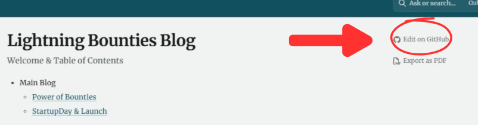

# Contributing

## Suggesting Changes

Want to make our blog content even better? First of all, thank you! This page will guide you through our contribution process, including how to submit changes and claim bounties for your contributions.

### Prerequisites

To edit our documentation, you must have a [GitHub account](https://github.com). If you already have one, make sure you are logged in. If you don't, please [create one](https://github.com/join).

### Understanding GitBook's Integration with GitHub

We use a platform called [GitBook](https://gitbook.com) to host, manage and serve our documentation. GitBook fetches files from our GitHub repository `Lightning-Bounties/our-blog`, reads them and converts them into the pages you can access on [blog.lightningbounties.com](https://blog.lightningbounties.com).

#### Repository Structure

A generic structure of documentation hosted on GitBook looks like this:

```
First page
├── A group of pages
│   ├── A page
│   ├── Another page
│   ├── One more page
│   │   ├── A nested page
│   │   └── Another nested page
```

Its mirror to GitHub has the following structure:

```
├── .gitbook/
│   └── assets/
│       └── an-image.png
├── a-group-of-pages/
│   ├── a-page.md
│   ├── another-page.md
│   ├── one-more-page/
│   │   ├── README.md
│   │   ├── a-nested-page.md
│   │   └── another-nested-page.md
├── README.md
└── SUMMARY.md
```

**Key Components:**

* The `.gitbook/assets` folder manages every file used in any page
* The `SUMMARY.md` file tells GitBook the order and grouping of pages
* The `README.md` file contains the first page content users see
* Groups of pages are controlled by folders named after the group title
* Nested pages have a similar structure, but require a `README.md` file in the parent folder

### Method 1: Quick Editing via GitHub Web Interface

#### Step 1: Access the Edit Function

1. Open the page you want to edit on [blog.lightningbounties.com](https://blog.lightningbounties.com)
2. Look for an "Edit on GitHub" button above the Table of Contents on the right side
3. Click on the GitHub icon to navigate to the Markdown file

<figure><figcaption><p>A GitHub icon along with the text <em><strong>"Edit on GitHub"</strong></em> is seen above the Table of Contents.</p></figcaption></figure>

#### Step 2: Edit the File

1. Click on the pencil icon labeled "Edit this file"
2. Make your edits using [Markdown formatting](https://gitbook.com/docs/creating-content/formatting/markdown)
3. Use GitBook's [Markdown reference guide](https://docs.gitbook.com) for proper formatting

<figure><figcaption><p>Screenshot of a version of our Contributing page on GitHub showing the Edit this file button as a <span data-gb-custom-inline data-tag="emoji" data-code="270f">✏️</span> pencil icon.</p></figcaption></figure>

#### Step 3: Create Your Pull Request

1. Scroll down to the "Commit changes" section
2. Write a short, descriptive title for your changes
3. Add a detailed description explaining your improvements
4. **Important**: Include `close #[issue-number]` in your description if you're fixing a specific issue
5. Select "Create a new branch for this commit and start a pull request"
6. Click "Propose file change"

<figure><figcaption><p>Screenshot of the Commit changes box. There are boxes for a brief description of the changes, an extended one, a selection menu for email addresses to associate with the commit, options to commit directly to the current branch or to create a new branch and a pull request (which opens an option to name your branch as you like) and buttons to either Propose file change or Cancel.</p></figcaption></figure>

#### Step 4: Submit Your Pull Request

1. On the Pull Request page, add a clear comment explaining your changes
2. **Critical Step**: Ensure your PR description includes `close #[issue-number]` syntax if applicable
3. Click "Create pull request"

<figure><figcaption><p>Screenshot of the Pull request page. It shows a box for the title of the Pull request, another for any comments. Below them, there's a Create pull request button.</p></figcaption></figure>

### Method 2: Local Development Workflow

#### Step 1: Fork and Clone

1. Navigate to the [Lightning-Bounties/our-blog](https://github.com/Lightning-Bounties/our-blog) repository
2. Click the "Fork" button to create your personal copy
3. Clone your fork locally:

```bash
git clone https://github.com/YOUR-USERNAME/our-blog.git
cd our-blog
```

#### Step 2: Create a Feature Branch

```bash
git checkout -b your-improvement-branch
```

#### Step 3: Make Your Changes

1. Edit the relevant Markdown files using your preferred editor
2. Follow GitBook's formatting guidelines
3. Place any images in the `.gitbook/assets/` folder
4. Test your changes locally if possible

#### Step 4: Commit and Push

```bash
git add .
git commit -m "Descriptive commit message"
git push origin your-improvement-branch
```

#### Step 5: Create Pull Request

1. Navigate to your fork on GitHub
2. Click "New Pull Request"
3. **Essential**: Include `close #[issue-number]` in the PR description
4. Provide clear explanation of your changes
5. Submit the pull request

### Lightning Bounties Payment System

#### The Critical `close #[issue-number]` Syntax

To earn Bitcoin bounties for your contributions, you **must** include the `close #[issue-number]` syntax in your pull request description. This connects your PR to the Lightning Bounties issue and triggers automatic payment processing.

**Important Notes:**

* The `close` keyword must be in the PR description itself, not in regular comments
* Adding this connection after merging will automatically trigger Lightning Bounty payment
* If you forget to add this initially, you can edit your merged PR description later

#### If You Forgot the Close Syntax

**Option 1: Edit Your Merged Pull Request**

1. Go to your merged PR and click into it
2. Click the "..." button at the top-right of your PR description
3. Select "Edit"
4. Add `close #[issue-number]` to your PR description
5. Click "Update Comment"

**Option 2: Ask for Help**
\
If you cannot edit the PR, ask the repository owner to add the `close` syntax for you.


[See Here For Full Troubleshooting Guide ](https://docs.lightningbounties.com/docs/getting-started/solving-a-bounty/claim-reward-criteria-and-troubleshooting-guide)


### Claiming Your Bitcoin Bounty

#### Step-by-Step Claiming Process

1. **Visit the Platform**: Go to [app.lightningbounties.com](https://app.lightningbounties.com)
2. **Find Your Bounty**: [Look for your bounty. ](https://docs.lightningbounties.com/docs/getting-started/solving-a-bounty/looking-for-a-project-to-get-rewarded)
   1. Example: _"Help Improve Our Blog & Docs and Earn Sats!"_
3. [**Claim Your Reward**:](https://docs.lightningbounties.com/docs/getting-started/solving-a-bounty/claiming-multiple-bounties-multi-bounty-prs)
   * Click on "Claim Reward"
   * Add your pull request number
   * Click the "Check" button to verify eligibility
4. [**Receive Payment**:](https://docs.lightningbounties.com/docs/getting-started/solving-a-bounty/working-on-the-bounty) The reward will be added to your balance and paid instantly via the Lightning Network

#### Payment Requirements

* Your pull request must be merged
* The PR description must contain `close #[issue-number]` syntax
* Lightning Bounties uses the GitHub API as an oracle to prevent fraudulent claims
* Payments are processed automatically when all conditions are met

### Content Guidelines

#### Writing Best Practices

* Use clear, concise language
* Follow consistent Markdown formatting
* Include relevant links to Lightning Bounties resources
* Ensure proper heading hierarchy (H1, H2, H3, etc.)
* Test all external links for functionality

#### Technical Standards

* Keep contributions focused on specific improvements
* Follow existing file structure and naming conventions
* Optimize images and include descriptive alt text
* Use proper Git commit message conventions

#### Community Engagement

* Respond promptly to feedback during reviews
* Be open to suggestions from maintainers
* Credit sources appropriately when building on existing work
* Maintain professional and constructive communication

### Getting Support

For additional help with contributions:

1. **Documentation**: Check our detailed guides at [docs.lightningbounties.com](https://docs.lightningbounties.com)
2. **Community**: Join our [Discord](https://discord.gg/zBxj4x4Cbq) for real-time assistance
3. **GitHub Issues**: Report bugs or request features on our repository

### Lightning Bounties Platform Benefits

* **No Installation Required**: Simply log in with your GitHub account
* **Instant Bitcoin Payments**: Receive rewards immediately after PR approval
* **Global Accessibility**: Available worldwide, bypassing traditional banking restrictions
* **Crowdfunding Support**: Multiple users can fund single bounties
* **Automated Validation**: GitHub API integration prevents fraudulent claims

Thank you for helping us improve our documentation and contributing to the Bitcoin development ecosystem! Your contributions help make Lightning Bounties more accessible and valuable for developers worldwide.

***


**Remember**: Always include `close #[issue-number]` in your pull request description to ensure you receive your Bitcoin bounty reward!

