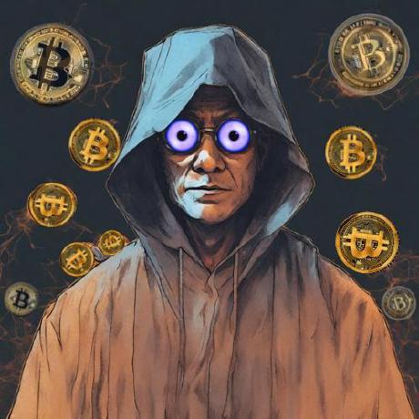

# Contributors

## Lightning Bounties Contributors

Welcome to our contributors page! This is where we celebrate the developers who make Lightning Bounties successful by solving bounties, improving documentation, and building features. Each contributor profile showcases their work and the bounties they've solved on our platform.

### How to Add Yourself

Want to join this page? Follow these simple steps:

1. **Fork the repository**: [github.com/Lightning-Bounties/our-blog](https://github.com/Lightning-Bounties/our-blog)
2. **Add your avatar**: Place your image in `.gitbook/assets/contributors/your-name.png`
3. **Copy the template below** and add your section to this page
4. **Fill in your information** (name, bio, 3 socials, 1-3 bounties)
5. **Submit a Pull Request** with `close #[issue-number]` in the description
6. **Claim your bounty** on [app.lightningbounties.com](https://app.lightningbounties.com)

### Template Format

### \[Your Name] 

1. A photo avatar (using Markdown image syntax, e.g., ``).
2. **About:** \[Write 2-3 sentences about yourself, your background, and/or what you enjoy about contributing to Lightning Bounties]
3. 3 social links (embedded as clickable text)
   1. &#x20;**Example:** Find me on [GitHub](https://github.com/yourusername), [X/Twitter](https://x.com/yourhandle), and [your third platform](https://yourlink.com/).
4. **Bounties Solved:**

* [Bounty Title 1](https://app.lightningbounties.com/issue/abc123) -&#x20;
* [Bounty Title 2](https://app.lightningbounties.com/issue/def456) -&#x20;
* [Bounty Title 3](https://app.lightningbounties.com/issue/ghi789) -&#x20;

### Example of How Your Contrinutors Section May Look


Don't worry about formatting. Just submit in plain markdown - we'll handle GitBook formatting.


<figure><figcaption></figcaption></figure>


{% column width="41.66666666666667%" %}
### Name

<figure><figcaption></figcaption></figure>


{% column width="58.33333333333333%" valign="bottom" %}
---

## Your Contributor Profile (Fill This Template Below)

### [Your Full Name] 

**About:**
I build Bitcoin and Nostr-based apps and enjoy solving real problems through open-source. Lightning Bounties lets me learn, earn, and contribute to the Bitcoin ecosystem in a meaningful way.

**Connect:**
Find me on [GitHub](https://github.com/turizspace), [Nostr](https://primal.net/p/nprofile1qqsqdqc0dj6eyk7c9n99n0dgfrcq2enxmlcyd3fc9936n9azxndyp3gk59y83), and [LinkedIn](https://ke.linkedin.com/in/2rizmo).

**Bounties Solved:**

* [Do not allow identically named wallets](https://github.com/BrantaOps/core/issues/32) - Fixed issue of duplicate wallet names.
* [Favicon renders on local dev but not in prod](https://github.com/ATLBitLab/twelvecash/issues/53) - Fixed custom favicon to work on local dev and in staging, and in prod.
* [Nostr-Account-Setup-Consultation](https://github.com/octoberjackie/Nostr-Account-Setup-Consultation/issues/1) - Guidance on setting up and optimizing Nostr presence and experience.
* [Mini Contest- Create media assets](https://github.com/octoberjackie/Design-Contest-Create-Our-New-Twitter-Image-Assets-/issues/2) - Designed badges for best perfoming bounty hunters

---
Full-stack developer passionate about Bitcoin and open-source software. I contribute to Lightning Bounties projects, earning sats while building tools that matter. Specialized in React, Node.js, and Lightning Network integrations.




{% column width="33.33333333333333%" valign="middle" %}
<i class="fa-github">:github:</i> [GitHub](https://github.com/aliraza556)


{% column width="33.33333333333333%" valign="middle" %}
<i class="fa-n">:n:</i> Nostr&#x20;


{% column width="33.33333333333336%" valign="middle" %}
<i class="fa-linkedin">:linkedin:</i> LinkedIn



<h4 align="center"><mark style="background-color:purple;">Here are some bounties I've successfully completed on Lightning Bounties:</mark></h4>



**\[Bounty Title]** - [Link to bounty](https://app.lightningbounties.com/issue/your-bounty-id)



**\[Bounty Title]** - [Link to bounty](https://app.lightningbounties.com/issue/your-bounty-id)



**\[Bounty Title]** - [Link to bounty](https://app.lightningbounties.com/issue/your-bounty-id)

 
