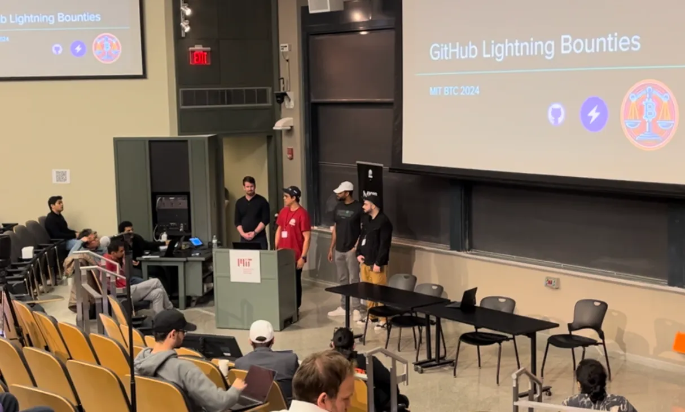
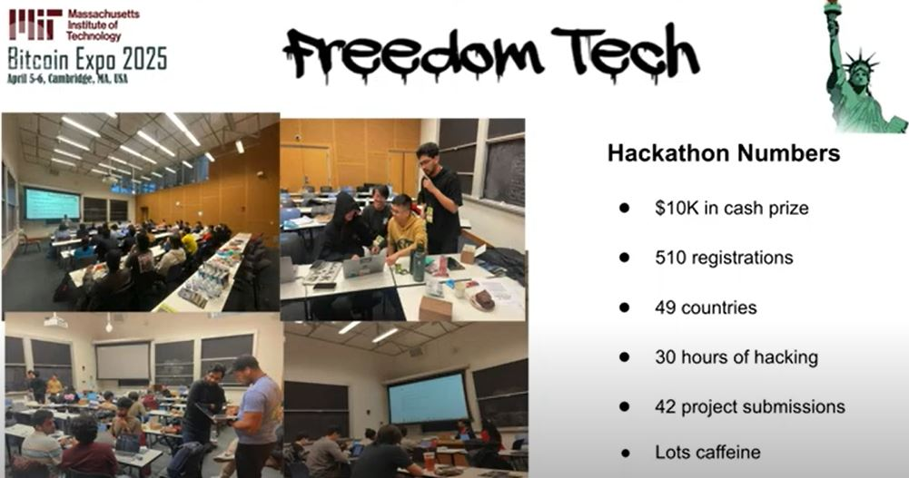

# Lightning Bounties: Mentoring MIT Bitcoin Hackathon 2025

This past weekend, the Lightning Bounties team returned to the MIT Bitcoin Hackathon—not as participants, but as mentors. Just one year after winning Track 1 with our GitHub-Bitcoin payment integration, we found ourselves guiding **510 hackers** through the challenges we had faced ourselves. This full-circle journey from competitors to coaches at the "Freedom Tech" hackathon highlighted not only Bitcoin's growing ecosystem but also the powerful community knowledge transfer that drives innovation forward. Here's our story of mentorship, technical challenges, and the incredible projects that emerged over those intensive 30 hours.

### The Birth of Lightning Bounties

Last spring, we huddled around a table at MIT, frantically debugging Lightning Network connections as the final minutes of the 2024 hackathon ticked down. Our project—a system to automatically reward open-source contributors on GitHub with Bitcoin—was held together with equal parts code, grit, and Red Bull.

<figure><figcaption>
Lightning Bounties 2024
</figcaption></figure> <figure><figcaption>
Presenting 2024 MITBitcoin Hackathon  
</figcaption></figure>

When Lightning Bounties was announced as the [Track 1 winner,](https://devpost.com/software/lightning-bounty) we experienced that rare moment of validation every builder craves. The enthusiastic response from judges and fellow participants confirmed we'd identified a genuine problem worth solving in open-source development.

That single weekend transformed our trajectory entirely. Within a year, we evolved from a hackathon project to a [vibrant startup](https://www.lightningbounties.com/) featured in[ Bitcoin News](https://youtu.be/IYmS16ruXp8?si=6ihgBC75m5vPN03l) and selected as a finalist in [PlebLab's Top Builder competition](https://youtu.be/jQANBbKPnvE?si=xWwWODKah913gYB7).

### Why We Returned as Mentors

We chose to mentor at this year's hackathon because Lightning Bounties is living proof that a weekend project built on grit can evolve into something meaningful. The doors that opened for us—media exposure, accelerator programs, industry connections—are waiting for the next wave of builders too.

There's something uniquely satisfying about watching someone solve a problem that once had you banging your head against the wall. Every time we helped a team navigate channel balancing issues or debug a payment flow, we weren't just solving their immediate problem—we were shortening their learning curve by months.

### Coming Full Circle: Mentors at MIT 2025

This year's hackathon theme—"Freedom Tech"—embodied everything Lightning Bounties was built to support. For 30 straight hours, **510 hackers** from around the globe transformed concepts into code, building tools for privacy, financial sovereignty, and censorship resistance. With **42 project submissions**, this marked a massive turnout compared to the 300+ participants last year—a testament to Bitcoin's growing developer interest and MIT's pull in the space.

<figure><figcaption>
The 2025 MIT Bitcoin Hackathon by the Numbers
</figcaption></figure>

Walking through the hacking spaces transported us back to last year. The determined expressions, the excitement of first Lightning transactions, the shared frustration of debugging—it all felt familiar yet different from our new perspective. We saw teams experiencing the same roadblocks we had encountered, but now we could offer guidance instead of just commiseration.

The most rewarding moments came when teams would hit what seemed like a dead end, only to break through with a gentle nudge in the right direction. This is what Bitcoin development is truly about—shared knowledge collaborative innovation.

### [Lightning Bounties Workshop: Building L-Apps on MutinyNet](https://github.com/Lightning-Bounties/mit-2025-hackathon)

<figure><figcaption>
<a href="https://replit.com/@sutt/LNBits-Tutorial-2025">LNBits Tutorial on Replit</a>
</figcaption></figure>

Our workshop at the MIT Bitcoin Hackathon 2025 was a cornerstone of our mentorship efforts, designed to empower participants to build Lightning Network applications without risking real funds. Titled _"Setup LNBits on MutinyNet"_, the session introduced hackers to testnet nodes from Voltage Cloud and LNBits' API, providing a safe sandbox for experimentation. Participants learned how to:

* Deploy Lightning nodes in minutes
* Build functional applications like tipping bots or donation platforms
* Transition projects from testnet to mainnet seamlessly

The turnout was incredible, with over **50 participants**, [19 Replit forks](https://replit.com/@sutt/LNBits-Tutorial-2025) of our tutorial and an active Discord discussion buzzing with questions and ideas. Hackers left the workshop equipped with practical skills and ready to integrate Lightning payments into their hackathon projects. Several teams leveraged this knowledge, creating projects that embodied the hackathon's "Freedom Tech" theme. From streaming payment automations to scalable developer tools, the workshop proved that hands-on mentorship can really help foster excitement and accelerate project creation.


Will Conducting the LNBits Workshop


<figure><figcaption>
Will Mentoring the Hackers
</figcaption></figure> <figure><figcaption>
Pavel Chopping it up
</figcaption></figure>


Fork the Tutorial on Replit Here :point\_right:   [https://replit.com/@sutt/LNBits-Tutorial-2025](https://replit.com/@sutt/LNBits-Tutorial-2025)


### The Judge's Perspective: Lightning Bounties' Enrique and Pavel

This year, we had the unique privilege of seeing the hackathon from yet another angle—as judges. Our team members Enrique and Pavel joined the judging panel, evaluating projects based on technical merit, impact, and originality.

<figure><figcaption>
Judge Pavel
</figcaption></figure> <figure><figcaption>
Judge Enrique
</figcaption></figure>

> _"The level of technical creativity I saw was humbling,"_ Enrique reflected. _"The energy and inspiration from this year's participants were a beautiful reminder of what can be accomplished with hard work."_

Pavel noted,&#x20;

> _"What impressed me most was how teams avoided the easy route, instead aiming high and truly excelling. These aren't just forks with minor tweaks to existing projects—many hold real potential to enhance Bitcoin's usability and adoption right now."_

Having been in the competitors' shoes just a year ago, Enrique and Pavel brought a uniquely empathetic perspective to the judging process, asking the questions they wished they'd been asked, and looking for the passion behind the presentations.

### The Winners

If there's one thing that keeps Bitcoin builders humble, it's watching the next wave of innovators take your ideas and catapult them into dimensions you hadn't even considered. The innovation showcased at the MIT Bitcoin Hackathon 2025 left us genuinely impressed. Here are the projects that stood out for their creativity, technical excellence,

[**TANOS (Taproot Adaptor for Nostr-Orchestrated Swaps)**](https://devpost.com/software/tanos) took home the Track 3 prize, enabling trustless atomic swaps between Nostr events and Bitcoin Taproot UTXOs through adaptor signatures. Built in Go, it ensures either a Nostr event is revealed and Bitcoin is paid, or nothing happens—eliminating counterparty risk without escrows.


TANOS


[**Payjoin Integrations**](https://devpost.com/software/payjoin-integrations) claimed the Track 1 prize (our old stomping grounds!) With the power of vibe coding they launched a web app that educates the user on how payjoin works via a step by step walkthrough, while coordinating a real payjoin live. It is not merely an educational tool. It is the first use of PDK in JavaScript and the most complete implementation available in JavaScript.

The demo presents a sender and receiver wallet. They sync to Mutinynet using Bitcoin Dev Kit. The team shows examples of what sending and receiving could look like. They also give an "under the hood" look at the Payjoin process.


Payjoin Intergrations


### **The Next Wave: Projects That Inspired Us**

[**BitBet**](https://devpost.com/software/bitbet) created a decentralized sportsbook using Discreet Log Contracts (DLCs) for resolving real-world events without trusted third parties. Their demo featured a live NBA game with odds updating in real-time—all without a bookmaker in sight.


BitBet


[**Lightning Time**](https://devpost.com/software/lightning-time) reimagined payroll with a Lightning-powered streaming platform that makes payday an obsolete concept. Why wait two weeks when your earnings can flow to your wallet second by second? Their time-tracking integration was particularly clever, automatically streaming payments when you're clocked in.


Lightning Time


[**ZipZap** ](https://devpost.com/software/zipzap-cjwqz0)allows for social media tipping over Lightning, using BOLT 12 offers and taking advantage of the latest protocol upgrades to Lightning. Zip Zap enable nostr users to tip each other's posts while maintaining self-custody and privacy.


Zip Zap


[**Bitlook** ](https://devpost.com/software/bitlook)centralizes Bitcoin data in one dashboard, combining real-time blockchain and Lightning Network analytics with curated news. The project features Lightning wallet integration for transactions and an AI chatbot for Bitcoin education.


BitLook


[**Reviu**](https://devpost.com/software/unpair-review) tackled academic gate-keeping with a peer-review platform where researchers stake sats to validate work pseudonymously. Quality rises to the top based on merit, not institutional affiliation—a refreshing approach to knowledge sharing.


Reviu


Each project reflected not just technical skill but a deep understanding of how Bitcoin and Lightning can solve real problems in ways that traditional systems simply cannot.

### Lightning Bounties: The Road Ahead

The energy at the 2025 MIT Bitcoin Hackathon reminded us why we built Lightning Bounties in the first place: to nurture innovation in the Bitcoin ecosystem through collaboration and incentives. The energy at MIT confirmed what we've suspected all along—Bitcoin's future isn't just bright, it's blinding when viewed through the creative lens of builders who care deeply about financial freedom.

**We're expanding our commitment to nurturing Bitcoin's builder ecosystem in two concrete ways:**


First, we're opening our mentorship pipeline to more hackathons. **If you're organizing a Bitcoin or Lightning-focused hackathon and need experienced mentors who've been on both sides of the judging table, reach out directly to our team.** We'll bring workshops, technical guidance, and firsthand perspective to your participants.



**Second—and this one's specifically for MIT Hackathon participants—we're putting our money where our mouth is. If you're continuing to build your hackathon project and hit technical roadblocks or bugs that need solving, reach out to us! Links below** :arrow\_down:**. We'll fund a bounty on our platform (**[**app.lightningbounties.com**](https://app.lightningbounties.com)**) to help you overcome those challenges and keep your project moving forward.**




The next generation of Bitcoin innovation is already being built—we'd love to help you be part of it.
