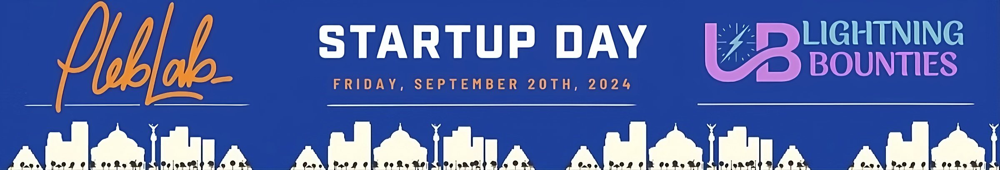
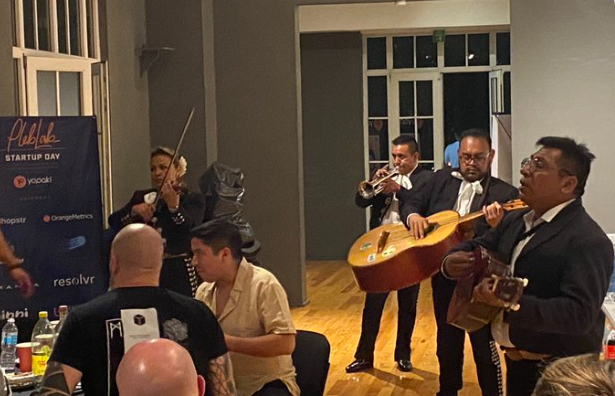

# Lightning Bounties' Recap of PlebLab's Startup Day 2024 - CMDX

<figure><figcaption></figcaption></figure>

On September 20, 2024, Mexico City became ground zero for Bitcoin innovation. [PlebLab's Startup Day](https://www.pleblab.dev/startup-day-cdmx) brought together the boldest and brightest in the Bitcoin space, [showcasing projects](https://lb-demo.vercel.app/) that are pushing the boundaries of what's possible with this technology.&#x20;

As first-time attendees and co-founders of Lightning Bounties, [Enrique ](https://www.linkedin.com/in/jegamboafuentes/)and I were immediately captivated by the electric atmosphere of [PlebLab](https://www.pleblab.dev/). All around us, innovators and entrepreneurs buzzed with anticipation, exchanging ideas about the future of Bitcoin and the [Lightning Network](https://lightning.network/).&#x20;

&#x20;                               Enrique and I exchanged excited glances, taking it all in.

&#x20;                  \
&#x20; &#x20;

From Resolvr's instant insurance settlements to Cascdr's AI-powered Lightning Network apps, the event was a testament to Bitcoin's emerging ecosystem.&#x20;

No bullshit, no hype – just raw innovation and real-world applications set to change the game. Buckle up, Bitcoiners. Here's what you missed at PlebLab's Startup Day, starting with Yopaki's gritty journey...

## [**Yopaki**](https://www.yopaki.com/)**: A Journey of Resilience**

[Francisco Chavarria, Co-Founder and CEO of Yopaki](https://x.com/FranciscoBTC), delivered a heartfelt and motivational keynote, focusing on the theme _**"Adapt or Die."**_ He shared Yopaki's journey from near-failure to success, emphasizing the importance of perseverance and adaptability in the startup world.

Francisco recounted Yopaki's early struggles, including their initial lack of investor interest and the challenges of building something new in the Bitcoin ecosystem. He highlighted their innovative approach to generating buzz, such as organizing Mexico's first non-technical Bitcoin-only conference and projecting a Bitcoin message on the Central Bank of Mexico.

The presentation culminated with the announcement of Yopaki's latest project: a Bitcoin-themed version of Lotería, a culturally significant game in Mexico. This clever adaptation aims to make learning about Bitcoin more engaging and accessible to a wider audience, demonstrating Yopaki's commitment to education and community building in the Bitcoin ecosystem. By combining traditional Mexican culture with Bitcoin education, Yopaki is creating a unique bridge between heritage and financial innovation, showcasing their ability to adapt and innovate in the face of challenges.

Francisco's honest account of their struggles and subsequent growth served as an inspiring message for fellow startups, demonstrating that even in the face of near-failure, success is possible with resilience and innovation.

<table data-view="cards"><thead><tr><th align="center"></th><th data-hidden data-card-cover data-type="files"></th><th data-hidden data-card-target data-type="content-ref"></th></tr></thead><tbody><tr><td align="center"><a href="https://www.yopaki.com/"><strong>Website</strong></a></td><td><a href=".gitbook/assets/yopaki_logo_no_bg.png">yopaki_logo_no_bg.png</a></td><td><a href="https://www.yopaki.com/">https://www.yopaki.com/</a></td></tr><tr><td align="center"><a href="https://youtu.be/jVtekBhztdg?si=CganMIjin4ZqdcoS"><strong>Presentation</strong></a></td><td><a href=".gitbook/assets/yopaki2_yt.PNG">yopaki2_yt.PNG</a></td><td><a href="https://youtu.be/jVtekBhztdg?si=kS81SSx4KWg7EH6h">https://youtu.be/jVtekBhztdg?si=kS81SSx4KWg7EH6h</a></td></tr><tr><td align="center"><a href="https://x.com/BitcoinNewsCom/status/1838688514038280276"><strong>Elevator Pitch</strong></a></td><td><a href=".gitbook/assets/yopaki_pitch.PNG">yopaki_pitch.PNG</a></td><td><a href="https://x.com/BitcoinNewsCom/status/1838688514038280276">https://x.com/BitcoinNewsCom/status/1838688514038280276</a></td></tr></tbody></table>

## [**Alamo Labs:**](https://www.alamobitcoin.com/) **Announces Bitcoin Diploma Program**

Next up was Alamo Labs, and I found myself leaning forward in my seat, captivated by their presentation. Alamo Labs, led by the charismatic and down-to-earth [Ge](https://x.com/Money2BMrdredBy), presented their innovative [Bitcoin Diploma program](https://x.com/PlebLab/status/1841564971991269546). This initiative aims to provide comprehensive Bitcoin education, offering classes every Tuesday starting October 1st. Upon completion, students receive a diploma accredited through My First Bitcoin, demonstrating Alamo Labs' commitment to quality education in the Bitcoin space.

Alamo Labs' dedication to fostering local talent and building a strong Bitcoin community in San Antonio is commendable. For those looking to dive into Bitcoin development, especially in the San Antonio area, Alamo Labs presents an exciting opportunity to gain valuable knowledge and experience. As they say in Texas, "Remember the Alamo" - and now, thanks to Alamo Labs, you can remember where your Bitcoin journey began.

<table data-view="cards"><thead><tr><th align="center"></th><th data-hidden data-card-cover data-type="files"></th><th data-hidden data-card-target data-type="content-ref"></th></tr></thead><tbody><tr><td align="center"><a href="https://www.alamobitcoin.com/"><strong>Website</strong> </a></td><td><a href=".gitbook/assets/alamolabs_logo.PNG">alamolabs_logo.PNG</a></td><td><a href="https://www.alamobitcoin.com/">https://www.alamobitcoin.com/</a></td></tr><tr><td align="center"><a href="https://youtu.be/MySjhX9KkSc?si=Z_6lwQmUPy2ucNCH"><strong>Presentation</strong></a></td><td><a href=".gitbook/assets/alamolabs_yt.PNG">alamolabs_yt.PNG</a></td><td><a href="https://youtu.be/MySjhX9KkSc?si=Z_6lwQmUPy2ucNCH">https://youtu.be/MySjhX9KkSc?si=Z_6lwQmUPy2ucNCH</a></td></tr><tr><td align="center"><a href="https://myfirstbitcoin.io/"><strong>Bitcoin Diploma Program</strong></a></td><td><a href=".gitbook/assets/myfirstBTC.PNG">myfirstBTC.PNG</a></td><td><a href="https://myfirstbitcoin.io/">https://myfirstbitcoin.io/</a></td></tr></tbody></table>

## [**Lightning Bounties**](https://www.lightningbounties.com/)**: Bridging Bitcoin & Open Source Innovation**

It was our turn to present, and my heart raced as Enrique and I took the stage. Despite countless rehearsals, the real deal brought a mix of pride and nervousness. Enrique began the demo with fluid confidence, executing each click and transition flawlessly, just as we had envisioned.

This seamless presentation was a testament to [Enrique's ](https://x.com/JEGamboaFuentes)dedication and the tireless efforts of [Will ](https://x.com/WillSuttonCodes)and [Pavel](https://www.linkedin.com/in/kononovp/), whose hard work transformed our platform. What once took 30 seconds in our Alpha stage now happened almost instantaneously. Watching their meticulous bug-fixing and optimization in action filled me with immense pride.

My part felt easy; I simply talked about Lightning Bounties, a topic I could discuss endlessly. But the real MVPs were [Enrique](https://x.com/JEGamboaFuentes), [Will](https://x.com/WillSuttonCodes), and [Pavel](https://www.linkedin.com/in/kononovp/)—their dedication made this moment possible. As we wrapped up our presentation to a full house, relief washed over me, replaced by excitement. We had done it! With our part complete, we could now immerse ourselves in the rest of the event.

<table data-view="cards"><thead><tr><th align="center"></th><th data-hidden data-card-cover data-type="files"></th><th data-hidden data-card-target data-type="content-ref"></th></tr></thead><tbody><tr><td align="center"><a href="https://www.lightningbounties.com/"><strong>Website</strong> </a></td><td><a href=".gitbook/assets/LB_Dark_BG_Favicon.png">LB_Dark_BG_Favicon.png</a></td><td><a href="https://www.lightningbounties.com/">https://www.lightningbounties.com/</a></td></tr><tr><td align="center"><a href="https://youtu.be/yxv3VpxuIFU?si=hSXiF71AhWS576K5"><strong>Presentation</strong></a></td><td><a href=".gitbook/assets/lightningbounties_yt (1).PNG">lightningbounties_yt (1).PNG</a></td><td><a href="https://youtu.be/yxv3VpxuIFU?si=hSXiF71AhWS576K5">https://youtu.be/yxv3VpxuIFU?si=hSXiF71AhWS576K5</a></td></tr><tr><td align="center"><a href="https://x.com/SonnyTheDegen/status/1839275728300618107"><strong>Elevator Pitch</strong></a></td><td><a href=".gitbook/assets/lb_pitch.PNG">lb_pitch.PNG</a></td><td><a href="https://x.com/SonnyTheDegen/status/1839275728300618107">https://x.com/SonnyTheDegen/status/1839275728300618107</a></td></tr></tbody></table>

## [**Orange Metrics**](https://orangemetrics.xyz/)**: Data-Driven Insights for Bitcoin Projects**

Next up was Orange Metrics; a powerful platform that Lightning Bounties can leverage to enhance our bug bounty platform. By utilizing Orange Metrics' data visualization and analysis tools, we can gain deeper insights into Bitcoin and Lightning Network projects.

The platform allows us to query and visualize open-source data from Bitcoin, Lightning, and various GitHub repositories using SQL. This capability is particularly valuable for Lightning Bounties, as we can analyze trends in developer activity, code quality, and project growth. For example, we could track open issues, pull requests, and commit frequencies across multiple repositories, helping us identify high-impact areas for bounties.

<table data-view="cards"><thead><tr><th align="center"></th><th data-hidden data-card-cover data-type="files"></th><th data-hidden data-card-target data-type="content-ref"></th></tr></thead><tbody><tr><td align="center"><a href="https://orangemetrics.xyz/"><strong>Website</strong> </a></td><td><a href=".gitbook/assets/orangemetrics2.PNG">orangemetrics2.PNG</a></td><td><a href="https://orangemetrics.xyz/">https://orangemetrics.xyz/</a></td></tr><tr><td align="center"><a href="https://youtu.be/OebU8GozxqI?si=ebLHYH75o_10FIPN"><strong>Presentation</strong></a></td><td><a href=".gitbook/assets/orangemetrics_YT.PNG">orangemetrics_YT.PNG</a></td><td><a href="https://youtu.be/OebU8GozxqI?si=ebLHYH75o_10FIPN">https://youtu.be/OebU8GozxqI?si=ebLHYH75o_10FIPN</a></td></tr><tr><td align="center"><a href="https://x.com/BitcoinNewsCom/status/1838948228189868510"><strong>Elevator Pitch</strong></a></td><td><a href=".gitbook/assets/orangemetrics_pitch.PNG">orangemetrics_pitch.PNG</a></td><td><a href="https://x.com/BitcoinNewsCom/status/1838948228189868510">https://x.com/BitcoinNewsCom/status/1838948228189868510</a></td></tr></tbody></table>

## [**Resolvr**](https://resolvr.io/)**: Transforming Insurance with Instant Settlements**

[Dave ](https://x.com/DaveResolvr)from Resolvr delivered an engaging presentation that transformed the typically mundane topic of insurance into something both educational and interesting. He highlighted a critical issue in the traditional insurance industry: the average settlement time of 180 days, which causes significant financial strain throughout the insurance chain. Resolvr's innovative solution leverages Bitcoin and Lightning Network technology to dramatically reduce this settlement time.

The presentation showcased Resolvr's Reinsurance Premium Manager (RPM), which enables instant, accurate, and global settlement payments. Dave demonstrated the platform live, processing payments instantly across multiple parties, including reinsurers. He emphasized that while they use Bitcoin and Lightning for settlements, the platform can also handle fiat-to-fiat transactions. Resolvr's approach significantly reduces processing costs and eliminates friction between different parties in the insurance chain, potentially transforming how insurance claims are processed and settled globally.

<table data-view="cards"><thead><tr><th align="center"></th><th data-hidden data-card-target data-type="content-ref"></th><th data-hidden data-card-cover data-type="files"></th></tr></thead><tbody><tr><td align="center"><a href="https://resolvr.io/"><strong>Website</strong> </a></td><td><a href="https://resolvr.io/">https://resolvr.io/</a></td><td><a href=".gitbook/assets/resolvr.png">resolvr.png</a></td></tr><tr><td align="center"><a href="https://youtu.be/Kd8Pm7c-rJ4?si=_XfMhgyfLIXKQgJ7"><strong>Presentation</strong></a></td><td><a href="https://youtu.be/Kd8Pm7c-rJ4?si=_XfMhgyfLIXKQgJ7">https://youtu.be/Kd8Pm7c-rJ4?si=_XfMhgyfLIXKQgJ7</a></td><td><a href=".gitbook/assets/resolvr_YT.PNG">resolvr_YT.PNG</a></td></tr><tr><td align="center"><a href="https://x.com/i/status/1841564982422511933"><strong>Elevator Pitch</strong></a></td><td><a href="https://x.com/i/status/1841564982422511933">https://x.com/i/status/1841564982422511933</a></td><td><a href=".gitbook/assets/resolvr_pitch.PNG">resolvr_pitch.PNG</a></td></tr></tbody></table>

## [**Shopstr**](https://shopstr.store/)**: Decentralized Marketplace on Nostr**

Shopstr, is a user-friendly decentralized marketplace that aims to revolutionize online selling. Built on Nostr and leveraging Bitcoin and Lightning Network technology, Shopstr offers a compelling alternative to traditional e-commerce platforms.&#x20;

Unlike giants like[ eBay which charge hefty fees (around 13.5%)](https://community.ebay.com/t5/Selling/E-bay-s-detailed-fee-breakdown/td-p/33898131), Shopstr provides a more cost-effective solution for sellers, saving them significant amounts on transaction costs.

What sets Shopstr apart is its focus on simplicity and user control. Users can easily create an account without extensive personal information, list items quickly, and maintain ownership of their data. The platform integrates seamlessly with other Nostr-based applications, allowing users to manage their marketplace presence across multiple platforms effortlessly.

These user-centric approaches make Shopstr accessible to anyone, from tech-savvy Bitcoin plebs to casual shoppers looking for a straightforward online marketplace experience.

<table data-view="cards"><thead><tr><th align="center"></th><th data-hidden data-card-cover data-type="files"></th><th data-hidden data-card-target data-type="content-ref"></th></tr></thead><tbody><tr><td align="center"><a href="https://shopstr.store/"><strong>Website</strong> </a></td><td><a href=".gitbook/assets/shopstr.png">shopstr.png</a></td><td><a href="https://shopstr.store/">https://shopstr.store/</a></td></tr><tr><td align="center"><a href="https://youtu.be/Tupe63Y8UT4?si=E-rWGRQkQfeS1Bc4"><strong>Presentation</strong></a></td><td><a href=".gitbook/assets/shopstr_YT (1).PNG">shopstr_YT (1).PNG</a></td><td><a href="https://youtu.be/Tupe63Y8UT4?si=E-rWGRQkQfeS1Bc4">https://youtu.be/Tupe63Y8UT4?si=E-rWGRQkQfeS1Bc4</a></td></tr><tr><td align="center"><a href="https://x.com/BitcoinNewsCom/status/1839688975654461567"><strong>Elevator Pitch</strong></a></td><td><a href=".gitbook/assets/shopstr_pitch.PNG">shopstr_pitch.PNG</a></td><td><a href="https://x.com/BitcoinNewsCom/status/1839688975654461567">https://x.com/BitcoinNewsCom/status/1839688975654461567</a></td></tr></tbody></table>

## [**Comet Notes**](https://comet.md/)**: Privacy-First Note-Taking**

Comet Notes is a clever open-source note-taking application that prioritizes user privacy and data sovereignty. Unlike traditional note-taking apps that store data in centralized clouds, Comet Notes allows users to keep their notes locally encrypted on their devices, ensuring complete control over their information. The platform is designed to be intuitive and accessible, making it easy for anyone to use without overwhelming them with complex features.

I appreciated how effectively [Jay ](https://github.com/nodetec/comet)showcased their software during the presentation. As someone who uses [Notion ](https://www.notion.so/)daily, I have been searching for a privacy-preserving alternative for my notes and research. Comet Notes offers the functionality I need while ensuring that my data remains secure and private. The familiar user interface makes transitioning from other apps seamless, allowing users to focus on their work without worrying about data breaches or centralized control.

<table data-view="cards"><thead><tr><th align="center"></th><th data-hidden data-card-cover data-type="files"></th><th data-hidden data-card-target data-type="content-ref"></th></tr></thead><tbody><tr><td align="center"><a href="https://comet.md/"><strong>Website</strong> </a></td><td><a href=".gitbook/assets/comet_no_bg (1).png">comet_no_bg (1).png</a></td><td><a href="https://comet.md/">https://comet.md/</a></td></tr><tr><td align="center"><a href="https://youtu.be/FfViuew6jX8?si=4yDJ5xEb1eVJrgqD"><strong>Presentation</strong></a></td><td><a href=".gitbook/assets/cometnotes_yt.PNG">cometnotes_yt.PNG</a></td><td><a href="https://youtu.be/FfViuew6jX8?si=4yDJ5xEb1eVJrgqD">https://youtu.be/FfViuew6jX8?si=4yDJ5xEb1eVJrgqD</a></td></tr><tr><td align="center"><a href="https://x.com/PlebLab/status/1841564990685233562"><strong>Elevator Pitch</strong></a></td><td><a href=".gitbook/assets/comet_pitch.PNG">comet_pitch.PNG</a></td><td><a href="https://x.com/PlebLab/status/1841564990685233562">https://x.com/PlebLab/status/1841564990685233562</a></td></tr></tbody></table>

## [**Cascdr**](https://cascdr.xyz/)**: Private Bitcoin Payable AI Services**

Jim Carucci, the founder and CEO of Cascdr, delivered an insightful presentation. He focused on the synergy between the Lightning Network and AI, explaining how these technologies form the core of Cascdr's vision. Jim's explanation of AI chatbots as _**"autocorrect on steroids"**_ was particularly enlightening, helping to demystify the complex world of AI for those unfamiliar with its inner workings. He broke down complex concepts into digestible parts, using examples like optical character recognition to explain neural networks and vectorization in language processing.

Cascdr is a platform that leverages the Lightning Network and AI to create innovative solutions in the Bitcoin ecosystem. By combining the advantages of the Lightning Network, such as low-fee, high-resolution payments, and instant transactions, with the power of AI and large language models, Cascdr aims to offer unique services.

<table data-view="cards"><thead><tr><th align="center"></th><th data-hidden data-card-cover data-type="files"></th><th data-hidden data-card-target data-type="content-ref"></th></tr></thead><tbody><tr><td align="center"><a href="https://cascdr.xyz/"><strong>Website</strong> </a></td><td><a href=".gitbook/assets/cascdr.png">cascdr.png</a></td><td><a href="https://cascdr.xyz/">https://cascdr.xyz/</a></td></tr><tr><td align="center"><a href="https://youtu.be/BJv2McQnX6I?si=ndtMDKIRQnWNr5fu"><strong>Presentation</strong></a></td><td><a href=".gitbook/assets/cascdr_yt.PNG">cascdr_yt.PNG</a></td><td><a href="https://youtu.be/BJv2McQnX6I?si=ndtMDKIRQnWNr5fu">https://youtu.be/BJv2McQnX6I?si=ndtMDKIRQnWNr5fu</a></td></tr><tr><td align="center"><a href="https://x.com/PlebLab/status/1841566288113549722"><strong>Elevator Pitch</strong></a></td><td><a href=".gitbook/assets/cascdr2_pitch.PNG">cascdr2_pitch.PNG</a></td><td><a href="https://x.com/PlebLab/status/1841566288113549722">https://x.com/PlebLab/status/1841566288113549722</a></td></tr></tbody></table>

## [**Branta**](https://www.branta.pro/)**: Guardrails for Bitcoin & Lightning**

Branta's focus on Bitcoin transaction safety is crucial in today's increasingly complex and sometimes treacherous digital landscape. As someone who values the security of their Bitcoin, I'm relieved to see a company tackling this important issue head-on. The rise of sophisticated scams, including clipboard attacks and imposter sites appearing in Google search results, poses a significant threat to Bitcoin users. These malicious tactics are designed to exploit even a moment's inattention, potentially resulting in the loss of valuable Bitcoin.

Branta's approach of providing instant address verification is a game-changer in this environment. By automatically checking clipboard contents against known wallet addresses, Branta offers a vital layer of protection against these types of attacks. This feature gives users like me peace of mind, knowing that we have an extra safeguard against accidentally sending our Bitcoin to the wrong address or falling victim to a cleverly disguised scam.

<table data-view="cards"><thead><tr><th align="center"></th><th data-hidden data-card-cover data-type="files"></th><th data-hidden data-card-target data-type="content-ref"></th></tr></thead><tbody><tr><td align="center"><a href="https://www.branta.pro/"><strong>Website</strong> </a></td><td><a href=".gitbook/assets/branta.png">branta.png</a></td><td><a href="https://www.branta.pro/">https://www.branta.pro/</a></td></tr><tr><td align="center"><a href="https://youtu.be/mc5_M68o5Fo?si=Bl33NNTmO4_kHgZE"><strong>Presentation</strong></a></td><td><a href=".gitbook/assets/branta_yt (1).PNG">branta_yt (1).PNG</a></td><td><a href="https://youtu.be/mc5_M68o5Fo?si=Bl33NNTmO4_kHgZE">https://youtu.be/mc5_M68o5Fo?si=Bl33NNTmO4_kHgZE</a></td></tr><tr><td align="center"><a href="https://x.com/BitcoinNewsCom/status/1839772028259471800"><strong>Elevator Pitch</strong></a></td><td><a href=".gitbook/assets/branta_pitch (1).PNG">branta_pitch (1).PNG</a></td><td><a href="https://x.com/BitcoinNewsCom/status/1839772028259471800">https://x.com/BitcoinNewsCom/status/1839772028259471800</a></td></tr></tbody></table>

## [Jippi](https://jippi.app/): Pokémon GO for Bitcoin

Jippi is an innovative mobile app that combines elements of Pokémon Go with Bitcoin education and rewards. The app encourages users to explore their real-world surroundings to find and collect digital assets, specifically sats (the smallest unit of Bitcoin). As users engage with the app, they learn about Bitcoin concepts and earn actual sats, creating a fun and interactive way to understand cryptocurrency. Key features of Jippi include geolocation-based gameplay, educational content integrated into the experience, and the ability to earn real Bitcoin while playing.&#x20;

The app's approach of gamifying Bitcoin education has the potential to attract younger users and those new to cryptocurrency, making the learning process enjoyable and rewarding. As someone eagerly anticipating Jippi's launch in the Boston area, I believe it will spark engaging discussions within the local Bitcoin community and contribute significantly to wider Bitcoin adoption and understanding.

<table data-view="cards"><thead><tr><th align="center"></th><th data-hidden data-card-cover data-type="files"></th><th data-hidden data-card-target data-type="content-ref"></th></tr></thead><tbody><tr><td align="center"><a href="https://jippi.app/"><strong>Website</strong> </a></td><td><a href=".gitbook/assets/jippi.jpg">jippi.jpg</a></td><td><a href="https://jippi.app/">https://jippi.app/</a></td></tr><tr><td align="center"><a href="https://youtu.be/2ZMpcdDj3mo?si=ErIwiwjWuCpnZCis"><strong>Presentation</strong></a></td><td><a href=".gitbook/assets/jippi_YT.PNG">jippi_YT.PNG</a></td><td><a href="https://youtu.be/2ZMpcdDj3mo?si=ErIwiwjWuCpnZCis">https://youtu.be/2ZMpcdDj3mo?si=ErIwiwjWuCpnZCis</a></td></tr><tr><td align="center"><a href="https://x.com/PlebLab/status/1841567194775486889"><strong>Elevator Pitch</strong></a></td><td><a href=".gitbook/assets/jippi_pitch.PNG">jippi_pitch.PNG</a></td><td><a href="https://x.com/PlebLab/status/1841567194775486889">https://x.com/PlebLab/status/1841567194775486889</a></td></tr></tbody></table>

## **The Yopaki Block Party: A Celebration of Community**

<figure><figcaption>
Yopaki Blockpary Poster
</figcaption></figure>

 

<figure><figcaption>
Mariachi
</figcaption></figure>

<figure><figcaption>
"Mariach is the Music for Drunk People"   
</figcaption></figure>

 

<figure><figcaption>
<a href="https://johnnyochoa.squarespace.com/">Chef Johnny Ochoa</a>
</figcaption></figure>

As the sun set on PlebLab Startup Day, the energy only continued to rise. The Yopaki Block Party kicked off with a gourmet dinner curated by [Chef Johnny Ochoa](https://johnnyochoa.squarespace.com/), a culinary delight that rivaled the earlier taco lunch. Francisco and Carlos, the Yopaki team, outdid themselves with an abundance of alcohol and a surprise mariachi band that transformed the atmosphere into a lively concert. The highlight was undoubtedly Enrique, belting out tunes with the band, surrounded by equally enthusiastic singers.

Amid the festivities, [Francisco ](https://x.com/FranciscoBTC)and [Carlos ](https://x.com/carloschida)erupted in joy as they received news of their Lotería Game's approval for the Apple App Store - a perfect capstone to an already epic event.

<figure><figcaption>
<a href="https://substack.com/@franciscobtc/p-139933347">Click Me to Learn About Loteria Bitcoin </a>
</figcaption></figure>

Throughout the party, we seized the opportunity to connect with the brilliant minds behind the startups, absorbing as much knowledge and inspiration as possible. Two individuals stood out, deserving special mention:

<figure><figcaption></figcaption></figure>

[Dr. Bitcoin](https://x.com/DrBitcoinMD) Founder & CEO of [TimeStamp](https://x.com/Timestamp\_BTC) became our impromptu mentor, offering invaluable insights on our next steps and answering our countless questions. As a fellow Bostonian, he bridged the gap between the Texas Pleb scene and our home turf, even offering ongoing mentorship that we eagerly accepted.


[Dr. Arman Meguerian - Timestamp](https://www.linkedin.com/in/armanmeguerian) Sharing Some of his Wisdom with the Plebs&#x20;


[Juan Galt](https://x.com/JuanSGalt) from [Bitcoin News](https://x.com/BitcoinNewsCom), whom we'd met the previous night, made good on his promise of an interview. [This brief 90-second spotlight](https://x.com/SonnyTheDegen/status/1839275728300618107) not only garnered thousands of views but also doubled our Twitter following. It provided the perfect, concise introduction to Lightning Bounties to show our friends and family.


&#x20; [Juan Galt](https://x.com/JuanSGalt) modern day Walter Cronkite&#x20;


We owe immense gratitude to [Car](https://primal.net/p/npub1f4www6qjx43mckpkjld4apyyr76j3aahprvkduh9gc5xec78ypmsmakqh9), [PlebLab](https://www.pleblab.dev/), [Yopaki](https://www.yopaki.com/), and the entire community for orchestrating this incredible event. The experience has ignited our passion and reinforced our commitment to building Lightning Bounties. The Plebs have proven themselves to be the most inspiring and dynamic community in the crypto space. We're excited about future collaborations and events, and confident that the future of Bitcoin development is in capable hands.

The connections made, knowledge gained, and support received have been invaluable. We're honored to be part of this vibrant ecosystem and look forward to contributing to its growth.

_**P.S. If you've made it this far and have a bug to squash or a feature to add to your project, you know what to do - head over to**_ [**app.lightningbounties.com**](http://app.lightningbounties.com/)_**, and let's build something amazing together!**_

<figure><figcaption></figcaption></figure>

 

<figure><figcaption>
Scan The QR Code to Ger Started!
</figcaption></figure>

