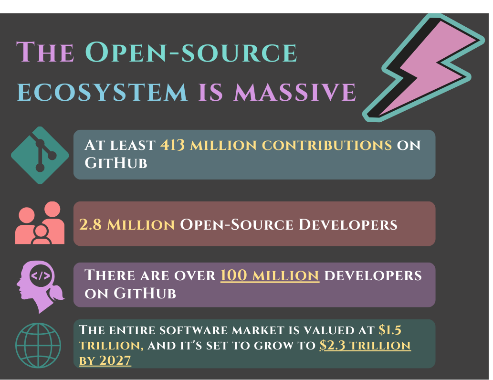
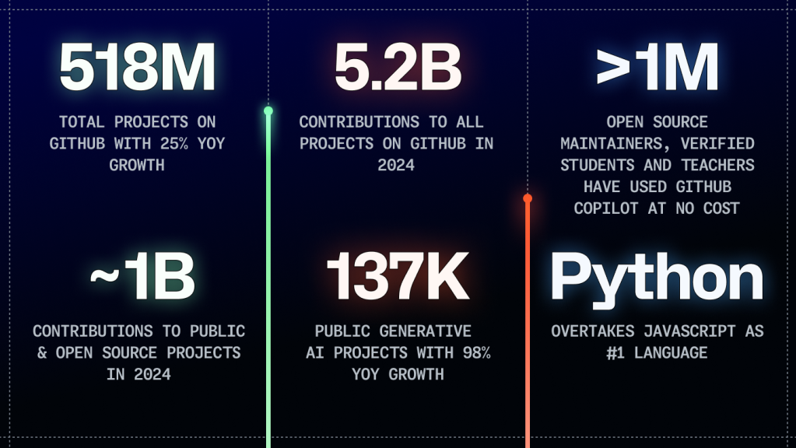
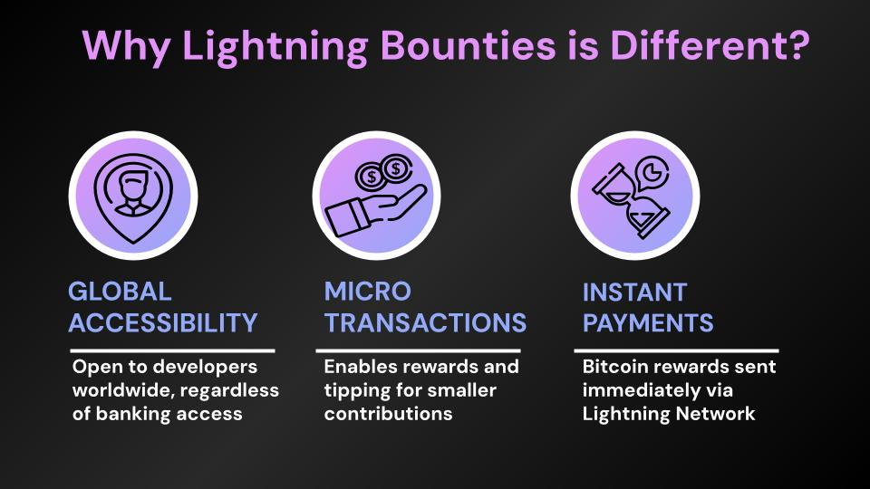
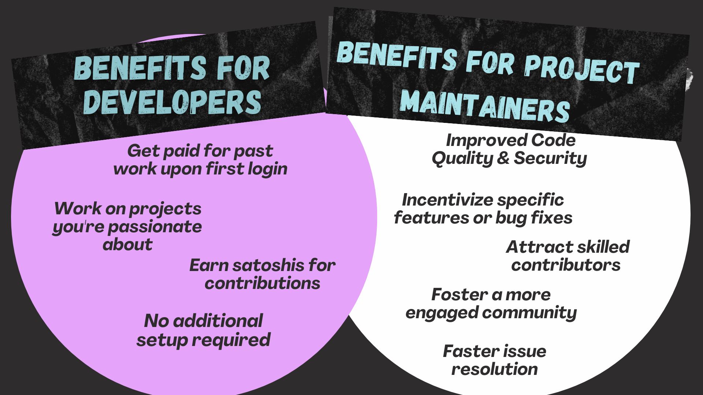
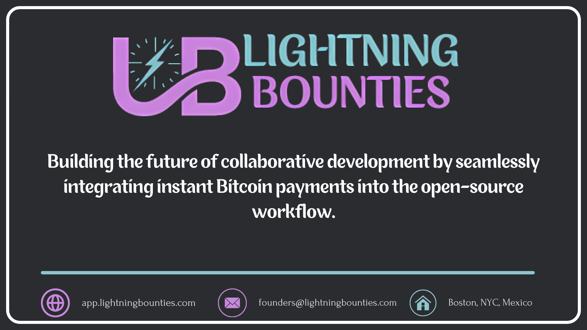

# Exploring Lightning Bounties: The Intersection of Open-Source and Bitcoin

## The State of Open Source Development

In the $1.5 trillion software industry, open-source software has become the foundation of innovation, with 90% of companies relying on it. However, a striking disparity exists: while 76% of modern codebases are built on open-source foundations, only 21% of maintainers receive compensation for their invaluable contributions. This misalignment is particularly glaring, considering [GitHub's massive ecosystem of over 100 million developers contributing more than 5.2 billion commits annually.](https://github.blog/news-insights/octoverse/octoverse-2024/)

<figure><figcaption></figcaption></figure> <figure><figcaption></figcaption></figure>

The challenge lies not in a lack of talent but in infrastructure and incentives. Millions of skilled developers, especially in the Global South, remain disconnected from high-impact opportunities due to traditional banking restrictions, complex payment systems, and geographical barriers. This untapped potential hinders innovation and stifles the growth of critical projects.

<figure><figcaption>
2024 GitHub Octoverse Report
</figcaption></figure>

## Introducing Lightning Bounties: A Solution for Global Collaboration

Lightning Bounties emerges as a transformative platform to bridge this gap, leveraging Bitcoin's Lightning Network to create a truly borderless bounty aggregator for open-source development. By leveraging the speed and efficiency of the Lightning Network, Lightning Bounties enables immediate Bitcoin payouts for approved pull requests, eliminating delays and fees associated with traditional payment methods.

## **Key Features and Benefits:**

1. **Instant Compensation:** Utilizes the Lightning Network for immediate Bitcoin payouts.
2. **Global Accessibility**: Opens doors for talent worldwide, including those in underserved regions.
3. **Lowered Barriers to Entry**: Seamless integration with GitHub streamlines the contribution process.
4. **Diverse Contributions**: Welcomes various forms of input, from coding to documentation and design.
5. **Community-Driven Crowdfunding**: Enables collective funding of critical issues and features.
6. **Lightning-Fast Payments**: Processes transactions at unprecedented speeds, regardless of amount or destination.

<figure><figcaption>
<a href="https://www.lightningbounties.com">www.lightningbounties.com</a>
</figcaption></figure>

## Driving Lightning Network Development

Lightning Bounties plays a crucial role in accelerating the growth and security of the Lightning Network itself. By incentivizing contributions to Lightning Network projects, the platform ensures that this vital infrastructure receives the attention and resources it deserves. This collaborative effort not only accelerates the network's development, it also ensures its resilience, paving the way for a more efficient and scalable Bitcoin ecosystem.

<figure><figcaption></figcaption></figure>

## Democratizing Participation&#x20;

Our platform emphasizes inclusivity by welcoming diverse contributions beyond complex coding tasks. This approach nurtures the growth of individual developers and cultivates a diverse community that taps into the collective genius of developers worldwide.

## Aligning with Open-Source and Bitcoin Principles

Lightning Bounties embodies the ethos of both the open-source community and Bitcoin itself. It aligns with principles of transparency, collaboration, permissionless contribution, decentralization, and censorship resistance. By enabling anyone to contribute to open-source projects and be instantly rewarded, it creates a new paradigm where online collaboration mirrors these core values.

## Promoting a Global, Decentralized Workforce

Lightning Bounties transcends the limitations of traditional freelance models, empowering developers worldwide to collaborate seamlessly. It challenges the notion of a centralized workforce, fostering a paradigm of decentralized collaboration where talent is recognized based on merit, not location. This shift democratizes access to opportunities, enabling developers to forge their own paths as global freelancers.

<figure><figcaption>
<a href="https://www.developerreport.com/developer-report?s=72-of-crypto-developers-live">Source: Electric Capital</a>
</figcaption></figure>

## A New Paradigm for Innovation

Lightning Bounties symbolizes a paradigm shift in open-source collaboration and the future of work. By aligning with principles of decentralization, permissionless participation, and financial inclusivity, it paves the way for a more equitable and innovative digital economy. The platform's commitment to financial inclusivity empowers individuals to take control of their financial futures and participate in the global marketplace on their own terms.



## Conclusion

Lightning Bounties represents a transformative vision that aligns the ethos of open-source development with the principles of decentralization and global accessibility. By leveraging the Lightning Network and Bitcoin's borderless nature, it empowers a global workforce of developers to contribute to the future of the decentralized web. As we move forward in this interconnected world, platforms like Lightning Bounties serve as beacons of what's possible when technology, creativity, and inclusivity converge, paving the way for a more equitable and innovative digital future.

<figure><figcaption>
<a href="https://www.lightningbounties.com">www.lightningbounties.com</a>
</figcaption></figure>
