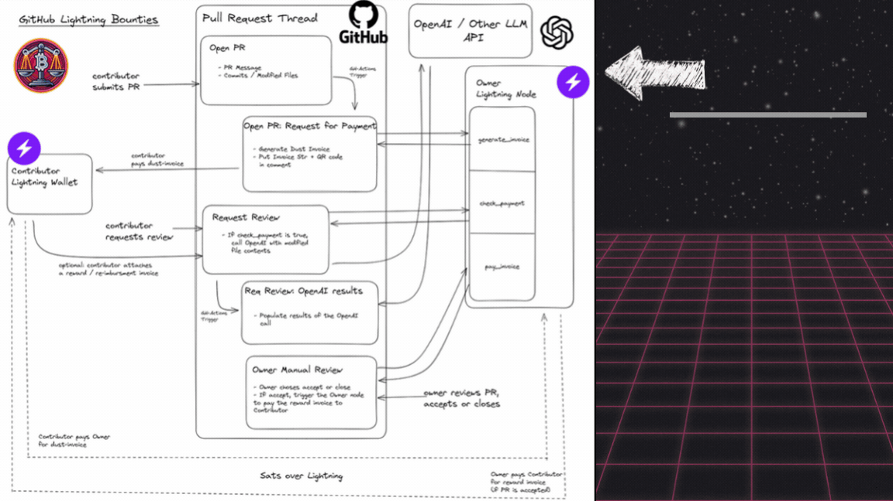
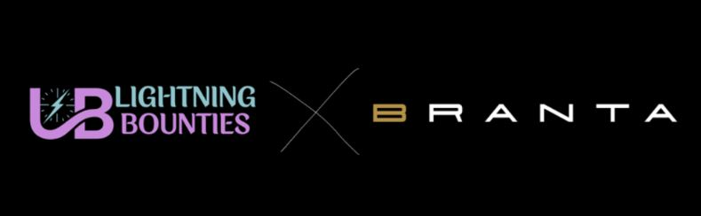
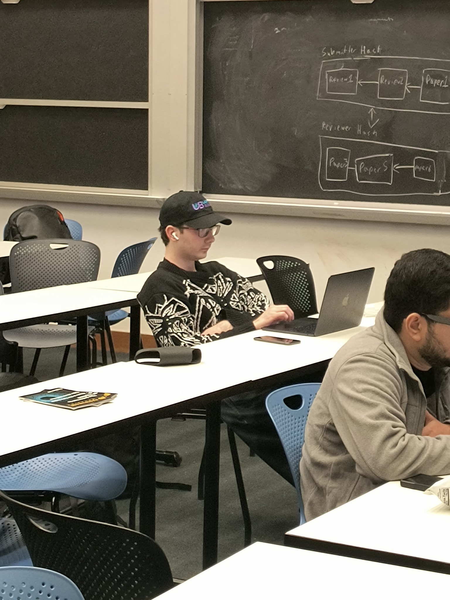

# Lightning Bounties Turns One: Our Year in Review

Remember that feeling when you're building something in your basement and suddenly realize it might just be something that someone will use? That's basically us right now, looking back at Lightning Bounties' first year. When we huddled together at the MIT Bitcoin Hackathon last April, we were just a bunch of indie hackers with a crazy idea: what if we could use the Lightning Network to fix open-source funding? Fast forward one year, and we've gone from scribbling ideas on dusty notebooks to processing over a million sats across our platform. Grab some coffee (or whiskey) and let me walk you through the rollercoaster that's the first year of Lightning Bounties.

## Winning the 2024 MIT Bitcoin Hackathon

Our journey began during a historic weekend—April 19-21, 2024—coinciding with Bitcoin's fourth halving. While the crypto world watched the halving countdown, our team huddled at MIT with a mission: solve a critical problem plaguing open-source development.


The statistics told a troubling story: 76% of modern codebases rely on open-source foundations, yet only 21% of maintainers receive compensation for their contributions. This disconnect wasn't just a statistic—it represented countless hours of unrecognized work powering our digital world.
\
Over 30 caffeine-fueled hours, we built "Lightning Bounties," integrating GitHub Actions with Bitcoin rewards through the Lightning Network. Our pitch was simple but powerful: create a easy way for open-source contributors to receive instant compensation through borderless Bitcoin payments.

<figure><figcaption>
Hackathon Award Ceremony — <strong>Lightning Bounties P</strong>resenting
</figcaption></figure>


\
When we were announced as first-place winners in the Bitcoin, Lightning & Taproot track, it wasn't just a victory for our team—it validated that we'd identified a real problem with a viable solution. The bragging rights was nice, but the enthusiastic feedback from judges and fellow hackers convinced us we were onto something bigger than a weekend project.


_Read the full recap of our MIT Hackathon experience in our_ [_dedicated Blog Post here_](https://medium.com/@jegamboafuentes/our-epic-win-at-the-mit-bitcoin-hackathon-2024-34fab944e78d)_._


## From Hackathon Project to Forming an LLC

The post-hackathon high quickly gave way to the realities of building a sustainable platform. Transforming our prototype into a legitimate business meant tackling unfamiliar territory: legal structures, business models, and strategic planning.

Forming our LLC wasn't just paperwork—it represented our commitment to building something lasting. Each team meeting became more structured, shifting from "wouldn't it be cool if..." conversations to discussions about user acquisition, development roadmaps, and sustainability. The transition taught us valuable lessons about building in both the Bitcoin and open-source spaces. We learned to balance innovation with practicality, idealism with sustainability. Most importantly, we discovered that our passion for connecting value to contribution resonated deeply with both communities.

## Embracing Self-Sovereignty: From GitHub Plugin to Independent Platform

<figure><figcaption>
Architecture Before 
</figcaption></figure>

Our most pivotal decision came when we transitioned from a GitHub plugin to our own self-hosted platform. Building as a GitHub Action initially made sense for rapid deployment, but we quickly realized we'd be building on quicksand—one policy change could wipe us out overnight.

Late-night team discussions always circled back to the same Bitcoin principle: "Why sacrifice self-sovereignty when it's the very foundation of what we believe in?" The answer was clear.

Our pivot to app.lightningbounties.com became our declaration of independence. We built a platform that leverages GitHub's API while maintaining complete control of our destiny—essentially becoming a Layer 2 solution atop GitHub's infrastructure. Contributors still interact with familiar GitHub workflows while we handle the Lightning payments independently.

<figure><figcaption>
Simplified Architecture After 
</figcaption></figure>

By year's end, with over 1 million sats flowing through our platform, we'd proven that in true Bitcoin fashion, choosing sovereignty over convenience pays dividends.

## Lightning Bounties Launch / PlebLab Startup Day CMDX

<figure><figcaption></figcaption></figure>

September 20, 2024, marked a pivotal moment for Lightning Bounties—our official debut to the Bitcoin world at PlebLab's Startup Day in Mexico City. This wasn't just another presentation; it was our "getting out of our basement and introducing the world to Lightning Bounties" moment. Behind the scenes, our development team was working tirelessly to ensure everything ran smoothly. [Will ](https://x.com/WillSuttonCodes)and [Pavel ](https://x.com/pavelkononov93)were coding around the clock, squashing bugs and optimizing performance to transform what once took 30 seconds in our Alpha stage into an almost instantaneous experience.

Meanwhile, [Mike ](https://x.com/SonnyTheDegen)and [Enrique ](https://x.com/JEGamboaFuentes)were on the ground in Mexico City, refining our presentation while simultaneously trying to ward off Montezuma's revenge—a challenge that only added to the pre-presentation jitters. As we took the stage, hearts racing despite countless rehearsals, Enrique executed each click and transition flawlessly, demonstrating the platform we'd poured our hearts into building.

### **Finding Our Home in the Bitcoin Ecosystem**

By the event's conclusion, any doubts about where Lightning Bounties belonged had completely dissolved. As the formal presentations gave way to the Yopaki Block Party, featuring gourmet food, bottomless drinks, and even a surprise mariachi band, we found ourselves forming meaningful connections that would shape our future. Particular highlights included meeting[ Dr. Bitcoin](https://x.com/DrBitcoinMD), the founder and CEO of [TimeStamp Financial](https://www.timestampfinancial.com/) who became our impromptu mentor, offering invaluable insights and ongoing guidance. An interview with a Bitcoin Journalist and legend, [Juan Galt ](https://x.com/JuanSGalt)not only garnered thousands of views but doubled our Twitter following overnight.&#x20;


Lightning Bounties Featured on[ Bitcoin News](https://x.com/BitcoinNewsCom)


We came away from Startup Day with absolute certainty that we had found our home in the Bitcoin ecosystem—the most inspiring and dynamic community in all of crypto. The connections made, knowledge gained, and support received energized us like never before, leaving us more motivated than ever to continue building Lightning Bounties into the best platform it could possibly be.


Read the Full Recap in Our Blog Post :point\_up\_2:


## Security First: Partnering with Branta

<figure><figcaption>
Partnership with Branta
</figcaption></figure>

As our platform handled increasing transaction volumes, security became our top priority. Our partnership with Branta to secure BOLT-11 deposits represented not just a technical integration but our commitment to building trust with users.

The collaboration introduced critical security features:

* **Deposit Verification**: Implemented a system allowing users to verify payments before processing.
* **Tamper Detection**: Enabled identification of client-side tampering that was previously impossible to detect.
* **Security Flagging**: Created mechanisms to flag non-matching BOLT-11 deposits as suspect.

These enhancements addressed vulnerabilities that are often overlooked in Lightning implementations. By verifying deposits and detecting tampering, we created a more secure environment for both project owners and contributors—building the trust necessary for our platform's continued growth.


Read The Full Announcement :point\_up\_2:


## Lightning Bounties Enters PlebLab’s Top Builder Season II

<figure><figcaption></figcaption></figure>

When we submitted our application to PlebLab's Top Builder Season ||, we essentially threw our fledgling project into a pressure cooker alongside Bitcoin's most ambitious builders. From day one, we embraced the "ship or sink" mentality that permeates the Bitcoin space. By Week 2, we'd deployed our Time Lock and Expiry feature to production, striking that crucial balance between security and user experience. Behind the scenes, our internal analytics dashboard gave us the cold, hard metrics that became our north star: percentage of solved bounties, average sats per bounty, and developer engagement rates.

<figure><figcaption>
Top Builder Season 2: Stats
</figcaption></figure>

The competition's accelerated timeline pushed us to eliminate friction at every opportunity. [Week 6](../top-builder-2025/lb-x-top-builder-weekly-recap/week-6-lb-x-top-builder-recap.md) became our feature blitz with the launch of Anonymous Rewards and "Add Without Login" capabilities—strategically removing barriers to entry. All while maintaining our dual focus of building features and documenting everything we learned.


Read Our Weekly Recaps  of our Top Builder Journey :point\_up\_2:


## **Lightning Bounties: Top Builder Season II Finalists**

The announcement in[ Week 7 ](../top-builder-2025/lb-x-top-builder-weekly-recap/week-7-lb-x-top-builder-recap.md)validated our efforts: Lightning Bounties had secured a spot as one of just five finalists heading to Austin. Preparing for PlebLab's Startup Day on March 13th consumed every moment as we refined our demonstration to showcase our platform's simplicity and direct access to GitHub's massive developer community.

Standing on that Austin stage alongside innovators like [Branta](https://www.branta.pro/), [Shopstr](https://shopstr.store/), [Sats.gg](https://sats.gg/), and [Jippi ](https://jippi.app/)was both humbling and energizing. Though we didn't take home the top prize, we gained something more valuable: battle-tested experience and crystal-clear direction. The compressed timeline of Top Builder forced us to make hard choices about prioritization and to refine our messaging relentlessly. This pressure-cooker environment provided exactly the exposure, validation, and focus we needed to propel Lightning Bounties into its next chapter—one where we could apply these hard-won lessons to serve our growing community of bounty hunters and open-source maintainers.


Lightning Bounties Full Pitch☝️


## Alby Community Call (Gaining Traction)

<figure><figcaption></figcaption></figure>

When [Alby ](https://getalby.com/)reached out via Twitter asking if we'd join their community call, I nearly spilled RedBull all over my keyboard. For context, this is like being an indie band and suddenly getting a text from Spotify asking if you want to be on their featured playlist. [Alby ](https://getalby.com/)is THE browser extension for Lightning payments—a platform we assumed would never notice us in an ocean of impressive Bitcoin projects. The call itself was equal parts terrifying and exhilarating.&#x20;

We shared our vision, demonstrated our platform, and waited for the inevitable "thanks but no thanks." Instead, something magical happened—people got it. They understood what we were building and why it mattered. The cherry on top? Within 2 hours of that call, someone posted our first [100,000 sat bounty](https://app.lightningbounties.com/issue/d5c82783-149d-4a3b-bc97-ebb1d2482816). Six figures of sats might not sound like much to the VCs of the world, but for us, it was validation in the most Bitcoin-native way possible: someone valued our platform enough to put their sats where their mouth was.&#x20;

Even more surprisingly, the call opened our eyes to an entire market we'd overlooked—Nostr. The positive reception from the Nostr community made one thing clear: Lightning Bounties needed to expand beyond Twitter. You can bet your sats you'll see us engaging more with the Nostr ecosystem in the coming weeks. Sometimes the best opportunities come from the places you least expect to find them.

## Full Circle: Mentoring at the 2025 MIT Bitcoin Hackathon

<figure><figcaption></figcaption></figure>

In a full-circle moment that perfectly captured our journey, we returned to the [MIT Bitcoin Hackathon](https://mitbtcexpo.org/index.html) in April 2025 – not as participants this time, but as mentors. Just one year after winning the competition ourselves, we had the privilege of helping the next generation of Bitcoin builders bring their ideas to life.

<figure><figcaption>
Judge Pavel
</figcaption></figure> <figure><figcaption>
Pavel Mentoring
</figcaption></figure>

<figure><figcaption>
Will Mentoring the Hackers
</figcaption></figure> <figure><figcaption>
Judge Enrique
</figcaption></figure>

[Will Sutton](https://x.com/WillSuttonCodes) from our team conducted a workshop titled "Setup LNBits on MutinyNet," teaching participants to build Lightning Network applications without risking real funds. Our team members [Enrique Gamboa](https://x.com/JEGamboaFuentes) and [Pavel Kononov](https://x.com/pavelkononov93) also served as judges, evaluating the impressive projects created during the hackathon. This experience was one of the most rewarding so far, seeing the next wave of Bitcoin builders solve complicated bugs, share knowledge with one another and push themselves through 30 hours of intense hacking was something that we all found inspiring.

<figure><figcaption>
The 2025 MIT Bitcoin Hackathon by the Numbers
</figcaption></figure>

As a result, the projects submitted in this years hackathon were arguably the best and most creative in the Expo’s rich history.


Read the Full Recap of our Experience in Here :point\_up\_2:


## What's Next For Lightning Bounties? Our Vision for Year Two

As we celebrate our first trip around the sun, we're setting ambitious goals for Year Two. Building on our foundation of connecting value to contribution, we're focusing on platform enhancements, community growth, and strategic positioning in both the Bitcoin and open-source ecosystems.

Our goals for year two include:

1. **Transitioning from LLC to C-Corp:** Converting our legal structure to position Lightning Bounties for serious investment opportunities. This transformation enables us to issue different stock classes, and speak the same language as VCs when we're ready for growth capital. Put simply: we're building the legal foundation to scale beyond what bootstrapping alone would allow.
2. **Hackathon Organization and Workshops:** Leveraging our experience as both winners and mentors at the MIT Bitcoin Hackathon to organize our own events. Our platform is tailor-made for hackathons with instant payments and clear success metrics, creating opportunities to introduce more developers to Lightning Network's power.
3. **Enhanced GitHub Automation and PR Templates:** Developing standardized templates and automated workflows that streamline the bounty fulfillment process. These improvements ensure consistent submission quality and make it easier for contributors of all skill levels to participate effectively.
4. **Comprehensive Onboarding Resources:** Developing detailed documentation and video tutorials that make Lightning Bounties accessible to developers of all experience levels. These resources will reduce the learning curve and help showcase our platform's full capabilities to both bounty hunters and project maintainers.
5. **User-Driven Product Iteration:** Creating formal feedback channels and a transparent feature request system where users can see their suggestions turn into roadmap items. Our platform will evolve based on actual usage patterns rather than our assumptions about what might be useful.

## Conclusion: From Proof-of-Concept to Proof-of-Value

<figure><figcaption></figcaption></figure>

One year ago, Lightning Bounties was just an idea—a hopeful solution to the critical disconnect between open-source value creation and contributor compensation. Today, we're processing millions of sats in bounties, connecting developers worldwide, and demonstrating that Bitcoin isn't just a store of value—it's a powerful engine for recognizing and rewarding value creation in real-time.

What we've built goes beyond a payment platform. We're creating an ecosystem where contribution is valued immediately and transparently, where open-source maintainers can sustain their work, and where the global developer community can participate regardless of geographic or financial barriers.

The journey from hackathon project to a vibrant platform has taught us countless lessons, but perhaps the most important is this: when you align value with contribution using the power of Bitcoin, magic happens. Communities form. Innovation accelerates. Barriers fall.

## How You Can Get Involved

If you've read this far, you're probably either a believer in what we're building or curious enough to give it a shot. Here's how you can be part of the Lightning Bounties revolution:

1. **For Project Maintainers**: Post your first bounty today at [app.lightningbounties.com](https://app.lightningbounties.com) and see how incentivizing contributions can transform your project's momentum.
2. **For Developers**: Join our growing [community of bounty hunters](https://discord.gg/zBxj4x4Cbq)—earn sats while contributing to meaningful open-source projects that match your skills and interests.
3. **For Bitcoiners**: Spread the word! Share our platform with your favorite open-source projects, especially those struggling with maintainer burnout or contribution bottlenecks.
4. **For Everyone**: Follow our journey through our social channels (listed below) for updates, success stories, and opportunities to shape our platform's future.



## This Is Just Beginning

We believe Lightning Bounties represents something fundamental to both Bitcoin and open-source: the recognition that value should flow to those who create it, without friction, permission, or delay. As we enter our second year, we're not just building features—we're building a future where contribution and compensation are seamlessly connected through the power of Bitcoin.

The first million sats was just the beginning. Join us for the next hundred million.

<figure><figcaption>
Team in Work Mode
</figcaption></figure> <figure><figcaption>
Team in Play Mode
</figcaption></figure>

⚡️ The Lightning Bounties Team
