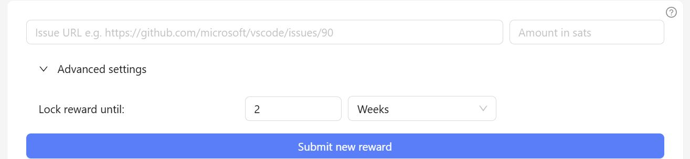
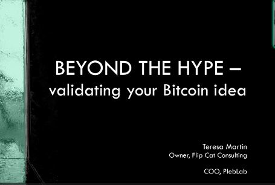

# Week 1: LB x Top Builder Recap

## PlebLab's Week 1 Recap: Lightning Bounties

### Let's Dive into Week 1 of Top Builder

In this section, we'll explore the events and highlights of the first week.

Welcome to the inaugural edition of PlebLab's Week 1 Recap, presenting insights from the perspective of Lightning Bounties! In this edition, we’ll share the valuable lessons we've learned, highlight the progress we've made with developing our bounty platform, and offer an overview of the engaging Top Builder workshops.

## Meeting the Teams

***

We had an exciting opportunity to preview and meet the participants in the Top Builder contest. This competition is filled with innovative projects designed to onboard new users to start stacking sats and use Bitcoin in unprecedented ways.

Watch the recording below to learn about the teams and their projects. :arrow\_down:



Seeing all of these amazing projects and meeting the teams behind them got us over at the Lightning Bounties team excited to roll up our sleeves and get involved. Here is a brief breakdown of what we have accomplished in Week 1

## Putting Together Our Roadmaps: Dev and Biz Dev Bored

### Roadmap and Task Breakdown&#x20;

Before diving into development, we prepared a milestone roadmap and task list. Our roadmap is divided into two main sections:

* **Developer Tasks**: Handled by Will and Pavel.
* **Business Development**: Managed by Enrique and Mike.

### Developer Roadmap /Issue Tracker for Top Builder&#x20;

Will outdid himself by creating an exceptional issue tracker for our Top Builder roadmap. It neatly organizes our milestones, defines clear deliverables, and sets a strong foundation for how we’ll tackle upcoming tasks. By using [this GitHub project](https://github.com/orgs/Lightning-Bounties/projects/2/views/1) as our blueprint, we can easily pinpoint priorities, assign responsibilities, and track progress in real-time. This level of transparency and structure ensures the entire team stays aligned on what needs to be done when it needs to be done, and who is responsible for each piece of the puzzle.

### Biz Dev Roadmap /Tasks Tracker for Top Builder

Using Will's issue tracker as a guide, the Biz dev team created a Notion-flavored business development tracker. It’s tailored to help us prioritize key business goals like refining our pitch, getting our LLC converted into a C-Corp, improving our documentation, and adding content for our Blog while serving as sort of a PoW while in Top Builder. This reminds me that I need to find bounties to post on our app. Interested? Ping me [here ](mailto:mike@lightningbounties.com)&#x20;

<table data-card-size="large" data-column-title-hidden data-view="cards" data-full-width="false"><thead><tr><th></th><th></th><th data-hidden data-card-cover data-type="files"></th><th data-hidden data-card-target data-type="content-ref"></th></tr></thead><tbody><tr><td><a href="https://lb-bizdev.notion.site/topbuilder-season-2?v=176e1fe7ce6b8168b785000c4c58ed88"><strong>Business Development Task Tracker</strong></a></td><td>Keep an eye on our business development plans and achievements. This tracker outlines our roadmap and the tasks we focus on during the Top Builder competition.  </td><td><a href="../../.gitbook/assets/notion_bizdev_ss (2).JPG">notion_bizdev_ss (2).JPG</a></td><td><a href="https://lb-bizdev.notion.site/topbuilder-season-2?v=176e1fe7ce6b8168b785000c4c58ed88">https://lb-bizdev.notion.site/topbuilder-season-2?v=176e1fe7ce6b8168b785000c4c58ed88</a></td></tr><tr><td><a href="https://github.com/orgs/Lightning-Bounties/projects/2/views/1"><strong>Development Task Tracker &#x26; Roadmap</strong> </a></td><td>Follow along with our development efforts. This tracker highlights our ongoing projects, key milestones, and progress we've made during the Top Builder competition.</td><td><a href="../../.gitbook/assets/github_tb_issue_ss.JPG">github_tb_issue_ss.JPG</a></td><td><a href="https://github.com/orgs/Lightning-Bounties/projects/2">https://github.com/orgs/Lightning-Bounties/projects/2</a></td></tr></tbody></table>

Together, these tools ensure we’re not just moving forward but doing so with clarity and purpose.

## **New Feature: Lock Time and Expiration for Bounties**

\
The Dev Team introduced a _lock time_ feature that holds each bounty’s reward in escrow for a set period—typically recommended at two weeks. This locked window confirms for bounty hunters that if they submit a valid solution before the time is up, the reward is guaranteed. However, once the lock time ends, the reward doesn’t automatically disappear—bounty hunters can still claim it. What does change is that the bounty poster now has the option to _expire_ the bounty if their priorities shift or if they solve the issue independently. Through this approach, bounty hunting becomes less risky for contributors (they know funds are firmly allocated) and more flexible for project teams (they can quickly adapt and reclaim funds for other pressing needs).&#x20;

Overall, lock times protect hunters by assuring them the reward is available, while expiration safeguards bounty posters by letting them recover any unclaimed rewards for future bounties or other development tasks. This balance of certainty and flexibility makes bounty-driven collaboration smoother and more efficient.

<figure><figcaption>
Issue Lock Reward in Test
</figcaption></figure>

This feature is currently in our test app but willl be implemented in our main app in the coming weeks.&#x20;

## Workshop: _'Beyond the Hype Validating Your Bitcoin Idea'_ By Teresa Martin

_See the complete workshop below_ :arrow\_down:



One of the key takeaways was the importance of concept viabili[^1]ty. It's not enough to have a cool idea; we need to ensure our solution addresses a real problem and is unique enough to stand out in the market. This immediately resonated with me due to my past experiences with doing tokenomics analysis for early-stage projects looking to launch a token. Most of my work involved competitor analysis researching how our clients' projects would bring in demand for their tokens. To make a long story short, most of the projects I researched were forks of existing successful projects that claimed to be different or innovative. The truth is, these projects were all the same, just different front-end code.

Another valuable lesson was about gathering feedback and testing early. Teresa suggested building prototypes and testing concepts before investing too much time and resources into full product development. We have begun interviewing our bounty hunters and the feedback has been incredible. However, we are always looking for feedback and implementing features, so feel free to contact us with any suggestions and we can set up a time to discuss each other’s projects. For your time, we are happy to pay you some sats for your feedback.

Teresa’s presentation has reinforced the importance of thorough in-depth research, resilience, and tapping into the experience of those who have navigated these waters before can be incredibly beneficial in building a successful Bitcoin-focused business.

With this in mind, we are lucky to be part of Top Builder where we can connect with founders who've secured investments in the Bitcoin space which will be a priority for us. Their insights and advice will be crucial as we navigate the unique challenges of building a Bitcoin-native business.

<figure><figcaption>
Bitcoin Beyond the Hype
</figcaption></figure> <figure><figcaption>
Remember to Research  
</figcaption></figure>

## Wrapping it Up:

The Lightning Bounties team is dedicated to sustaining our current momentum and is excited to see continued growth from the ideas and projects generated this week. These will significantly contribute to the wider Lightning Network community. For those interested in joining our mission, we welcome your involvement to help make an impact.

After an energizing Week 1, we are focused on advancing our roadmap, launching new features, and applying insights from Pleblab mentors and fellow builders. This week has laid a solid foundation for future initiatives.

The Top Builder competition has already emerged as an excellent avenue for growth, learning, and networking with other passionate Bitcoin builders. We eagerly anticipate the developments of  Week 2 as we continue advancing Lightning Bounties!

[^1]: 
