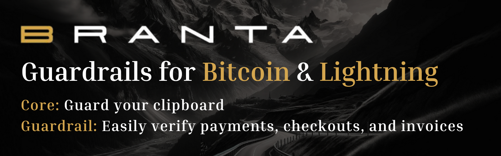

# Week 2: LB x Top Builder Recap

## PlebLab's Week 2 Recap: Lightning Bounties

In this weeks edition, we’ll explore the key milestones and achievements from the second week of Pleb Lab's Top Builder competition. For week 2, Lightning Bounties focused on expanding our business development efforts, documenting our journey, and implementing our Time Lock and Bounty Expiry feature onto our production app. Join us as we dive into an eventful Week 2 of Top Builder and explore what these developments mean for Lightning Bounties!

### **Time Lock and Expiry Feature Now Live on Lightning Bounties!**

We're excited to announce that after a week of rigorous testing in our development environment, the Time Lock and Expiry feature is now live on [app.lightningbounties.com](https://app.lightningbounties.com)! This new functionality brings a significant enhancement to our platform, balancing security for bounty hunters with flexibility for project teams.

**Key Features:**

* **Time Lock**: Each bounty's reward is held in escrow for a set period (typically two weeks), guaranteeing the reward for valid submissions within this timeframe.

<figure><figcaption>
<strong>Time Lock</strong> 🔝
</figcaption></figure>

* **Expiry Option**: After the lock period, bounty posters can expire unclaimed bounties if priorities change or issues are resolved internally.

<figure><figcaption>
<strong>Expiry Option on Past Due Bounties</strong> 🔝
</figcaption></figure>

**Why It Matters:**\
This feature makes bounty hunting less risky for contributors while giving project teams more control over their resources. It ensures that funds are firmly allocated for a specific period, encouraging participation, and then allows for adaptability as project needs evolve.

### **GitHub Integration Improvements**

* We encountered and swiftly addressed a schema change in GitHub's API.
* This led to improved health checks and more reliable integration with GitHub.
* A key improvement: GitHub now guarantees that merging a PR will close associated issues, enhancing our workflow reliability.

### **What's Next: Dev Milestone 2 Planning**

**Key Focus Areas**

* Non-logged-in crowdfunding has been identified as a top priority to drive business development traction.
* We've reshuffled some items:
  * Lightning Network withdrawal enhancements moved to v3
  * Some infrastructure and developer experience items from v1 added to v2

**Ongoing Tasks**

* Implementing time tracking for development periods
* Collaborating with @BrantaOps for expiry feature testing

We're excited about these developments and the direction we're heading. Stay tuned for more updates as we continue to build and improve Lightning Bounties!

### **Documenting Our Journey: Week 1 Recap & Diving Into Branta**&#x20;

For week 2, we kicked off our journey in the Top Builder competition by publishing our [**Week 1 Recap**](week-1-lb-x-top-builder-recap.md), highlighting our interactions with fellow Top Builder Teams, what we learned from the Week 1 workshops, development progress and lessions we learned along the way. This[ blog post](week-1-lb-x-top-builder-recap.md) provides a transparent look into our progress while celebrating collaborative milestones. We also featured [**Branta**](../top-builder-x-lightning-bounties/top-builder-teams/branta-guardrails-for-bitcoin-and-lightning.md), a Top Builder team and valued partner of Lightning Bounties, in a dedicated article. [Branta’s ](https://www.branta.pro/)important solutions, such as wallet verification, transaction protection, and Lightning Network integration, provide essential safeguards for Bitcoin users, aligning perfectly with our mission to enhance security and usability in the Bitcoin ecosystem.

<figure><figcaption>
<a href="week-1-lb-x-top-builder-recap.md">Click Here to Read Full Article</a>
</figcaption></figure> <figure><figcaption>
<a href="../top-builder-x-lightning-bounties/top-builder-teams/branta-guardrails-for-bitcoin-and-lightning.md">Click Here to Read Full Article</a>
</figcaption></figure>

We’re excited to continue featuring Top Builder teams in future posts and invite others to contact [**mike@lightningbounties.com**](mailto:mike@lightningbounties.com) for an interview to share their story with the community!

### Alanytics Dashboard for Lightning Bounties

Thanks to Enrique's efforts, the Biz Dev team has developed an internal dashboard to visualize key metrics for our bug bounty platform. This dashboard tracks essential data, including the percentage of open versus solved bounties, average and total sats per bounty, the number of developers, unique repositories, and Twitter follower growth. These insights will enhance our understanding of user engagement and help us refine our strategies. In the coming weeks, we will actively monitor these metrics and make necessary adjustments to ensure our platform remains attractive to both bounty issuers and hunters.

Below are some screenshots of our Dashboard in action:

<figure><figcaption>
Metrics Dashboard
</figcaption></figure> <figure><figcaption>
Data on User Demographics
</figcaption></figure> <figure><figcaption>
Data on Time Spent Solving a Bounty
</figcaption></figure>

### **Documentation Bounties Are Live—Contribute with Ease!**

The Lightning Bounties team reached an exciting milestone by creating a [**Contributing Guide**](../top-builder-x-lightning-bounties/top-builder-teams/suggesting-changes.md) that makes it easier than ever for open-source contributors to improve our Blog and Documentation sites. This [guide ](../top-builder-x-lightning-bounties/top-builder-teams/suggesting-changes.md)offers simple, step-by-step instructions for making edits directly through GitHub—no need to fork the entire repository. With GitBook seamlessly integrated into GitHub, contributors can quickly find, edit, and propose changes, streamlining the entire process.

<figure><figcaption>
Edit on GitHub Located Top Right of Each Doc/Blog Page
</figcaption></figure>

This effort not only improves the quality of our written content but also encourages community engagement by rewarding  approved contributions with a minimum of **5,000 sats**. If you have ideas to further simplify or improve our documentation, we’d love to hear from you! Visit our platform at [app.lightningbounties.com ](https://app.lightningbounties.com/issue/40bbd95b-929b-4502-92d3-2028159fb79c)and help us make our documentation better for everyone. Your contributions matter!

## YoPaki Mentorship Session

The YoPaki Mentorship workshop, led by Francisco, whom we met at the 2024 PlebLab Startup Day in Mexico City, provided valuable advice for developers and entrepreneurs looking to build on Bitcoin & Lightning. Francisco anticipates a significant influx of developers entering this space within the next 12-18 months, highlighting the growing importance of Lightning Network applications. The workshop emphasized the challenges of getting apps approved on Apple and Android app stores, particularly for those dealing with Bitcoin payments. Key advice included being prepared for initial rejections, appealing decisions after multiple rejections, and carefully framing the app's functionality to avoid raising red flags with app store reviewers.

The session also touched on the complexities of navigating Geo-IP restrictions and jurisdictional rules, emphasizing the need for patience and collaboration with other Bitcoin companies to overcome these hurdles. Francisco encouraged Top Builder teams to collaborate with each other and stressed the importance of discerning good advice from bad when receiving feedback. For those seeking funding, the workshop highlighted that VCs often look for founders with a track record of successful fundraising and teams capable of delivering on their roadmaps. Setting realistic goals and maintaining momentum throughout the development process were identified as crucial factors for success in the Lightning Network ecosystem.

To learn more about YoPaki, click the images below to view their presentation and elevator pitch at PlebLab’s 2024 startup day. Also, stay tuned for their Android app store release coming soon and if you have an iPhone check out YoPaki's website to download the app and start stacking sats!&#x20;

<table data-view="cards"><thead><tr><th align="center"></th><th data-hidden data-card-cover data-type="files"></th><th data-hidden data-card-target data-type="content-ref"></th></tr></thead><tbody><tr><td align="center"><a href="https://www.yopaki.com/"><strong>Website</strong></a></td><td><a href="../../.gitbook/assets/yopaki_logo_no_bg.png">yopaki_logo_no_bg.png</a></td><td><a href="https://www.yopaki.com/">https://www.yopaki.com/</a></td></tr><tr><td align="center"><a href="https://youtu.be/jVtekBhztdg?si=CganMIjin4ZqdcoS"><strong>Presentation</strong></a></td><td><a href="../../.gitbook/assets/yopaki2_yt.PNG">yopaki2_yt.PNG</a></td><td><a href="https://youtu.be/jVtekBhztdg?si=kS81SSx4KWg7EH6h">https://youtu.be/jVtekBhztdg?si=kS81SSx4KWg7EH6h</a></td></tr><tr><td align="center"><a href="https://x.com/BitcoinNewsCom/status/1838688514038280276"><strong>Elevator Pitch</strong></a></td><td><a href="../../.gitbook/assets/yopaki_pitch.PNG">yopaki_pitch.PNG</a></td><td><a href="https://x.com/BitcoinNewsCom/status/1838688514038280276">https://x.com/BitcoinNewsCom/status/1838688514038280276</a></td></tr></tbody></table>

## PlebLab Early Days Interview with Lightning Bounties&#x20;

Our interview with Car on PlebTV's Early Days Podcast was a highlight of the week. It was a great opportunity to reflect on how Lightning Bounties came to life and share our journey so far. Car asked insightful questions about our decision to build on the Lightning Network, how we’ve tackled challenges like managing development alongside operations, and the lessons we’ve learned along the way.&#x20;

We also discussed how using Lightning Bounties for our own development has helped us refine the platform while staying connected to the needs of both developers and organizations. The conversation touched on fun topics like AI in coding and the future of decentralized technologies, making it both thought-provoking and fun.&#x20;

It was a blast being featured on the podcast, and we’re looking forward to tuning into other Top Builder teams’ stories in upcoming episodes!


PlebLab Early Days Interview with Lightning Bounties


## Bitcoin Design UX & UI Workshop with Sam Brewton

Sam Brewton’s recent workshop on Bitcoin interface and experience design was both insightful and inspiring. His focus on creating designs that support mass adoption resonated deeply with our team as we work to make Lightning Bounties accessible to a broad range of diverse users.&#x20;

Sam highlighted three key principles that we’re excited to apply. First, he stressed the importance of reducing friction in Bitcoin transactions by carefully designing every step of the user journey. Small details, like animations providing feedback during transactions, can go a long way in building user confidence. Second, he underscored the value of accessibility by designing for edge cases, such as users with disabilities, which ultimately improves usability for everyone. Lastly, Sam emphasized real-world testing with actual users to uncover issues that might not surface otherwise—a hands-on approach we plan to incorporate into our development process.&#x20;

This workshop gave us actionable insights as we continue building a platform that welcomes new developers and drives Bitcoin adoption. Simplicity, accessibility, and user-focused testing will remain at the core of our design philosophy moving forward.

To see Sam's entire workshop click the video below :arrow\_down:


Bitcoin Design UX & UI with Sam Brewton


## Wrapping Up Week 2

As we wrap up our Week 2 recap, we’re pleased with the progress made at Lightning Bounties. The deployment of the Time Lock and Expiry feature and improvements to our documentation and analytics have enhanced our platform's functionality. Additionally, insights from the YoPaki Mentorship session and Sam Brewton's presentation on Bitcoin design have provided valuable guidance as we work to improve user experience.&#x20;

We appreciate the support from the Top Builder community and look forward to applying these learnings in the coming weeks. Stay tuned for more updates, and be sure to check out our platform at [app.lightningbounties.com](https://app.lightningbounties.com)!

