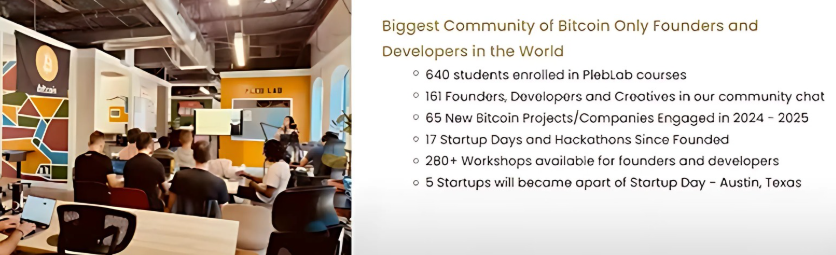
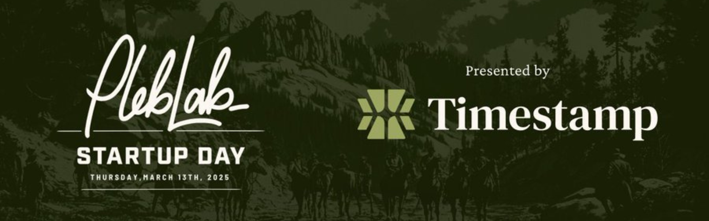

# Week 3: LB x Top Builder Recap

## PlebLab's Week 3 Recap: Lightning Bounties

Documenting our journey through PlebLab's Top Builder competition is more than just a weekly update—it's an inside look at the valuable resources and mentorship shaping the future of Bitcoin innovation. Week 3 was particularly intense, packed with workshops that delivered crucial insights for early-stage startups like Lightning Bounties. This week, we had the privilege of attending four transformative sessions:

Documenting our journey through PlebLab’s Top Builder competition isn’t just about weekly check-ins—it’s a front-row seat to the groundbreaking ideas and mentorship shaping Bitcoin’s next wave of innovation. Week 3 pushed us to new limits, packed with intensive workshops that delivered critical insights for early-stage startups like Lightning Bounties. This week, we participated in four transformative sessions led by industry pioneers, each unpacking strategies to navigate the unique challenges of building in Bitcoin. From refining user experiences to rethinking fundraising, here’s how these lessons are accelerating **our mission to create a Bitcoin-powered bug bounty platform that rewards developers worldwide—in real time, directly through GitHub—for fixing software bugs.**


:arrow\_down: Learn more about each workshop by visiting the links below. :arrow\_down:


1. [Media Strategy with Phil of 21M Communications](week-3-lb-x-top-builder-recap.md#mentor-session-phil-of-21m-communications)
2. [AMA with Topher Scott on Lightning Network Development](week-3-lb-x-top-builder-recap.md#ama-session-with-topher-scott)
3. [Product, Users, and Revenue with Santos Hernandez](week-3-lb-x-top-builder-recap.md#product-users-and-revenue-with-santos-hernandez)
4. [Investing in Bitcoin Companies with Dr. Arman Meguerian](https://app.gitbook.com/o/BGwrTsFHxhSQHPgv6nD1/s/gvH1HLwrajw9XplSBFfy/)
5. [**imestamp Financial: Invest In Bitcoin Startups with as Little as $100**](https://www.timestampfinancial.com/)

Each workshop was so rich with actionable advice that we've decided to focus on highlighting key takeaways rather than diving deep into each one. To do justice to these presentations would require a much longer read, but we encourage fellow builders to seek out these mentors directly.

Each workshop was packed with actionable insights that could fill an entire playbook. While we’re focusing on key takeaways here, we encourage you to watch the full sessions (links below) to absorb the depth of knowledge shared. No summary can fully capture the wealth of knowledge that came with each of these session, but we're gonna try anyways. First up Media strategy with 21M Communictions.

## Mentor Session - Phil of [21M Communications](https://www.21mcommunications.com/)

<figure><figcaption>
<a href="https://www.21mcommunications.com/">https://www.21mcommunications.com/</a>
</figcaption></figure>

This session sharpened our approach to media strategy as a Bitcoin startup, emphasizing how to protect our mission from misrepresentation. We learned to anchor messaging in clear problem-solution narratives—_for Lightning Bounties, this means spotlighting how instant Bitcoin payouts break barriers for developers globally._ Phil stressed targeting Bitcoin-native outlets like [_**Bitcoin News**_](https://bitcoinnews.com/) while cautioning against legacy media’s filthy habbit of twisting narratives, as seen in the [Boston Globe’s misleading framing of Caroline Ellison’s fraud as a “crypto issue”](https://www.bostonglobe.com/2022/12/06/business/caroline-ellison-math-whiz-newton-native-was-bound-success-then-she-got-into-crypto/) rather than gross misconduct.

Key insights included refining our messaging for distinct audiences—crafting specialized pitches for project owners (B2B) versus developers (B2C)—and building partnerships to strengthen trust. We’re also prioritizing collaboration with Bitcoin communities in regions like Africa, where challenges like currency volatility make Lightning solutions critical. To combat legacy media’s narrow focus on price swings, we’re steering conversations toward our core purpose: enabling instant, borderless payments for developers. These strategies not only sharpen our focus during Top Builder but also lay groundwork for lasting impact, ensuring Bitcoin remains a tool for global financial freedom.

## AMA Session with Topher Scott&#x20;

This week’s AMA with Topher Scott highlighted a critical insight: Lightning’s growth depends on lowering barriers to entry, not just moving money. At Lightning Bounties, we’re leveraging our _Lightning Instance_—a self-hosted node that enables developers to earn Bitcoin without needing external wallets. This approach directly addresses the friction many new users face, especially those transitioning from Web2. Hearing Super Testnet’s emphasis on comprehensive documentation resonated deeply, as we’re currently building detailed guides through our documentation, crafting short form YouTube tutorials for using our platform, and planning future workshops to educate users. For developers unfamiliar with Lightning, these resources will demystify everything from claiming bounties to withdrawing sats, making sure no one gets left behind.

This session reminded us that Lightning is still in its infancy, with vast opportunities for innovation. _**Collaboration, not competition, drives progress.**_ We’re actively partnering with Top Builder teams and engaging the PlebLab community to refine our platform.&#x20;

Want to help shape Lightning Bounties? **You can contribute to our documentation efforts and earn sats for your work!** Whether it’s writing guides, testing out our platform, or fixing typos on this blog post, your input matters! This [guide ](../top-builder-x-lightning-bounties/top-builder-teams/suggesting-changes.md)offers simple, step-by-step instructions for making edits directly through GitHub—no need to fork the entire repository.&#x20;

<figure><figcaption>
We Want You To Continute to Lightning Bounties!
</figcaption></figure>

Want to contribute but don't know how to get started? No problem! **Reach out to** [**mike@lightningbounties.com**](mailto:mike@lightningbounties.com) to get started and claim your first lightning bounty today!

## Product, Users, and Revenue with Santos Hernandez

Santos' mentorship session discussed the importance of _user-centric design_ and _strategic monetization_ for Bitcoin startups. A key takeaway was the need to prioritize honest user feedback through anonymous surveys, asking questions like _“What frustrates you about our platform?”_ to uncover pain points. For Lightning Bounties, this means incentivizing developers with sats for candid feedback, ensuring we address barriers for global contributors. Santos stressed that ignoring competitors is a red flag—rigorous SWOT analysis helps identify gaps in the market. For example, studying how competitors handle onboarding or fees allows us to refine our own approach, focusing on what Michael Porter calls _“choosing what not to do.”_

The session also highlighted the critical role of _frictionless user journeys_. Tracking every step from signup to logout reveals where users drop off, enabling iterative improvements. While Santos emphasized tutorial videos, we’re doubling down on written guides and in-app tooltips to simplify onboarding for developers new to Lightning. Building in public remains vital: sharing progress on Bitcoin-native platforms like [Nostr ](https://nostr.com/)and [Stacker News](https://stacker.news/) encourages community trust and attracts early adopters. As Reid Hoffman noted, _“If you’re not embarrassed by v1, you launched too late._

<figure><figcaption>
The Marketing Funnel
</figcaption></figure>

**Monetization & Growth: Lessons for Lightning Startups**\
Santos challenged the myth of delaying revenue, urging startups to monetize early. For Lightning Bounties, this could start with testing a small fee-per-bounty model while focusing on retention through gamification (e.g., achievement badges for top contributors). Email marketing, often overlooked in Bitcoin, offers a 36:1 ROI—a tool we’ll leverage for product updates and educational content. Retention tactics like rewarding loyal users and reactivating inactive ones are 5-25x cheaper than acquisition.&#x20;

<figure><figcaption>
Distribution of Content Flow
</figcaption></figure>

Collaboration within the Top Builder ecosystem, such as cross-promotions with other teams, amplifies growth organically. Ultimately, the workshop reinforced that Bitcoin startups thrive by balancing user needs with sustainable revenue. This means staying lean, iterating quickly, and keeping the _“build in public”_ ethos at the core—turning every piece of feedback into a step toward reshaping open-source collaboration.


Click here to see Santos' Full Workshop!


## Investing in Bitcoin Companies with Dr. Arman Meguerian

<figure><figcaption>
☝️The MVP's Right Here ☝️
</figcaption></figure>

[Dr. Arman Meguerian’s](https://x.com/DrBitcoinMD) workshop offered a sobering yet strategic look at fundraising for Bitcoin startups, emphasizing that raising capital is “brutal but sometimes necessary.” For Lightning Bounties, his insights arrived at a pivotal moment as we transition from an LLC to a C-corp—a move critical for attracting investors. Arman stressed the importance of getting corporate structure right early, from equity allocation to bylaws, to avoid costly revisions later. His guidance, paired with our monthly consultations, has been invaluable in navigating this complex process while maintaining focus on product growth.

A key takeaway was the need to _**“speak the language of fundraising,”**_ particularly when pitching to investors. Arman’s framework for pitch decks—starting with problem-solution narratives and bottom-up market sizing—reshaped how we articulate Lightning Bounties’ value. Instead of claiming “1% of the global developer market,” we are now going to calculate our Total Addressable Market (TAM) based on active  [Bitcoin contributors](https://www.developerreport.com/developer-report), making projections more credible. For early-stage startups like ours, he advised prioritizing proof-of-work milestones (e.g., user traction, partnerships) to build investor confidence without over-diluting equity.


Click here to see Arman's' Full Workshop!


[**Timestamp Financial: Invest In Bitcoin Startups with as Little as $100**](https://www.timestampfinancial.com/)

As co-founder of [Timestamp Financia](https://www.timestampfinancial.com/)[l,](https://www.timestampfinancial.com/) Arman practices what he preaches. The platform disrupts traditional venture capital by letting almost _anyone_ invest in early-stage Bitcoin startups with as little as **$100**—no accreditation required. Current listings include [**Jippi**](https://jippi.app/), a Pokémon Go-style game rewarding players with Bitcoin, and [**Shopstr**](https://shopstr.store/), a Nostr-based marketplace slashing eBay’s 15% fees. These projects exemplify Bitcoin’s potential to reimagine industries through decentralized applications.

<figure><figcaption></figcaption></figure>

For Lightning Bounties, Timestamp represents more than funding—it’s a community-powered launchpad. While we’re early in our C-corp transition, the platform’s ethos mirrors our vision of open collaboration. Future listings will invite supporters to back our mission directly, turning users into stakeholders. As we refine our pitch and structure, Timestamp’s model—like Arman’s mantra of _**“no half-measures”**_—reminds us that Bitcoin’s future is built by those willing to democratize access, one satoshi at a time.

## Wrapping it Up

These workshops have reshaped our approach to everything from user onboarding to fundraising strategy. As we apply these lessons, we're more committed than ever to building in public and iterating quickly based on user feedback.&#x20;

Next week's edition, we'll shift focus to Lightning Bounties' recent developments, including:

* More bounties are being solved on our platform thanks to the addition of new bounty hunters.
* A comprehensive explainer on why GitHub login is necessary (we only request read-only access)
* Exciting discussions at the MIT BTC Expo on mentoring hackers and organizing bounty postings for hackathon projects.

Plus much much more! Tune in next week for TopBuilder Recap week 4!&#x20;

