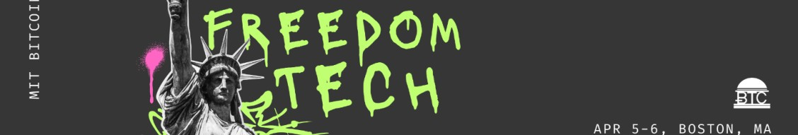

# Week 4: LB x Top Builder Recap

## PlebLab's Week 4 Recap: Lightning Bounties

Week 4 of PlebLab's Top Builder competition has been transformative for Lightning Bounties. From laying groundwork as possible mentors at the 2025 MIT Bitcoin Expo to enhancing our platform's documentation with a revamped blog landing page, and launching our first experimental live coding session - each milestone demonstrates our commitment to building value for the Bitcoin ecosystem. These achievements not only showcase our progress in the competition but also highlight our dedication to making bug bounty hunting more accessible and rewarding for developers worldwide. Let's dive into these developments that are shaping our journey through Top Builder.

### This Week's Journey: A Snapshot

#### Must Watch Content

* [Bitcoin Marketing & Media with Brandon Keys](week-4-lb-x-top-builder-recap.md#bitcoin-marketing-and-media-with-brandon-keys-1)
* [Must Watch: Shopstr on Early Days Podcast!](week-4-lb-x-top-builder-recap.md#shopstr-on-early-days-podcast)

#### Lightning Bounties: Milestones & Achievements

* [Join Us at the 2025 MIT Bitcoin Expo](week-4-lb-x-top-builder-recap.md#initial-steps-toward-mentoring-in-the-2025-mit-bitcoin-expo-hackathon)
* [Blog Landing Page Improvements](week-4-lb-x-top-builder-recap.md#blog-landing-page-improvements)&#x20;
* [First Live Coding Session](week-4-lb-x-top-builder-recap.md#first-live-coding-session-trial-run)&#x20;

#### [Bounty of the Week: Contribute to PlebBook.com](week-4-lb-x-top-builder-recap.md#bounty-of-the-week-contribute-to-plebbook.com)

## Bitcoin Marketing & Media with Brandon Keys

Brandon Keys delivered some hard-hitting truths that changed our perspective on marketing in the Bitcoin space. The biggest wake-up call? The best products don't always win—it's the ones that are effectively marketed and sold that succeed. As we build Lightning Bounties, this hit home: creating an amazing platform is crucial, but getting our message out there is equally important. Brandon encouraged us to start marketing now, not wait for some mythical "perfect moment," and to keep our branding consistent even if we're still refining our approach.&#x20;

His practical content creation tips were game-changing, especially around the power of presentation. When Brandon shared how he achieved 55x more views just by improving a thumbnail, it really drove home the importance of these seemingly small details. For our team, this means rethinking how we showcase our demos, educational content, and technical updates. What really resonated was his emphasis on personal branding within the Bitcoin ecosystem—showing the human side of our platform and sharing our building journey openly. It's exactly what we need as we continue building in public and engaging with fellow developers.&#x20;


Want to see Brandon's full presentation? Check out the recording :point\_up:


### Shopstr on Early Days Podcast!&#x20;


Watch their full Early Days interview here :point\_up: to learn more about their vision and journey.\



Our journey with Shopstr began when we met CalDev at the[ 2024 PlebLab Startup Day in Mexico City](https://youtu.be/Tupe63Y8UT4?si=4x8bz0SBU3PAvs8V), where his passion for revolutionizing e-commerce immediately resonated with our team. After watching their compelling Early Days podcast interview, we were inspired to try the platform ourselves. We purchased a Shopstr-themed t-shirt, and the experience perfectly demonstrated their vision - a seamless, peer-to-peer marketplace that works. Unlike traditional platforms like eBay that take a hefty 15% cut from sellers, Shopstr's Bitcoin-native approach using Lightning Network for payments and Nostr for communication creates a more efficient, cost-effective solution for everyone involved.

What makes Shopstr truly revolutionary is how it solves fundamental problems in e-commerce. In their Early Days interview, CalDev shares how Shopstr emerged from the need to create a truly permissionless marketplace - one without the restrictive policies, high fees, and centralized control that plague Web2 platforms. Their mission extends beyond just creating another shopping site; it's about building a future where commerce is peer-to-peer, borderless, and accessible to everyone. The team's approach to bridging the gap to mainstream users is particularly impressive - making Bitcoin commerce as simple as traditional online shopping while maintaining the core benefits of decentralization.

For aspiring builders in the Bitcoin space, Shopstr's journey offers valuable insights about focusing on user experience without compromising on decentralization principles. Want to experience the future of e-commerce yourself?&#x20;

Visit [https://shopstr.store/](https://shopstr.store/) to start shopping!

<figure><figcaption>
shopstr.store
</figcaption></figure>

## Lightning Bounties: Milestones & Achievements

Week 4 marks significant strides in our platform's evolution and community engagement. From taking our first steps toward mentoring at the 2025 MIT Bitcoin Expo to improving our documentation with a revamped blog landing page, and conducting our first live coding session trial - each milestone reflects our commitment to building in public and fostering collaboration within the Top Builder competition. Let's dive into these achievements.

### Initial Steps Toward Mentoring in the 2025 MIT Bitcoin Expo Hackathon

<figure><figcaption></figcaption></figure>

Our journey with the MIT Bitcoin Expo holds a special place in Lightning Bounties' story. After first meeting at the 2023 expo and then winning first place at the[ 2024 MIT Bitcoin Hackathon,](../../enrique-gamboa/winning-the-mit-hackathon-2024.md) we're thrilled to announce our return in 2025 - this time as mentors. Our transformation from hackathon participants to mentors represents a full-circle moment that embodies the collaborative spirit of the Bitcoin community. In just one year, we've grown from a hackathon project into a platform that's been featured in [Bitcoin News](https://youtu.be/IYmS16ruXp8) and presented at events like the [2024 PlebLab Startup Day.](https://youtu.be/yxv3VpxuIFU?si=SGKctVsV4re0d1Xe)&#x20;

<figure><figcaption>
<strong>2025 MIT Bitcoin Expo is happening on April 5th-6th</strong>
</figcaption></figure>

Recent discussions with the MIT Bitcoin Expo organizers have opened exciting opportunities for Lightning Bounties to give back to the community that helped launch us. We'll be sharing our experience and knowledge with the next generation of Bitcoin builders, helping teams develop their ideas and navigate the challenges we faced just a year ago. Our focus will be on supporting projects that align with freedom tech principles and fostering the kind of innovation that can shape Bitcoin's future.

[**The 2025 MIT Bitcoin Expo is happening on April 5th-6th**](https://mitbtcexpo.org/index.html), and we encourage everyone in the Bitcoin community to get involved! Whether you're interested in being a speaker, sponsor, attendee, or hackathon participant, there are numerous ways to contribute to this incredible event.&#x20;

The expo represents a unique opportunity to connect with builders, learn from industry leaders, and potentially launch your own Bitcoin journey - just like we did. &#x20;

Visit [https://mitbtcexpo.org/index.html](https://mitbtcexpo.org/index.html) to learn more about participation opportunities and join us in shaping the future of Bitcoin!

### Blog Landing Page Improvements

The evolution of our blog's landing page reflects our commitment to building comprehensive, accessible documentation for the Lightning Bounties community. By restructuring our content into clear categories - from event recaps and team insights to media coverage and upcoming tutorials - we're making it easier for users to navigate our growing knowledge base.&#x20;

Whether you're exploring our platform updates, diving into technical guides, or following our building journey through the Bitcoin ecosystem, the improved layout ensures a smoother path to the information you need. It's all part of our iterative approach to building in public and growing alongside our community of builders and bounty hunters.&#x20;

Click the video below to see a quick visual of the before and after!


&#x20;Quick visual of the before and after!



If you have ideas to further simplify or improve our blog content, we’d love to hear from you! Visit our platform at [app.lightningbounties.com ](https://app.lightningbounties.com/issue/40bbd95b-929b-4502-92d3-2028159fb79c)and help us make our documentation better for everyone. Your contributions matter!


### First Live Coding Session (Trial Run)

<figure><figcaption>
Screen Shot of First Live Coding Session
</figcaption></figure>

Our team conducted our first experimental live coding session this week, testing the waters for future community-focused development streams. Using [Aider ](https://aider.chat/)and [DeepSeek-R1](https://www.deepseek.com/) AI tools, we worked through UI improvements while exploring how to create engaging, educational content for developers interested in bug bounty hunting. While the session revealed some technical challenges with streaming and AI response times, it provided valuable insights into how we can structure future live coding sessions. This trial run aligns with our mission to make bug bounty hunting more accessible and collaborative, laying the groundwork for Twitch-style streams where developers can learn, contribute, and earn Bitcoin in real-time.

## Bounty of the Week: Contribute to [PlebBook.com](https://plebbook.com)

<figure><figcaption>
<a href="https://plebbook.com">PlebBook.com</a>
</figcaption></figure>

PlebBook stands as the essential builder's manual for the Bitcoin and Lightning ecosystem, serving as a comprehensive resource hub where developers and enthusiasts can learn, contribute, and grow. Think of it as community-driven documentation that helps bridge the gap between curiosity and capability in the Bitcoin building space. This week's featured bounty presents an exciting opportunity to help refresh PlebBook's content across 24 different categories. The Bitcoin ecosystem evolves rapidly, and keeping documentation current is crucial for newcomers and experienced builders alike.&#x20;

**By contributing to PlebBook, you're not just earning sats—you're helping maintain a vital resource that empowers the next generation of Bitcoin builders.**

Why does this matter? Because documentation is the foundation of adoption. Every line you update, every concept you clarify, and every category you refresh makes Bitcoin development more accessible to someone starting their journey. Plus, you'll earn sats for each successfully updated category while gaining recognition as a PlebBook contributor. Ready to make an impact?&#x20;

Check [here ](https://app.lightningbounties.com/issue/b32dedf6-67c9-4dd5-bd68-8aa5641a2054)to get started, and help shape the future of Bitcoin education!


Ready to make an impact?


## Looking Ahead: What's Next for Lightning Bounties

As we wrap up Week 4 of PlebLab's Top Builder competition, anticipation builds for next week's crucial milestone - the end of Round 1. The competition has pushed us to grow, innovate, and strengthen our platform in ways we couldn't have imagined.&#x20;

Will Lightning Bounties advance to Round 2? The stakes are high, and we've poured our hearts into building value for the Bitcoin ecosystem. Tune in next week for our final Round 1 recap to find out if we make the cut and continue our journey in this incredible competition!
