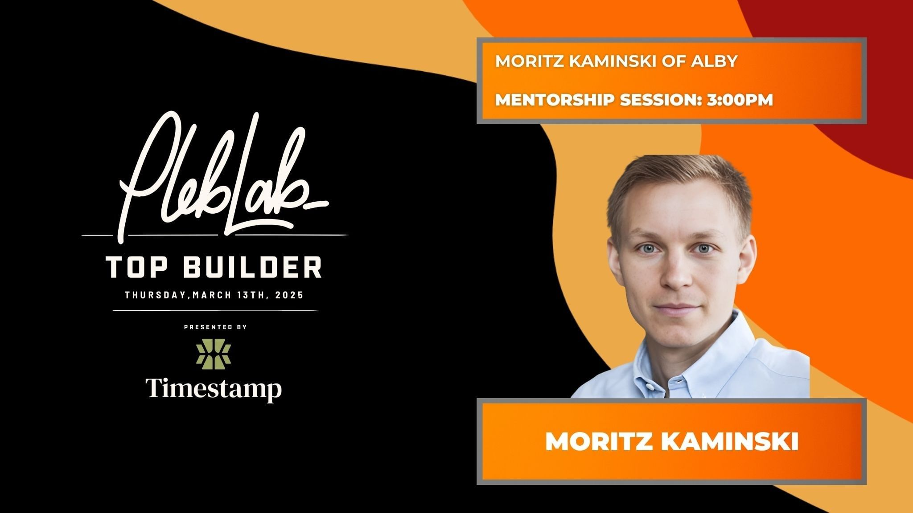
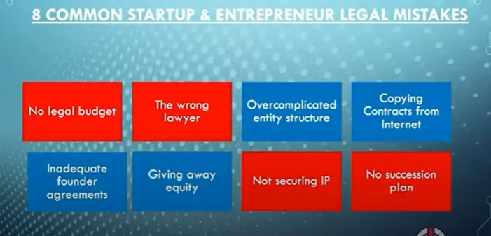
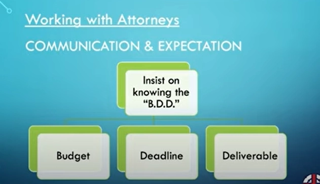
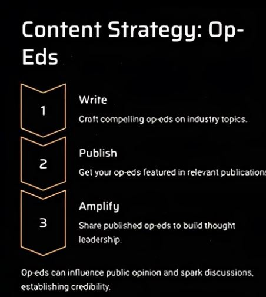

# Week 6: LB x Top Builder Recap

This week, Lightning Bounties doubled down on growth—sharpening strategy with mentors like Alby’s Moritz Kaminski, tightening legal safeguards via Jim Chester’s no-nonsense advice, and refining PR tactics with Phil's media mastery. On our own platform, two new features (_Anonymous Rewards_ and _Add Without Login_) began dismantling barriers to collaboration, letting anyone contribute sats—privately or effortlessly. Here’s what went down in Week 6 of PlebLab's Top Builder competition.

## Mentor Session - Moritz Kaminski of Alby

<figure><figcaption>
Mentorship Session: Moritz Kaminski of Alby 
</figcaption></figure>

[**Moritz Kaminski**](https://www.moritzkaminski.com/), co-founder of the Bitcoin Lightning wallet [Alby ](https://albyhub.com/)and former venture capitalist, has spent years bridging the gap between startup pragmatism and Bitcoin’s decentralized ethos—a perspective he shared candidly during the mentorship session. Known for his work streamlining micropayments for [podcasters ](https://www.podcastjunkies.com/moritz-kaminski-interview/)and web developers, Kaminski offered hard-won lessons on balancing user needs with business growth in Bitcoin’s unique ecosystem.

During our mentorship session Moritz showcased, his deep understanding of two-sided markets in Bitcoin shone through. He pointed out a crucial insight about bounty platforms: **while finding hunters is relatively straightforward, securing organizations to post bounties presents the real challenge.** His experience with Alby's scattered bounty system across GitHub, separate bounty platforms, and their website highlighted the need for consolidation. The suggestion to start with simpler bounties - focusing on front-end fixes or documentation - before tackling complex Lightning-specific issues resonated strongly. His emphasis on tiered difficulty levels to manage submission quality felt particularly relevant.

On the fundraising front, Moritz didn't sugarcoat his advice. He stressed **quick closure when a fund shows interest rather than shopping for better terms**. For pre-seed valuations, he shared that companies with solid user traction could reasonably target a $3 million pre-seed valuation cap. The fundraising strategy he outlined was refreshingly practical: rank potential investors from most to least desirable, and work down the list systematically.

When discussing controversial feature requests, Moritz emphasized staying true to core mission over chasing every suggestion. This philosophy extends to his approach with Layer 2 protocols - while [Alby](https://albyhub.com/) explores options like [Ark](https://ark-protocol.org/), they carefully weigh whether new integrations justify the resources required. His measured responses and frequent pauses to think demonstrated the depth of consideration he gives to each decision in building Bitcoin products.

## Company Killers: 8 Common Legal Mistakes that Startups Make with Jim Chester


Click to Watch the Entire Session :point\_up\_2:


Navigating Bitcoin’s legal gray zones demands equal parts innovation and prudence. In a recent mentorship session with **Jim Chester**, a 25-year tech lawyer and SMU professor, Lightning Bounties absorbed hard truths about startup pitfalls. Chester—a veteran of Bitcoin ventures—stressed that _legal hygiene isn’t optional_, even in decentralized ecosystems.

<figure><figcaption>
8 Common Startup Mistakes
</figcaption></figure>

Here’s how his advice applies to Bitcoin builders:

### **1. No Legal Budget**

_“Bitcoin startups aren’t exempt from legal fires.”_

Set aside funds for foundational legal work upfront—even 5-10% of early capital. For Lightning Bounties, this meant drafting **multisig escrow clauses** and reviewing state-specific Bitcoin regulations.&#x20;

### **2. Wrong Lawyer Choice**

_“BigLaw bills like Fortune 500 clients; Bitcoin needs specialists.”_

Opt for lawyers fluent in crypto’s risks (e.g., securities law for holding bounties in escrow). Avoid firms allergic to “chaotic awesomeness” of startups.

### **3. Overcomplicated Entity Structure**

_“Delaware C-Corp? Coming Soon”_

Start as a **simple LLC** (e.g., Texas) to avoid governance bloat. Convert only when investors demand it. Lightning Bounties is staying lean until traction justified complexity.

### **4. Copied Contracts**

_“ChatGPT privacy policies = legal Russian roulette.”_

Generic template terms from the likes of ChatGPT miss Bitcoin-specific risks (e.g., time-locked sats, Nostr integrations). Jim advised reverse-engineering competitors’ docs for industry nuances—_then_ customizing these documents with the help of an expierenced attorney.

### **5. Inadequate Founder Agreements**

_“Ambiguity = litigation grenade.”_

Define equity splits, vesting (4-year cliffs), and IP ownership _day one_. Lightning Bounties added **clawbacks** for inactive co-founders.

### **6. Giving Equity Like Candy**

_“Equity is irreversible—vest it or regret it.”_

No free shares for “advisors” without deliverables. For Bitcoin projects, tie equity to code commits or bounty resolutions.

### **7. Ignoring IP Ownership**

_“Your dev’s code ≠ your company’s code.”_

Use **Founder IP Agreements** to transfer ownership. Lightning Bounties now auto-include these for open-source contributors.

### **8. No Succession Plan**

_“What if your CTO gets hit by a bus?”_

Define buyout terms (sats-based valuations) and equity redistribution. For decentralized teams, codify this in smart contracts.

#### **Jim’s Bitcoin-Specific Wisdom**

* _“Your v1 legal strategy will suck. Iterate publicly.”_
* Use **BDD (Budget/Deadline/Deliverable)** with lawyers: “Draft a Lightning-compliant bounty agreement”
* _Never lie to counsel_—regulators already assume you’re guilty.

<figure><figcaption>
Working with Attorneys: B.D.D
</figcaption></figure>

Lightning Bounties left with actionable fixes: tightening NDAs, and auditing competitor TOS. &#x20;


Jim’s mantra: _“Build fences, not fortresses.”_


## Bitcoin PR for Startups with Phil from 21M


Click to Watch the Entire Session :point\_up\_2:


Phil from 21M Communications broke down PR strategy into three core buckets for Bitcoin builders: **announcements**, **media activity**, and **content**—with events as a bonus lever. For startups like Lightning Bounties, announcements (funding rounds, partnerships, novel features) offer the biggest visibility spikes, but _only if they’re truly newsworthy_. Phil stressed avoiding AI-generated fluff words (i.e: “revolutionary,” “game-changing”) and keeping announcements concise (1-1.5 pages max) with founder quotes that add grit—like explaining how Bitcoin-native escrow solves real dev pain points.

<figure><figcaption>
Drafting the Perfect Pitch
</figcaption></figure>

Crafting pitches requires surgical precision: subject lines must hook reporters in 5-7 words (i.e: _“Lightning Bounties Launches Auto-Expiring Bug Bounties”_), while embargo strategies (8-day lead time, avoiding Mondays or Fridays) balance exclusivity and reach. For Bitcoin startups, targeting niche reporters at outlets like [_Bitcoin Magazine_](https://x.com/BitcoinMagazine) or [_Bitcoin News_](https://x.com/BitcoinNewsCom) beats spray-and-pray. Phil highlighted cost-effective PR wires ($500-$6.5K) for SEO boosts but urged prioritizing _feature coverage_ for credibility—like a [_Coindesk_ ](https://www.coindesk.com/)deep dive on how tiered bounties attract global dev talent.

<figure><figcaption>
Write, Publish, Pitch
</figcaption></figure> <figure><figcaption>
Media Activity: Building Relationships
</figcaption></figure>

Long-term, Phil framed PR as a marathon: weekly refinement of op-eds (800-1,000 words problem-solving Bitcoin’s friction points), podcast clips repurposed into social soundbites, and “newsjacking” trends (e.g., tying announcements to nation-state adoption). His blunt advice? _“Be spicy but strategic.”_ For Lightning Bounties, this means pitching data-driven stories (e.g., “Nigeria Tops Bounty Earnings Amid Hyperinflation”) while building relationships with reporters who live in Bitcoin’s trenches.

_“PR isn’t about hype—it’s about proving you’re solving real problems.”_ – Phil’s parting wisdom.

## Must Watch: Cozy on Early Days Podcast


Full Early Days Interview ft. Kiki from Cozy :point\_up\_2:


### **Kiki’s Journey to Building Cozy**

\
Kiki’s path to tech innovation defies convention. A former artist, and dog trainer, she stumbled into coding while helping an artist collective explore virtual reality (VR) and 3D modeling. Her Venezuelan upbringing—marked by hyperinflation and distrust in centralized systems—fueled her fascination with Bitcoin’s decentralized promise. After enrolling in a VR program and winning third place at her first Bitcoin hackathon in Austin, Kiki merged her creative instincts with technical rigor. This fusion birthed _Cozy_, a gaming experience blending Tamagotchi-like digital pets with Bitcoin-powered utility. Players train AI agents to perform real-world tasks—like purchasing items via Lightning or managing social media—while earning sats through challenges. For Kiki, Cozy isn’t just a game; it’s a gateway to financial sovereignty, where playful interactions teach Bitcoin’s value without complex jargon.

### **Cozy’s Vision: Where Play Meets Pragmatism**

\
Cozy reimagines gaming as a tool for everyday Bitcoin adoption. Set in a vibrant, interconnected world, players customize AI agents that handle practical tasks—think virtual pets that pay invoices or crowdfund projects. Kiki envisions a deep in-game economy reflecting real-world transactions, powered entirely by Bitcoin. Drawing inspiration from machine-to-machine payment trends and Nostr’s decentralized social layer, she aims to eliminate friction between play and utility. Within 18 months, Kiki plans to assemble a team to expand Cozy’s ecosystem, emphasizing community collaboration—a lesson from her hackathon days. For newcomers intimidated by Bitcoin’s complexity, Cozy offers a whimsical on-ramp: “Play,” she says, “is the best teacher.” As VR and AI reshape digital interaction, Kiki’s work proves creativity and decentralized principles can coexist—one playful agent at a time.

## Meet the Top Builders Stream


Click to Watch the Entire Session :point\_up\_2:


The 2025 Pleb Lab Top Builder competition has become a launchpad for Bitcoin’s most audacious innovators. In a recent virtual roundtable, seven teams shared their progress, struggles, and visions for reshaping Bitcoin’s ecosystem—from gamified education ([Jippi](https://jippi.app/)) to decentralized commerce ([Shopstr](https://shopstr.store/)) and self-custody solutions ([Inherit](https://x.com/Inherit_to)). Each project reflects a unique approach to onboarding the next billion users while staying true to Bitcoin’s core ethos: collaboration over corporations, sovereignty over surveillance.&#x20;

Here’s a closer look at the teams pushing Bitcoin’s boundaries.

## Meet the Teams

### 1. [Lightning Bounties](https://app.lightningbounties.com/)&#x20;

* **Team:** [Enrique](https://x.com/JEGamboaFuentes), [Will](https://x.com/WillSuttonCodes), [Mike](https://x.com/SonnyTheDegen), & [Pasha](https://x.com/pavelkononov93)
* **Description:** A Bitcoin-native bug bounty platform where developers solve GitHub issues for Bitcoin.&#x20;
* **Mission:** Democratizing open-source development: We pay contributors in Bitcoin to fix bugs and grow the Lightning Network, one bounty at a time.
* **Origin Story:** Lightning Bounties was born at the 2024 MIT Bitcoin Expo Hackathon, where our team developed the initial prototype to bridge the gap between open-source development and Bitcoin compensation. The project gained significant momentum after participating in the 2024 PlebLab Startup Day in Mexico City. Our platform aims to strengthen the Bitcoin ecosystem by providing sustainable incentives for developers while maintaining the decentralized ethos of both Bitcoin and open-source development.
* **Quote:** _“We’re building tools to turn every developer into a Bitcoin contributor.”_

### 2. [Jippi](https://jippi.app/)

* **Team:** [Oliver](https://x.com/heyolpo)
* **Description:** Jippi is Pokémon GO for Bitcoin.&#x20;
* **Mission:** To educate the next generation of Bitcoiners through gamification.
* **Origin Story:** Jippi began as a hobby project in 2022 and was born from Oliver's love for Bitcoin and education. As a receiver of the orange pill in 2020, he started learning through various books, podcasts, and articles that make up the recommended learning for new Bitcoiners. This multitude of content was overwhelming at the time. He decided to set to work to build the most accessible on-ramp into the Bitcoin ecosystem for beginners. A fun and friendly tool to educate the next generation.
* **Quote:** _“Bitcoin’s future depends on capturing 8-second attention spans.”_

### 3. [Branta](https://www.branta.pro/)

* **Team:** [Keith](https://x.com/unfakekeith)
* **Description:** Branta offers payment verification for various bitcoin and lightning technologies.
* **Mission: E**xpanding Bitcoin as a Medium of Exchange:[ See here](https://www.branta.pro/blog?tag=whybuildbranta)
* **Origin Story:** Read the Bitcoin Standard and never looked back.
* **Quote:** _“Bitcoin’s final settlement needs good security.”_

### 4. [**Inherit Finance** ](https://x.com/Inherit_to)&#x20;

* **Team:** [Tom](https://x.com/Mr_Bahama_)
* **Description:** Inherit is a self-custodial Bitcoin recovery solution, enabling users to time-lock their BTC to guard against wrench attacks and quantum threats, with an optional dead man's switch for recovery in case of key loss or unexpected life events.
* **Mission:** Empower more people to self-custody Bitcoin by making it safer.
* **Origin Story:** I befriended an elderly man seeking a self-custodial way to pass on his Bitcoin without changing his wallet setup, inspired by John McAfee's "dead man switch" concept.
* **Quote:** _“Your keys shouldn’t die with you.”_

### 5. [Cozy](https://cozybot.my.canva.site/)

* **Team:** [Kiki](https://x.com/kikidesignsfun)
* **Description:** A gamified platform for AI agents to be created by non technical users.
* **Mission:** Make Bitcoin interactions fun, playful, and accessible.
* **Origin Story:** As a new mom, I rely on voice assistants like Alexa a lot, but they constantly frustrate me. I find myself repeating commands, dealing with irrelevant ads, and realizing Alexa is designed to serve Amazon—not me. It doesn’t learn, adapt, or truly assist in a meaningful way. This frustration led me to create Cozy during my student innovation project at the University of Advancing Technology—a personalized, intelligent assistant built on open protocols like Bitcoin, Lightning, and Nostr to prioritize the user, not a corporation.
* **Quote:** _“Delight as a gateway to financial sovereignty.”_

### 6. [Shopstr ](https://shopstr.store/)

* **Team:** [Caladev](https://primal.net/p/npub16dhgpql60vmd4mnydjut87vla23a38j689jssaqlqqlzrtqtd0kqex0nkq)
* **Description:** Shopstr is a global, decentralized Nostr marketplace for Bitcoin commerce.
* **Mission:** Permissionless, KYC-free marketplace on Nostr.
* **Origin Story:** Having attended the alma mater of Ross Ulbricht (founder of Silk Road), Cristian drew inspiration to create a market for p2p trade, but on the right foundation with Nostr. As time worked on the project has progressed, the potential and conviction with regards to the project has only grown. The mission is to allow anyone to be able to trade globally and permissionlessly directly with Bitcoin and to make Bitcoin earn-ramps more accessible.
* **Quote:** _“Free markets shouldn’t require permission.”_

### 7.[ BitcoinOnly Events](https://bitcoinonly.events/)

* **Team:** [Andrew](https://x.com/BitcoinEventsHQ)
* **Description:** BitcoinOnly Events is a platform dedicated to organizing, promoting, and supporting Bitcoin-focused meetups, conferences, and community events worldwide.
* **Mission:** To help HODLers, professionals, and newcomers stay informed, connected, and engaged with the events that matter most.
* **Origin Story:** Andrew founded BitcoinOnly Events after years of attending grassroots Bitcoin meetups, where he saw firsthand how fragmented event organization had become. Frustrated by reliance on centralized platforms like Eventbrite, he envisioned a decentralized alternative that aligned with Bitcoin’s ethos. Inspired by the Lightning Network’s scalability and community-driven growth, he built a tool to empower organizers, amplify Bitcoin-only principles, and foster local adoption through education-first gatherings.
* **Quote:** _“Bitcoin’s community thrives when it gathers.”_

From [Lightning Bounties’](https://app.lightningbounties.com/) mission to turn developers into Bitcoin contributors to [Shopstr’s ](https://shopstr.store/)uncensorable marketplace, these builders prove Bitcoin’s potential stretches far beyond “digital gold.” Whether safeguarding generational wealth ([Inherit](https://x.com/Inherit_to)), securing transactions ([Branta](https://www.branta.pro/)), or reimagining AI assistants ([Cozy](https://cozybot.my.canva.site/)), their work fuels an ecosystem where innovation thrives without gatekeepers. As [BitcoinOnly Events ](https://bitcoinonly.events/)connects communities and [Jippi ](https://jippi.app/)gamifies onboarding, one truth emerges: Bitcoin’s future isn’t built in silos. It’s forged by builders who stack sats—and principles—together.

## **New Features on Lightning Bounties: Anonymous Rewards & Adding Rewards Without Login**

This week, Lightning Bounties introduced two powerful features to enhance user participation. **Anonymous Rewards** allows logged-in users to contribute sats to bounties privately, ensuring their identity remains hidden while still supporting open-source development. **Add Without Login** enables anyone to add sats to bounties without creating an account, making it easier for non-developers or those without GitHub accounts to get involved.

Explore these features in detail below and see how they’re shaping the future of collaboration on Lightning Bounties.

### **Anonymous** Rewards&#x20;

The **Anonymous Rewards** feature enables logged-in users on Lightning Bounties to add sats to bounties without revealing their identity. This is ideal for contributors who value privacy but still want to incentivize progress on open issues. With Anonymous Rewards, users can fund bounties discreetly while maintaining full control over their contributions.

This feature encourages participation from individuals and organizations that prefer to stay private while supporting the Bitcoin and Lightning ecosystem. It’s another step toward decentralizing collaboration and ensuring that anyone can contribute, regardless of their need for anonymity.

### Add Without Login&#x20;

The **Add Without Login** feature allows anyone to contribute sats to existing bounties on the Lightning Bounties platform without needing to create an account or log in. This is perfect for users who want to support developers but don’t have a GitHub account or prefer not to login. By removing this barrier, more people can participate in funding open-source development, helping bounties grow faster and attracting more contributors.

To ensure security, this feature leverages **Branta’s address verification**, protecting both the platform and bounty hunters while maintaining trustworthiness. Add Without Login expands accessibility, making it easier than ever for anyone to back projects they care about.

<figure><figcaption>
Add to Reward Without Login Preview
</figcaption></figure>

## Wrapping Up Week 6:

Week 6 wasn’t just about coding or compliance—it was about building with intention. Moritz’s insights on balancing user needs, Jim’s legal firewalls, and Phil’s PR pragmatism gave us tools to navigate Bitcoin’s chaos. With new features empowering contributors and a community stacking sats (and principles) together, Lightning Bounties is proof that collaboration outpaces competition. Onward to Week 7!
