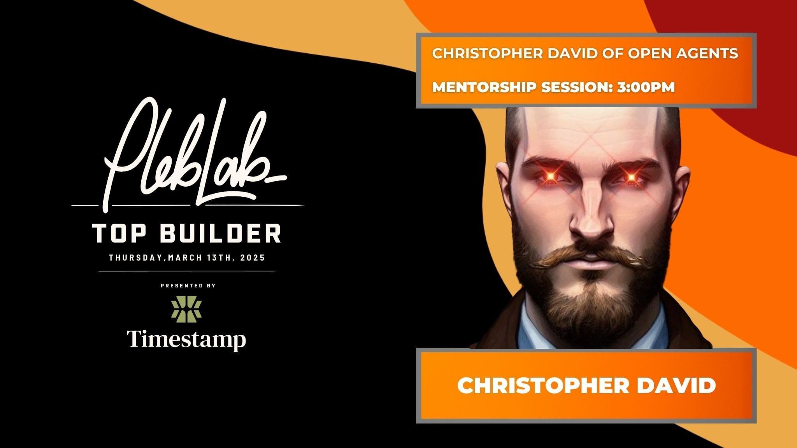

# Week 7: LB x Top Builder Recap

## Opener&#x20;

## Open Agents Mentor Session&#x20;

<figure><figcaption></figcaption></figure>

## Bitcoin Startup Accounting&#x20;



_Workshop Recap with Joe Wood (Satoshi Patoli)_

Bitcoin businesses face a minefield of accounting quirks—but Joe Wood’s workshop cut through the noise. Here’s what builders need to know:

### **1. Accounting for Bitcoin: What Actually Matters**

* **Valuation**: Bitcoin’s price swings hit your balance sheet. Unrealized gains/losses now get tracked, so monitor them like hawk.
* **Taxes**: Holding Bitcoin? No taxes until you sell/spend it. But _every transaction_ (sending, receiving, swapping) triggers a taxable event. Track sats like your freedom depends on it—because it does.

### **2. Using Bitcoin as Payment**

* **Price It in USD**: When accepting Bitcoin for goods/services, record the USD value _at receipt_. Volatility isn’t an excuse for lazy bookkeeping.
* **Employees Love Sats**: Paying team members in Bitcoin boosts morale (if you’re already holding). But warn them: selling = taxable income.

### **3. Holding Bitcoin: Treasury Strategy**

* **Risk Check**: How much volatility can your startup stomach? If investors panic at -30% dips, maybe don’t put 80% of cash reserves in Bitcoin.
* **Investor Optics**: Fundraising? Assume VCs will grill your Bitcoin treasury strategy. Prepare answers tighter than a 21M supply cap.

### **4. International Payments: Bitcoin’s Killer App**

* **Speed Wins**: Pay global contractors in minutes, not days. Traditional banks can’t compete.
* **Tools Matter**: Use non-custodial processors like **Zap** to avoid third-party risk.

### **5. Accounting Tools for Bitcoiners**

* **Zap**: Track payments without handing keys to a custodian.
* **Clan Tech**: Open-source accounting suite for Bitcoin-only businesses.
* **Banking**: Mercury/Brex still work, but keep Bitcoin transactions separate.

### **Biggest Pitfalls**

* **Tax Surprises**: That Lightning payment you sent? Taxable. That refund you received? Taxable. Assume everything’s taxable until proven otherwise.
* **Custody Risks**: Mixing custodial/non-custodial wallets? Recipe for audit hell. Segregate funds like a cypherpunk monk.

**Why This Matters for Builders**\
Bitcoin accounting isn’t about compliance—it’s about survival. Messy books attract regulators. Sloppy tax reporting kills startups. Joe’s takeaway? _“Run your Bitcoin business like a Fortune 500 company, but with better money.”_

_Next week: How to handle payroll for a fully remote, Bitcoin-only team._

**Toolkit**: [Zap](https://zaphq.io/) | [Clan Tech](https://clan.tech/) | [Mercury](https://mercury.com/)

## Phil 21M Communications on Early Days Podcast



### An Analytical Summary of Phil's Insights on Bitcoin PR and Marketing

In a recent conversation, Phil, the founder and CEO of 21M Communications, shared his journey and insights into the Bitcoin space, particularly focusing on public relations (PR) and marketing for Bitcoin companies. His unique perspective stems from a rich background in media and a deep commitment to Bitcoin, which he believes is fundamentally different from the broader crypto landscape. This summary encapsulates Phil's key points, emphasizing the importance of tailored PR strategies for Bitcoin startups, the nuances of marketing in this niche, and actionable advice for early-stage founders.

***

### Phil's Background and the Birth of 21m Communications

Phil's journey into the Bitcoin realm began with a solid foundation in media, having worked across various platforms, including print, digital, and broadcast. His experiences in traditional PR agencies led him to recognize a gap in the market for Bitcoin-focused PR services.

* **Key Motivations for Founding 21m Communications:**
  * **Focus on Bitcoin:** Phil's disillusionment with the broader crypto space, particularly the prevalence of "shitcoins," drove him to concentrate solely on Bitcoin.
  * **Community-Centric Approach:** He aimed to create a PR agency "for Bitcoiners, by Bitcoiners," ensuring a deep understanding of the Bitcoin ethos.
  * **Long-Term Vision:** Phil emphasized the importance of aligning with companies that have a long-term vision, contrasting them with the high time preference often seen in the crypto space.

### The Unique Nature of Bitcoin PR

Phil articulated the distinctiveness of PR in the Bitcoin ecosystem compared to the broader crypto market.

* **High vs. Low Time Preference:**
  * **High Time Preference in Crypto:** Many crypto companies focus on short-term gains, leading to a volatile and often unethical environment.
  * **Low Time Preference in Bitcoin:** Bitcoin companies tend to prioritize long-term goals, fostering a more stable and ethical business environment.
* **PR Strategies for Bitcoin Companies:**
  * **Authentic Storytelling:** Phil highlighted the importance of crafting narratives that resonate with both the media and the Bitcoin community.
  * **Understanding the Audience:** He stressed the need for PR professionals to grasp the intricacies of Bitcoin to effectively communicate its value.

### Marketing Insights for Bitcoin Startups

Phil shared his thoughts on the marketing landscape within the Bitcoin ecosystem, emphasizing the need for a strategic approach.

* **Seth Godin's Philosophy:** Phil referenced Godin's quote, "Marketing is no longer about the stuff you make; it's about the stories you tell," underscoring the importance of narrative in marketing.
* **Technical vs. Accessible Communication:** He noted that while Bitcoin products may be technically complex, the messaging should be simplified for broader understanding.

### Practical Advice for Early-Stage Founders

Phil provided actionable insights for founders looking to establish their presence in the Bitcoin space.

1. **Create a Document for Announcements:**
   * Maintain a running list of potential announcements, product updates, and partnerships to keep the media informed.
2. **Engage in Media Activity:**
   * **Social Listening:** Monitor conversations in the Bitcoin space to identify trends and opportunities for engagement.
   * **Trend Jacking:** Leverage existing conversations to insert your brand into relevant discussions.
3. **Content Creation:**
   * **Opinion Editorials:** Write op-eds to establish thought leadership and address pressing issues within the Bitcoin ecosystem.
   * **Utilize Newsletters:** Engage with industry newsletters to share insights and gain visibility.

### The Role of Influencers in Bitcoin Marketing

Phil discussed the evolving landscape of influencer marketing within the Bitcoin community.

* **Authenticity Matters:** Phil emphasized that consumers are increasingly interested in the people behind the brands, making it essential for founders to be authentic and relatable.
* **Building Trust:** By positioning themselves as thought leaders, founders can foster trust and credibility within the community.

### Conclusion

Phil's insights into Bitcoin PR and marketing reveal a landscape that is both challenging and ripe with opportunity. His emphasis on authenticity, long-term vision, and community engagement provides a roadmap for Bitcoin startups looking to navigate the complexities of the media landscape. As the Bitcoin ecosystem continues to evolve, the strategies outlined by Phil will be crucial for founders aiming to make a meaningful impact.

Key takeaways to take with you&#x20;

* **Focus on Bitcoin:** Prioritize long-term goals and ethical practices.
* **Craft Authentic Narratives:** Engage with the media through compelling storytelling.
* **Leverage Community:** Build relationships within the Bitcoin ecosystem to enhance visibility and credibility.

By following these principles, Bitcoin startups can effectively position themselves for success in a competitive and rapidly evolving environment.

## Top Builder Final 5 Announced&#x20;



We’re honored to share that Lightning Bounties has been selected as one of the **Top 5 teams** advancing to Pleb Lab’s Startup Day on **March 13 in Austin, Texas**, during SXSW. Standing alongside innovators like _Jippi_ (gamifying Bitcoin education), _Branta_ (securing Lightning transactions), _Shopstr_ (uncensorable commerce), and _SATs.GG_ (gaming economies) is both thrilling and humbling.

This season’s competition was fierce. With **243 applications reviewed**, **35 projects submitted**, and **17 teams onboarded**, the talent pool was staggering. To every builder who participated: your work inspired us. It really did. The creativity and grit we saw over these six weeks

—like tools for self-custody, privacy, and global payments—prove Bitcoin’s ecosystem is stronger than ever. To those not advancing: keep building.&#x20;

The space _needs_ your ideas.

Pleb Lab’s stats say it all: **65+ Bitcoin projects launched since 2022**, **280+ workshops held**, and a community of **640+ learners**. This isn’t just a competition—it’s a movement.

We’ve got two weeks to refine our pitch for Austin. No victory laps. Just gratitude for the push from peers, mentors, and the 161 founders in this trenches with us. Let’s show why Bitcoin collaboration matters.

**To Austin, with purpose.**

“Iron sharpens iron. Keep building.” — Car PlebLab CEO

