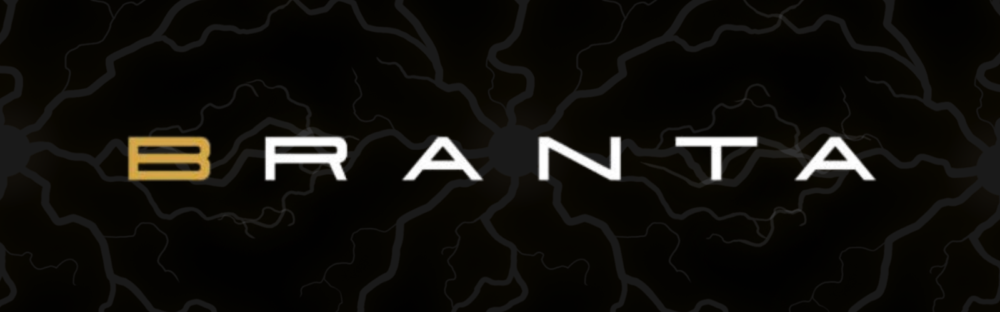
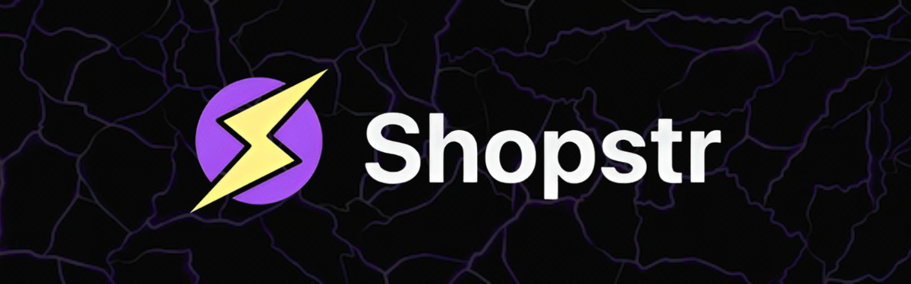
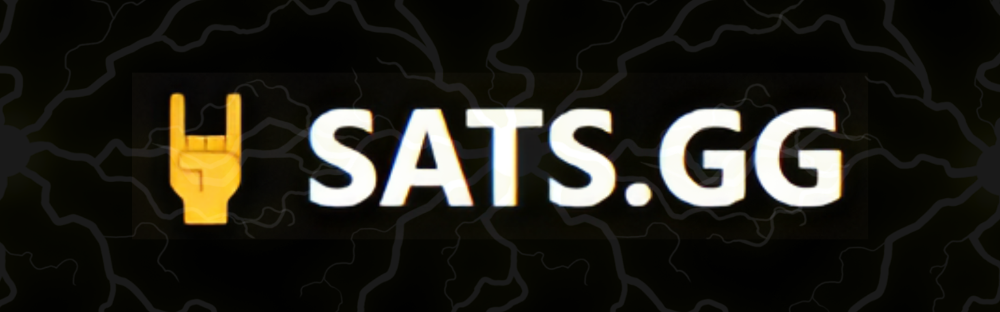
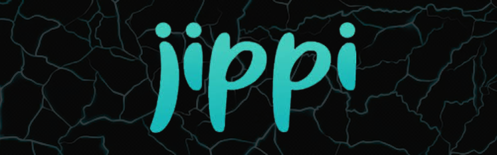

# Week 8-10: Top Builder Finale

**Five teams. One stage. $15K in Bitcoin on the line.**&#x20;

The PlebLab Top Builder Season 2 finale wasn’t just another pitch competition—it was a battleground for Bitcoin’s most innovative builders. Months of sleepless nights, relentless iteration, and bold ideas had led to this moment. For Lightning Bounties and four other groundbreaking projects, everything came down to twenty minutes on stage—a chance to prove we had what it takes to shape the future of Bitcoin. This was the "Top Chef of Bitcoin," where only one team would take the crown. Let me take you inside the chaos, the excitement, and the journey that brought us here.

## What is PlebLab?

For those who don't know, PlebLab has become the Mecca of the Bitcoin startup ecosystem in the United States. What began as a humble coworking space at Capital Factory in 2021 has evolved into a thriving community hub for Bitcoin builders. Led by CEO Car González, PlebLab transcends the traditional coworking concept.

> _"How do I make it more collaborative? When you say coworking, it's literally just working. How boring is that—working among other people who are also working? That's not fun,"_&#x20;
>
> Car explains about his vision.

This philosophy has transformed PlebLab into what Car describes as "an accelerator for the Bitcoin era"—not following the traditional startup path of giving someone "$500k on day one and say, 'You got three months to make it or see you later,'" which he considers "a fiat-era thing".

<figure><figcaption>
Come &#x26; Make it
</figcaption></figure>

## What the Hell is PlebLab Anyway?

If you've never experienced PlebLab, you're missing Bitcoin's most powerful startup ecosystem. Born in 2021 from the minds of Car González, and Keyan Kousha, PlebLab started as a humble coworking space at Capital Factory in Austin. What began with Bitcoin meetups drawing crowds of 200+ people has evolved into what Car calls "an accelerator for the Bitcoin era".

Today, PlebLab has become the beating heart of Bitcoin innovation in Texas—a hybrid hacker garage and startup incubator that's launched 65+ Bitcoin projects and hosted 280+ workshops since 2022. It's where Bitcoin builders come to transform impossible ideas into working products.

## The Top Builder Competition

Top Builder isn't just another hackathon. As Car puts it, it's "the Top Chef of Bitcoin" where they "try to find the latest, greatest builders, pile them in, and get them to build an MVP or something pitchable.” The competition runs over approximately three months, culminating in presentations before VCs and angel investors.

Our journey through Top Builder Season 2 led us to the final round, where we faced off against four other impressive Bitcoin projects:

## The Final Contenders

<figure><figcaption>
<strong>Branta</strong>
</figcaption></figure> <figure><figcaption>
<strong>Shopstr</strong>
</figcaption></figure> <figure><figcaption>
<strong>SATS.GG</strong>
</figcaption></figure> <figure><figcaption>
<strong>Lightning Bounties</strong>
</figcaption></figure> <figure><figcaption>
<strong>Jippi</strong> 
</figcaption></figure>

<figure><figcaption>
Branta, Shopstr, SATS.GG, Lightning Bounties, Jippi 
</figcaption></figure>

## Branta: Guardrails for Bitcoin

<figure><figcaption>
<strong>Branta</strong>
</figcaption></figure>

Branta's presentation focused on enhancing Bitcoin as a medium of exchange. Their flagship product, Guardrail, provides payment verification to solve the "last mile problem" in Bitcoin transactions. When you interact with Bitcoin, you typically see a QR code and a string representing a Bolt11 invoice or address. What happens if that information gets compromised somewhere between generation and scanning?

Branta's solution allows users to verify whether an address is legitimate before sending funds, with implementation as simple as hovering over text that says "verify invoice Bronta". This provides a second touchpoint to verify the address is correct, protecting against compromised servers or malicious browser extensions.

During the presentation, Branta also announced new partnerships with Ambos for compliance solutions and Clams for Bitcoin-native accounting, creating a complete stack for Bitcoin businesses.

## Shopstr: Revolutionizing Bitcoin Commerce

<figure><figcaption>
<strong>Shopstr</strong>
</figcaption></figure>

Shopstr addresses a significant problem: permissionless commerce. As Christian (calvadev) explained in his presentation, small merchants frequently face censorship on centralized platforms. He shared examples of sellers getting shut down on Etsy for seemingly minor issues like claiming a tallow cream was "deeply moisturizing".

Shopstr provides a permissionless marketplace built on three technologies: Bitcoin/Lightning for payments, ecash for privacy, and Nostr for social infrastructure and distribution. Shopstr makes it remarkably simple for merchants to list products and receive Bitcoin payments, without requiring extensive technical knowledge or payment infrastructure.

What impressed me was their self-hostable solution—merchants can install their own client on Umbrel or Start9, completely removing reliance on DNS or other centralized internet technologies. With about 50 people already running their own instances and 5 million sats in transaction volume, they're demonstrating real traction.

## [SATS.GG](http://sats.gg/): Post Content. Get Paid.

<figure><figcaption>
<strong>SATS.GG</strong>
</figcaption></figure>

Chad from [SATS.GG](http://sats.gg/) presented a compelling solution for content creators struggling with monetization. He highlighted how platforms like YouTube provide minimal revenue to creators (showing an example of 83,000 views generating only $280), forcing them to use services like Patreon or OnlyFans, which require followers to create new accounts and enter payment information.

[SATS.GG](http://sats.gg/) solves this by allowing creators to upload content once and monetize it anywhere through an innovative protocol called L402 HLS, which combines HTTP Live Streaming with Lightning Labs' L402 payment system. Their Lightning video player works across platforms—from personal websites to Twitter and Nostr—letting viewers pay directly through Lightning without creating accounts.

The live demo showed how content creators can stream, set pricing tiers for different quality levels, and receive payments instantly to their Lightning wallets, with viewers able to watch the content where they already are, without extra accounts.

## Lightning Bounties: Fix Code, Earn Bitcoin

<figure><figcaption>
<strong>Lightning Bounties</strong>
</figcaption></figure>

Our platform, Lightning Bounties, connects developers with projects needing code contributions. We identified the disconnect between Bitcoin open-source projects needing development help and talented developers looking to earn Bitcoin. Our solution creates a marketplace where projects can post bounties and developers can claim them, all using Bitcoin's Lightning Network for instant, borderless payments.

We've focused on making the platform both user-friendly for newcomers to Bitcoin development and powerful enough for experienced coders. Our escrow system ensures fair payment while our reputation system builds trust in the ecosystem.

Our journey through Top Builder helped us refine our platform and connect with the broader Bitcoin developer community, creating relationships that will continue to grow long after the competition ends.

## Jippi: An AR Adventure Game with a Bitcoin Twist

<figure><figcaption>
<strong>Jippi</strong>
</figcaption></figure>

Oliver presented Jippi, an augmented reality game reminiscent of Pokémon Go but with a Bitcoin education twist. The app targets Gen Z, who have an 8-second attention span but represent a massive potential market with $12 trillion in expected purchasing power by 2030.

Jippi combines what Gen Z loves—gaming (90% play games), rewards (70% expect rewards while playing), and Bitcoin interest (41% want to learn more). Players explore real-world locations to find Bitcoin-themed "beasts" in AR, answer Bitcoin quiz questions to catch them, and earn tickets to spin a rewards wheel for real Bitcoin sats.

Oliver demonstrated how players progress through educational "islands" before catching beasts like "Nakamoto Nick" and "Proof of Work Patrick," with a million-sat prize for the first person to catch all six beasts in their foundation series. The presentation included impressive metrics from their SXSW promotion efforts and the announcement that the app was available to download that day.

## The Winner Is... Jippi!

🎉 When the judges announced Jippi as the winner of Top Builder 2025, it was a well-deserved victory. Oliver built a truly innovative product with real mainstream potential. His ability to make Bitcoin education fun and engaging for a demographic that's notoriously difficult to reach impressed everyone in the room.

The judging panel described Jippi as "mind-blowing" with its "live, functioning app, man-on-the-street surveys, and app tests in a local university," along with a "masterful presentation of the rationale and vision". The app genuinely has viral potential that could bring a new generation into Bitcoin.

<figure><figcaption></figcaption></figure>

## Reflections on Top Builder

Looking back at our Top Builder journey, I'm struck by how much we've grown. Being surrounded by such talented teams pushed us to refine our product, clarify our vision, and improve our pitch. The PlebLab community provided invaluable feedback and connections that would have taken years to develop otherwise.

The competition format creates a unique pressure-cooker environment that accelerates learning. Even though we didn't win, we're walking away with a stronger product and a clearer understanding of our place in the Bitcoin ecosystem.

## What's Next for Lightning Bounties

The Top Builder finale isn't the end—it's just the beginning. We're more committed than ever to our mission of helping Bitcoin open-source projects find talented developers. We're incorporating the feedback we received during the competition and focusing on growing our user base.

In the coming months, we'll be expanding our platform capabilities, improving our user experience, and forging new partnerships within the Bitcoin ecosystem. The connections we made through Top Builder will be instrumental in this next phase of growth.

## A Thank You to Car, the Teams, and PlebLab

I want to express my profound gratitude to Car González and the entire PlebLab ecosystem for creating this incredible platform for Bitcoin builders. The structure of Top Builder, with its emphasis on shipping code and building viable products rather than just pitching ideas, truly sets it apart from other startup competitions.

To my fellow competitors—Branta, Shopstr, [SATS.GG](http://sats.gg/), and Jippi—thank you for the inspiration and camaraderie. The Bitcoin ecosystem is stronger because of the solutions you're building.

### Join Our Journey

If you're a developer looking to earn Bitcoin or a project in need of development help, we invite you to join us at Lightning Bounties. Visit [lightningbounties.com](https://www.lightningbounties.com/) or join our Discord community to learn more.

The future of Bitcoin is being built by individuals and small teams with big visions. Whether you're a builder, investor, or Bitcoin enthusiast, there's a place for you in this revolution. Let's build together.

