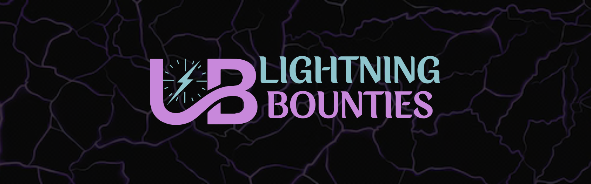

# Week 8-10: Top Builder Finale

**Five teams. One stage. $15K in Bitcoin on the line.**&#x20;

The PlebLab Top Builder Season 2 finale wasn’t just another pitch competition, it was a battleground for Bitcoin’s most promising builders. Months of sleepless nights, relentless iteration, and bold ideas had led to this moment. For Lightning Bounties and four other exceptional projects, everything came down to twenty minutes on stage—a chance to prove we had what it takes to shape the future of Bitcoin. This was the "Top Chef of Bitcoin," where only one team would take the crown. Let me take you inside the chaos, the excitement, and the journey that brought us here.

## What the Hell is PlebLab Anyway?

For those new to the Bitcoin building scene, PlebLab has become the Mecca of the Bitcoin startup ecosystem in the United States. Born in 2021 from the vision of Car González and Keyan Kousha, what began as a humble coworking space at Capital Factory in Austin has evolved into a thriving community hub that's launched over 65 Bitcoin projects and hosted 280+ workshops.

But PlebLab transcends the traditional coworking concept. As Car explains about his vision:&#x20;

> _"How do I make it more collaborative? When you say coworking, it's literally just working. How boring is that—working among other people who are also working? That's not fun,"_&#x20;

This philosophy has transformed PlebLab into "an accelerator for the Bitcoin era"—not following the traditional startup path of giving someone "$500k on day one and say, 'You got three months to make it or see you later,'" which Car correctly considers "a fiat-era thing." Instead, it's a hybrid hacker garage and startup incubator where Bitcoin builders transform impossible ideas into working products, creating the beating heart of Bitcoin innovation in Texas.

<figure><figcaption>
Come &#x26; Make it
</figcaption></figure>

## The Top Builder Competition

Top Builder isn't just another hackathon. As Car puts it, it's "the Top Chef of Bitcoin" where they "try to find the latest, greatest builders, pile them in, and get them to build an MVP or something pitchable.” The competition runs over approximately three months, culminating in presentations before VCs and angel investors.

Our journey through Top Builder Season 2 led us to the final round, where we faced off against four other impressive Bitcoin projects:

## The Final Contenders

<figure><figcaption>
<strong>Branta</strong>
</figcaption></figure> <figure><figcaption>
<strong>Shopstr</strong>
</figcaption></figure> <figure><figcaption>
<strong>SATS.GG</strong>
</figcaption></figure> <figure><figcaption>
<strong>Lightning Bounties</strong>
</figcaption></figure> <figure><figcaption>
<strong>Jippi</strong> 
</figcaption></figure>

## Branta: Guardrails for Bitcoin

<figure><figcaption>
<strong>Branta</strong>
</figcaption></figure>

Branta's presentation focused on enhancing Bitcoin as a medium of exchange. Their flagship product, Guardrail, provides payment verification to solve the "last mile problem" in Bitcoin transactions. When you interact with Bitcoin, you typically see a QR code and a string representing a Bolt11 invoice or address. What happens if that information gets compromised somewhere between generation and scanning?

Branta's solution allows users to verify whether an address is legitimate before sending funds, with implementation as simple as hovering over text that says "verify invoice Bronta". This provides a second touchpoint to verify the address is correct, protecting against compromised servers or malicious browser extensions.

During the presentation, Branta also announced new partnerships with Ambos for compliance solutions and Clams for Bitcoin-native accounting, creating a complete stack for Bitcoin businesses.

## Shopstr: Revolutionizing Bitcoin Commerce

<figure><figcaption>
<strong>Shopstr</strong>
</figcaption></figure>

Shopstr addresses a significant problem: permissionless commerce. As Christian (calvadev) explained in his presentation, small merchants frequently face censorship on centralized platforms. He shared examples of sellers getting shut down on Etsy for seemingly minor issues like claiming a tallow cream was "deeply moisturizing".

Shopstr provides a permissionless marketplace built on three technologies: Bitcoin/Lightning for payments, ecash for privacy, and Nostr for social infrastructure and distribution. Shopstr makes it remarkably simple for merchants to list products and receive Bitcoin payments, without requiring extensive technical knowledge or payment infrastructure.

What impressed me was their self-hostable feature—merchants can install their own client on Umbrel or Start9, completely removing reliance on DNS or other centralized internet technologies. With about 50 people already running their own instances and 5 million sats in transaction volume, they're demonstrating real traction.

## [SATS.GG](http://sats.gg/): Post Content. Get Paid.

<figure><figcaption>
<strong>SATS.GG</strong>
</figcaption></figure>

[Chad ](https://x.com/chdwlch)from [SATS.GG](http://sats.gg/) presented a compelling solution for content creators struggling with monetization. He highlighted how platforms like YouTube provide minimal revenue to creators (showing an example of 83,000 views generating only $280), forcing them to use services like Patreon or OnlyFans, which require followers to create new accounts and enter payment information.&#x20;

[SATS.GG](http://sats.gg/) fixes this by allowing creators to upload content once and monetize it anywhere through an innovative protocol called L402 HLS, which combines HTTP Live Streaming with Lightning Labs' L402 payment system. Their Lightning video player works across platforms—from personal websites to Twitter and Nostr—letting viewers pay directly through Lightning without creating accounts.

The live demo showed how content creators can stream, set pricing tiers for different quality levels, and receive payments instantly to their Lightning wallets, with viewers able to watch the content where they already are, without extra accounts.

## Lightning Bounties: Fix Code, Earn Bitcoin

<figure><figcaption>
<strong>Lightning Bounties</strong>
</figcaption></figure>

Up next was us, Lightning Bounties. Saying I was nervous is a massive understatement. I was sweating fucking bullets. It didn't help that the three pitches before us absolutely nailed their presentations and we still had Jippi to follow, who I'd witnessed give a captivating pitch during Startup Day in September. Worst of all, we were running on 3-4 hours of sleep—refining, editing, changing slides and talking points until the insomnia and the previous three days all seemed like a blur.

<figure><figcaption>
us, the night before 
</figcaption></figure>

But this is what Top Builder is all about: bringing out the absolute best in us. We wouldn't have had it any other way.

Our presentation focused on three key aspects of Lightning Bounties:

1. **Market potential**: By integrating Lightning-based payments into GitHub, we're meeting 100+ million developers where they already work. This creates a massive addressable market for Bitcoin adoption through everyday developer workflows.
2. **Versatility beyond code**: Bounties aren't limited to programming tasks. They can include logo designs, documentation updates, YouTube tutorials, and more. If it can be solved online, it can be posted as a GitHub issue and turned into a Lightning Bounty.
3. **Simplicity by design**: Posting a bounty requires just six clicks and about 30 seconds. With one click, you're already logged in and registered. Copy/paste the GitHub Issue URL, set your satoshi reward amount, and you've created your first bounty—friction removed.

We demonstrated this with a live example. The only hiccup came when I didn't account for using Enrique's MacBook. Hard to believe, but this was the first time I'd used a Mac in as long as I could remember. While running through the demo, this realization hit me as I looked up at everyone watching. I froze momentarily, trying to figure out why copy/paste wasn't working. Luckily, I heard Enrique whispering "`Command-A`, `Command-C`, `Command-V.`" Once I heard that, it was smooth sailing, and I took a massive breath of relief knowing everything went off without a hitch.

As we wrapped up our pitch, I stepped back from the podium with a strange mix of exhaustion and exhilaration. The judges scribbled notes while the audience applauded. In that moment, standing under those lights, the results almost didn't matter anymore. We'd shown how Lightning Bounties could make a genuine impact in the Bitcoin ecosystem. We'd changed some minds about what a bounty could be—not just code, but design, documentation, education, and beyond. Most importantly, we'd demonstrated just how ridiculously simple the platform was to use—so fucking easy that even a caveman could post a bounty in 30 seconds.

Our journey through Top Builder helped us refine our platform and connect with the broader Bitcoin developer community, creating relationships that will continue to grow long after the competition ends. We've built a marketplace that solves real problems for both open-source projects and developers, all powered by Bitcoin's Lightning Network.

## Jippi: An AR Adventure Game with a Bitcoin Twist

<figure><figcaption>
<strong>Jippi</strong>
</figcaption></figure>

Oliver took the stage to present Jippi, an augmented reality game that brilliantly reimagines Pokémon Go with a Bitcoin educational twist. His pitch immediately zeroed in on their target audience: Gen Z users with their notorious 8-second attention spans who nonetheless represent a staggering $12 trillion in expected purchasing power by 2030.

What made Jippi compelling was how it merges three key elements that Gen Z craves—gaming (played by 90% of the demographic), rewards (expected by 70% while playing), and Bitcoin knowledge (with 41% wanting to learn more). The concept is elegantly simple yet addictive: players explore their real-world surroundings to discover Bitcoin-themed "beasts" in augmented reality, answer Bitcoin quiz questions to capture them, and earn tickets to spin a rewards wheel for actual Bitcoin sats.

Oliver's live demonstration showcased how players progress through educational "islands" before encountering characters like "Nakamoto Nick" and "Proof of Work Patrick." He dangled a tantalizing million-sat prize for the first person to collect all six beasts in their foundation series. Backing up their concept with hard data, he shared impressive metrics from their SXSW promotion and dropped the mic with the announcement that the app was available for download that very day.

## The Winner Is... Jippi!

🎉 When the judges announced Jippi as the winner of Top Builder 2025, it was a well-deserved victory. Oliver built a truly innovative product with real mainstream potential. His ability to make Bitcoin education fun and engaging for a demographic that's notoriously difficult to reach impressed everyone in the room.

The judging panel described Jippi as "mind-blowing" with its "live, functioning app, man-on-the-street surveys, and app tests in a local university," along with a "masterful presentation of the rationale and vision". The app genuinely has viral potential that could bring a new generation into Bitcoin.

<figure><figcaption></figcaption></figure>

## Reflections on Top Builder

Looking back at our Top Builder journey, I'm struck by how much we've grown. Being surrounded by such talented teams pushed us to refine our product, clarify our vision, and improve our pitch. The PlebLab community provided invaluable feedback and connections that would have taken years to develop otherwise.

The competition format creates a unique pressure-cooker environment that accelerates learning. Even though we didn't win, we're walking away with a stronger product and a clearer understanding of our place in the Bitcoin ecosystem.

## What's Next for Lightning Bounties

The Top Builder finale isn't the end—it's just the beginning. We're more committed than ever to our mission of helping Bitcoin open-source projects find talented developers. We're incorporating the feedback we received during the competition and focusing on growing our user base.

In the coming months, we'll be expanding our platform capabilities, improving our user experience, and forging new partnerships within the Bitcoin ecosystem. The connections we made through Top Builder will be instrumental in this next phase of growth.

## A Thank You to Car, the Teams, and PlebLab

I want to express my profound gratitude to Car González and the entire PlebLab ecosystem for creating this incredible platform for Bitcoin builders. The structure of Top Builder, with its emphasis on shipping code and building viable products rather than just pitching ideas, truly sets it apart from other startup competitions.

To my fellow competitors—Branta, Shopstr, [SATS.GG](http://sats.gg/), and Jippi—thank you for the inspiration and camaraderie. The Bitcoin ecosystem is stronger because of the solutions you're building.

### Join Our Journey

If you're a developer looking to earn Bitcoin or a project in need of development help, we invite you to join us at Lightning Bounties. Visit [lightningbounties.com](https://www.lightningbounties.com/) or join our Discord community to learn more.

The future of Bitcoin is being built by individuals and small teams with big visions. Whether you're a builder, investor, or Bitcoin enthusiast, there's a place for you in this revolution. Let's build together.

