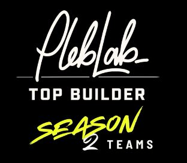

# Week 1: LB x Top Builder Recap

<figure><figcaption>
Top Builder Season 2!
</figcaption></figure>

Week 1 of PlebLab's Top Builder competition has been a whirlwind of excitement, collaboration, and progress for Lightning Bounties. Meeting the other teams was nothing short of inspiring—this competition is stacked with awesome projects pushing Bitcoin adoption in ways we hadn’t even imagined. The excitement got us fired up to roll up our sleeves and start building. Here’s a quick recap of what went down during our first week of Top Builder.

***

## Meeting the Teams

***

We got a first look and got to meet the teams in the Top Builder competition and this field is stacked with projects that are innovative and onboard people to start stacking sats and using Bitcoin in ways that I never imagined. They can be summarized [here](https://blog.lightningbounties.com/top-builder-2025/top-builder-x-lightning-bounties#topbuilder-teams)

Seeing all of these amazing projects and meeting the teams behind them got us over at the Lightning Bounties team excited to roll up our sleeves and get involved. Here is a brief breakdown of what we have accomplished in Week 1

### Putting Together Our Roadmap Dev and Biz Dev Bored

Before the fun development can begin, we like to first set a roadmap and tasks for what we hope to accomplish week by week. We have our roadmap broken down into 2 sections Enrique and Mike handling the Business Development tasks. Will and Pavel building the Developer Tasks.

## Issue Tracker  for Top Builder Roadmap

Will outdid himself by creating an exceptional issue tracker for our Top Builder roadmap. It neatly organizes our milestones, defines clear deliverables, and sets a strong foundation for how we’ll tackle upcoming tasks. By using [this GitHub project](https://github.com/orgs/Lightning-Bounties/projects/2/views/1) as our blueprint, we can easily pinpoint priorities, assign responsibilities, and track progress in real-time. This level of transparency and structure ensures the entire team stays aligned on what needs to be done when it needs to be done, and who is responsible for each piece of the puzzle. Overall, it’s a game-changer for keeping everyone on the same page and pushing our builder competition efforts forward efficiently.

## Biz Dev Team

We created a Business Development Task board using Notion Sites to track our progress and set milestones on what we hope to accomplish for the Top Builder competition. Some of the Business tasks we set for ourselves are focusing&#x20;

Using Will's issue tracker as a guide, the Biz dev team created a Notion-flavored business development tracker. It’s tailored to help us prioritize key business goals like refining our pitch, getting our LLC converted into a C-Corp, improving our documentation, and adding content for our Blog while serving as sort of a PoW while in TopBuilder. This reminds me that I need to find bounties to post on our app. Interested? Ping me [here ](mailto:mike@lightningbounties.com)&#x20;

Together, these tools ensure we’re not just moving forward but doing so with clarity and purpose.

## Dev Team

***

## **New Feature: Lock Time and Expiration for Bounties**

\
The Dev Team introduced a _lock time_ feature that holds each bounty’s reward in escrow for a set period—typically recommended at two weeks. This locked window confirms for bounty hunters that if they submit a valid solution before the time is up, the reward is guaranteed. However, once the lock time ends, the reward doesn’t automatically disappear—bounty hunters can still claim it. What does change is that the bounty poster now has the option to _expire_ the bounty if their priorities shift or if they solve the issue independently. Through this approach, bounty hunting becomes less risky for contributors (they know funds are firmly allocated) and more flexible for project teams (they can quickly adapt and reclaim funds for other pressing needs).&#x20;

Overall, lock times protect hunters by assuring them the reward is available, while expiration safeguards posters by letting them recover any unclaimed rewards for future bounties or other development tasks. This balance of certainty and flexibility makes bounty-driven collaboration smoother and more efficient.

<figure><figcaption>
Issue Lock Reward in Test
</figcaption></figure>

## Beyond the Hype Validating Your Bitcoin Idea By Teresa Martin

One of the key takeaways was the importance of concept viability. It's not enough to have a cool idea; we need to ensure our solution addresses a real problem and is unique enough to stand out in the market. This immediately resonated with me due to my past experiences with doing tokenomics analysis for early-stage projects looking to launch a token. Most of my work involved competitor analysis researching how our clients' projects would bring in demand for their tokens. To make a long story short, most of the projects I researched were forks of existing successful projects that claimed to be different or innovative. The truth is, these projects were the same, just a different front-end code.

Another valuable lesson was about gathering feedback and testing early. Teresa suggested building prototypes and testing concepts before investing too much time and resources into full product development. We have begun interviewing our bounty hunters and the feedback has been incredible. However, we are always looking for feedback and implementing features, so feel free to contact us with any suggestions and we can set up a time to discuss each other’s projects. For your time, we are happy to pay you some sats for your feedback.

Teresa’s presentation has reinforced the importance of thorough in-depth research, resilience, and tapping into the experience of those who have navigated these waters before can be incredibly beneficial in building a successful Bitcoin-focused business.

With this in mind, we are lucky to be part of Top Builder where we can connect with founders who've secured investments in the Bitcoin space which will be a priority for us. Their insights and advice will be crucial as we navigate the unique challenges of building a Bitcoin-native business.

As Week 1 concludes, we’re feeling energized and focused on the road ahead. From setting up our roadmap to launching new features and absorbing valuable lessons from industry leaders, this week has laid a strong foundation for what’s to come. The Top Builder competition is already proving to be an incredible opportunity to grow, learn, and connect with other passionate builders in the Bitcoin space. We can’t wait to see what Week 2 brings as we continue to push Lightning Bounties forward!

