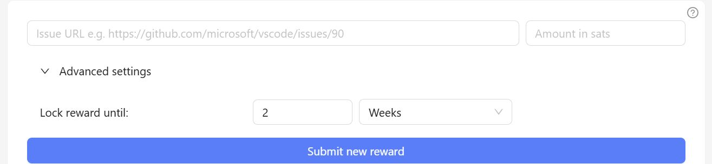
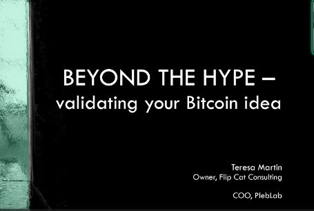

# Week 1: LB x Top Builder Recap

## PlebLab's Week 1 Recap: Lightning Bounties

<figure><figcaption></figcaption></figure>

Welcome to the inaugural edition of PlebLab's Week 1 Recap, presenting insights from the perspective of Lightning Bounties! In this edition, we’ll share the valuable lessons we've learned, highlight the progress we've made with developing our bounty platform, and offer an overview of the engaging Top Builder workshops.

## Meeting the Teams

***

We had an exciting opportunity to preview and meet the participants in the Top Builder contest. This competition is filled with innovative projects designed to onboard users to start stacking sats and use Bitcoin in unprecedented ways.

Each team's card provides a direct link to their respective project site or repository, offering a deeper insight into their work. By clicking on a card, you will be redirected to the project's website, where you can explore what they are building. Below, we offer a concise overview of each team.

<table data-view="cards" data-full-width="false"><thead><tr><th align="center"></th><th align="center"></th><th data-hidden data-card-cover data-type="files"></th><th data-hidden data-card-target data-type="content-ref"></th></tr></thead><tbody><tr><td align="center"><a href="https://www.branta.pro/"><strong>BRANTA</strong></a></td><td align="center">Branta offers payment verification for various Bitcoin and Lightning technologies.</td><td><a href="../../../.gitbook/assets/branta (1).png">branta (1).png</a></td><td><a href="https://www.branta.pro/">https://www.branta.pro/</a></td></tr><tr><td align="center"><a href="https://jippi.app/"><strong>JIPPI</strong></a></td><td align="center">Pokémon GO for Bitcoin.</td><td><a href="../../../.gitbook/assets/image (26).png">image (26).png</a></td><td><a href="https://jippi.app/">https://jippi.app/</a></td></tr><tr><td align="center"><a href="https://shopstr.store/"><strong>SHOPSTR</strong></a></td><td align="center">Shopstr is a global, decentralized Nostr marketplace for Bitcoin commerce.</td><td><a href="../../../.gitbook/assets/shopstr.jpg">shopstr.jpg</a></td><td><a href="https://shopstr.store/">https://shopstr.store/</a></td></tr><tr><td align="center"><a href="https://www.assign.money"><strong>ASSIGN MONEY</strong></a></td><td align="center">Assign is Bitcoin for teams. Teams create an account, invite members, and assign payments such as salaries, pensions, bonuses, etc.</td><td><a href="../../../.gitbook/assets/monirate.jpg">monirate.jpg</a></td><td><a href="https://www.assign.money">www.assign.money </a></td></tr><tr><td align="center"><a href="https://bitcoinonly.events/"><strong>BITCOIN ONLY EVENTS</strong></a></td><td align="center">Carefully curated and comprehensive calendar of major conferences, summits, and gatherings within the Bitcoin-only space</td><td><a href="../../../.gitbook/assets/BitcoinEvents_Logo.png">BitcoinEvents_Logo.png</a></td><td><a href="https://bitcoinonly.events/">https://bitcoinonly.events/</a></td></tr><tr><td align="center"><a href="https://sats.gg/"><strong>SATS.GG</strong></a></td><td align="center">Video streaming platform like Twitch.tv, but integrated with Lightning and Nostr.</td><td><a href="../../../.gitbook/assets/image (35).png">image (35).png</a></td><td><a href="https://sats.gg/">https://sats.gg/</a></td></tr><tr><td align="center"><a href="https://cozybot.my.canva.site/"><strong>COZYBOT</strong></a></td><td align="center">A gamified platform for AI agents to be created by non-technical users.</td><td><a href="../../../.gitbook/assets/cozybot.JPG">cozybot.JPG</a></td><td><a href="https://cozybot.my.canva.site/">https://cozybot.my.canva.site/</a></td></tr><tr><td align="center"><a href="https://plunda.co"><strong>PLUNDA</strong></a></td><td align="center">Bitcoin powered collectibles exchange. Buy, sell &#x26; swap collectibles digitally.</td><td><a href="../../../.gitbook/assets/image (29).png">image (29).png</a></td><td><a href="https://plunda.co">https://plunda.co</a></td></tr><tr><td align="center"><a href="https://www.bitcoinflash.xyz/"><strong>FLASH</strong></a></td><td align="center">Combines Lightning and Mobile Money technologies to make access to Bitcoin simple and easy for people in Africa.</td><td><a href="../../../.gitbook/assets/image (30).png">image (30).png</a></td><td><a href="https://www.bitcoinflash.xyz/">https://www.bitcoinflash.xyz/</a></td></tr><tr><td align="center"><a href="https://bitsspend.com/"><strong>BITSPEND</strong></a></td><td align="center">BitSpend aims to develop a secure, pluggable, and lightweight Bitcoin payment client that enables applications to process Bitcoin payments on &#x26; off-chain natively.</td><td><a href="../../../.gitbook/assets/image (31).png">image (31).png</a></td><td><a href="https://bitsspend.com/">https://bitsspend.com/</a></td></tr><tr><td align="center"><a href="https://questforsats.com"><strong>QUEST FOR SATS</strong></a></td><td align="center">It's like geocaching with Lightning.</td><td><a href="../../../.gitbook/assets/image (32).png">image (32).png</a></td><td><a href="https://questforsats.com">https://questforsats.com</a></td></tr><tr><td align="center"><a href="https://clubbink.vercel.app/"><strong>CLUB BINK</strong></a></td><td align="center">Toolkit to bootstrap local peer-to-peer markets within high-trust Bitcoin communities, allowing members to keep their privacy intact and save on commissions.</td><td><a href="../../../.gitbook/assets/image (33).png">image (33).png</a></td><td><a href="https://clubbink.vercel.app/">https://clubbink.vercel.app/</a></td></tr><tr><td align="center"><a href="https://pleb.fm/"><strong>PLEB.FM</strong></a></td><td align="center">Auction-style, lightning-powered jukebox. Choose songs and outbid others to control the playlist.</td><td><a href="../../../.gitbook/assets/image (34).png">image (34).png</a></td><td><a href="https://pleb.fm/">https://pleb.fm/</a></td></tr><tr><td align="center"><a href="https://github.com/RedVelvetZip/discreetluck"><strong>DISCREET LUCK</strong></a></td><td align="center">DLC-based prediction market on bitcoin. This interface enables instant order fulfillment via Polymarket's liquidity, with end users using only native BTC.</td><td><a href="../../../.gitbook/assets/image (37).png">image (37).png</a></td><td><a href="https://github.com/RedVelvetZip/discreetluck">https://github.com/RedVelvetZip/discreetluck</a></td></tr><tr><td align="center"><a href="https://github.com/PlebLab/Top-Builder-Season-2/issues/17"><strong>INHERIT FINANCE</strong></a></td><td align="center">Self-custodial Bitcoin recovery solution, enabling users to time-lock their BTC to guard against wrench attacks &#x26; quantum threats, with an optional dead man's switch for recovery in case of key loss or unexpected life events.</td><td><a href="../../../.gitbook/assets/inherit_logo.JPG">inherit_logo.JPG</a></td><td><a href="https://github.com/PlebLab/Top-Builder-Season-2/issues/17">https://github.com/PlebLab/Top-Builder-Season-2/issues/17</a></td></tr><tr><td align="center"><a href="https://blockstamp.app/">BLOCKSTAMP.APP</a></td><td align="center">Allow users to "stamp the blockchain" to commemorate meaningful events (birth of a kid, wedding dates, etc.). </td><td><a href="../../../.gitbook/assets/blockstamp_app.JPG">blockstamp_app.JPG</a></td><td><a href="https://blockstamp.app/">https://blockstamp.app/</a></td></tr></tbody></table>

Seeing all of these amazing projects and meeting the teams behind them got us over at the Lightning Bounties team excited to roll up our sleeves and get involved. Here is a brief breakdown of what we have accomplished in Week 1

## Putting Together Our Roadmaps: Dev and Biz Dev Bored

## Roadmap and Task Breakdown&#x20;

Before diving into development, we prepare a milestone roadmap and task list. Our roadmap is divided into two main sections:

* **Developer Tasks**: Handled by Will and Pavel.
* **Business Development**: Managed by Enrique and Mike.

## Developer Roadmap /Issue Tracker for Top Builder&#x20;

Will outdid himself by creating an exceptional issue tracker for our Top Builder roadmap. It neatly organizes our milestones, defines clear deliverables, and sets a strong foundation for how we’ll tackle upcoming tasks. By using [this GitHub project](https://github.com/orgs/Lightning-Bounties/projects/2/views/1) as our blueprint, we can easily pinpoint priorities, assign responsibilities, and track progress in real-time. This level of transparency and structure ensures the entire team stays aligned on what needs to be done when it needs to be done, and who is responsible for each piece of the puzzle.

## Biz Dev Roadmap /Tasks Tracker for Top Builder

Using Will's issue tracker as a guide, the Biz dev team created a Notion-flavored business development tracker. It’s tailored to help us prioritize key business goals like refining our pitch, getting our LLC converted into a C-Corp, improving our documentation, and adding content for our Blog while serving as sort of a PoW while in TopBuilder. This reminds me that I need to find bounties to post on our app. Interested? Ping me [here ](mailto:mike@lightningbounties.com)&#x20;

<table data-card-size="large" data-column-title-hidden data-view="cards" data-full-width="false"><thead><tr><th></th><th></th><th data-hidden data-card-cover data-type="files"></th><th data-hidden data-card-target data-type="content-ref"></th></tr></thead><tbody><tr><td><a href="https://lb-bizdev.notion.site/topbuilder-season-2?v=176e1fe7ce6b8168b785000c4c58ed88"><strong>Business Development Task Tracker</strong></a></td><td>Keep an eye on our business development plans and achievements. This tracker outlines our roadmap and the tasks we focus on during the Top Builder competition.  </td><td><a href="../../../.gitbook/assets/notion_bizdev_ss (2).JPG">notion_bizdev_ss (2).JPG</a></td><td><a href="https://lb-bizdev.notion.site/topbuilder-season-2?v=176e1fe7ce6b8168b785000c4c58ed88">https://lb-bizdev.notion.site/topbuilder-season-2?v=176e1fe7ce6b8168b785000c4c58ed88</a></td></tr><tr><td><a href="https://github.com/orgs/Lightning-Bounties/projects/2/views/1"><strong>Development Task Tracker &#x26; Roadmap</strong> </a></td><td>Follow along with our development efforts. This tracker highlights our ongoing projects, key milestones, and progress we've made during the Top Builder competition.</td><td><a href="../../../.gitbook/assets/github_tb_issue_ss.JPG">github_tb_issue_ss.JPG</a></td><td><a href="https://github.com/orgs/Lightning-Bounties/projects/2">https://github.com/orgs/Lightning-Bounties/projects/2</a></td></tr></tbody></table>

Together, these tools ensure we’re not just moving forward but doing so with clarity and purpose.

## **New Feature: Lock Time and Expiration for Bounties**

\
The Dev Team introduced a _lock time_ feature that holds each bounty’s reward in escrow for a set period—typically recommended at two weeks. This locked window confirms for bounty hunters that if they submit a valid solution before the time is up, the reward is guaranteed. However, once the lock time ends, the reward doesn’t automatically disappear—bounty hunters can still claim it. What does change is that the bounty poster now has the option to _expire_ the bounty if their priorities shift or if they solve the issue independently. Through this approach, bounty hunting becomes less risky for contributors (they know funds are firmly allocated) and more flexible for project teams (they can quickly adapt and reclaim funds for other pressing needs).&#x20;

Overall, lock times protect hunters by assuring them the reward is available, while expiration safeguards posters by letting them recover any unclaimed rewards for future bounties or other development tasks. This balance of certainty and flexibility makes bounty-driven collaboration smoother and more efficient.

<figure><figcaption>
Issue Lock Reward in Test
</figcaption></figure>

## Workshop: _'Beyond the Hype Validating Your Bitcoin Idea'_ By Teresa Martin

<figure><figcaption>
Bitcoin Beyond the Hype
</figcaption></figure> <figure><figcaption>
Remember to Research  
</figcaption></figure>

One of the key takeaways was the importance of concept viabili[^1]ty. It's not enough to have a cool idea; we need to ensure our solution addresses a real problem and is unique enough to stand out in the market. This immediately resonated with me due to my past experiences with doing tokenomics analysis for early-stage projects looking to launch a token. Most of my work involved competitor analysis researching how our clients' projects would bring in demand for their tokens. To make a long story short, most of the projects I researched were forks of existing successful projects that claimed to be different or innovative. The truth is, these projects were all the same, just different front-end code.

Another valuable lesson was about gathering feedback and testing early. Teresa suggested building prototypes and testing concepts before investing too much time and resources into full product development. We have begun interviewing our bounty hunters and the feedback has been incredible. However, we are always looking for feedback and implementing features, so feel free to contact us with any suggestions and we can set up a time to discuss each other’s projects. For your time, we are happy to pay you some sats for your feedback.

Teresa’s presentation has reinforced the importance of thorough in-depth research, resilience, and tapping into the experience of those who have navigated these waters before can be incredibly beneficial in building a successful Bitcoin-focused business.

With this in mind, we are lucky to be part of Top Builder where we can connect with founders who've secured investments in the Bitcoin space which will be a priority for us. Their insights and advice will be crucial as we navigate the unique challenges of building a Bitcoin-native business.

## Wrapping it Up:

As Week 1 concludes, we’re feeling energized and focused on the road ahead. From setting up our roadmap to launching new features and absorbing valuable lessons from the Pleblab mentors and fellow builders, this week has laid a strong foundation for what’s to come. The Top Builder competition is already proving to be an incredible opportunity to grow, learn, and connect with other passionate builders in the Bitcoin space. We can’t wait to see what Week 2 brings as we continue to push Lightning Bounties forward!

Looking ahead, PlebLab and the Lightning Bounties team are committed to maintaining this momentum. We are excited to see how the ideas and projects generated during this week will continue to evolve and contribute to the broader Lightning Network community. Stay tuned for more updates, and if you're interested in joining our efforts, we encourage you to get involved and make a difference.

[^1]: 
