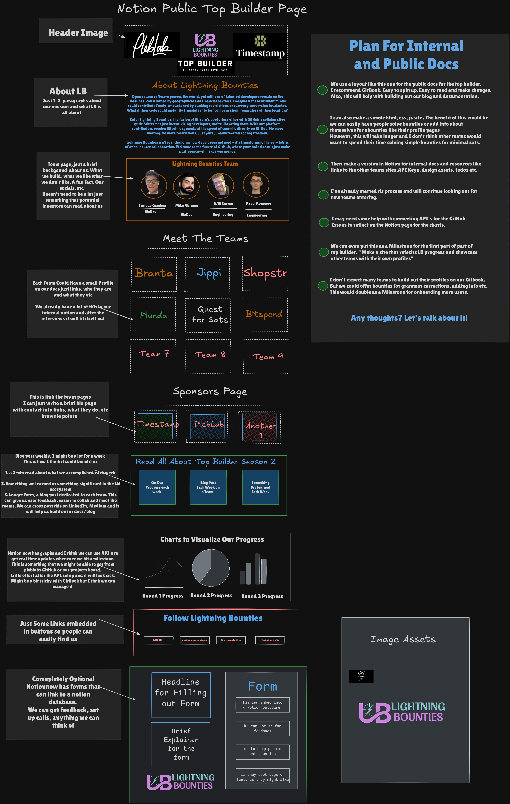

# TODO

* [x] Make Banner
* [ ] Make Clever Names For Parent, Home, and other pages&#x20;
* [ ] incorporate Excalidraw blueprint on LB Top Builder Home&#x20;
* [ ] Figure Out Subpages with Blog Post&#x20;
* [ ] Get Teams Directory sub pages and use ref links to LB Blog Docs&#x20;
* [ ] Figure out Notion Graphs into GitBook blog
* [ ] Bio Page on home + team pages&#x20;
* [ ] Dont forget Light screens and responsiveness&#x20;
* [ ] Separate blog section for weekly updates LB-specific
* [ ] &#x20;Neaten up docs.lb entire thing (been a while)
  * [ ] Look for broken links&#x20;
  * [ ] Maybe make a LB Featured section (Startup day, branta, hackathon etc)
  * [ ] Make the Glossary have more vocab with images

#### LB Team Specific

* [x] Bio Page **for (About, Card Headshot, Links to Socials)**
  * [x] Enrique
  * [x] Will
  * [x] Pavel&#x20;
  * [x] Mike&#x20;
  *
* [ ] Figure Out Ideal Documentation design&#x20;
* [x] Add Top Builder & TimeStamp theme&#x20;
* [ ] Add cool button link redirects to Socials&#x20;
* [x] Make Card designs for LB Team Directory&#x20;

#### Maybes

* [ ] Add a call to action to encourage teams to do bounties for small dox fixes on their own projects.
* [ ] &#x20;New Card Design for Top Builder Docs/Blog For LB
* [ ] Form for Feedback & or Posting Bounties&#x20;
  * [ ] Think of questions for a survey for Qualitative Research (Good for Pitch Decks)
* [ ] iFrame or Widget for easy-to-use Post Bounties&#x20;
* [ ] &#x20;Show open bounties in a dynamic way

#### Things to research&#x20;

* [x] Notion Charts / Sync with Notion & GiitHub projects to embed graphs&#x20;
* [ ] Embed forms if needed&#x20;

<figure><figcaption>
Blueprint so far
</figcaption></figure>

*

