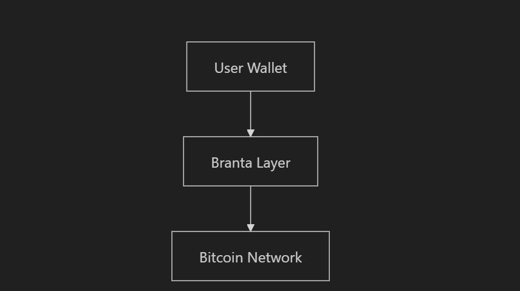
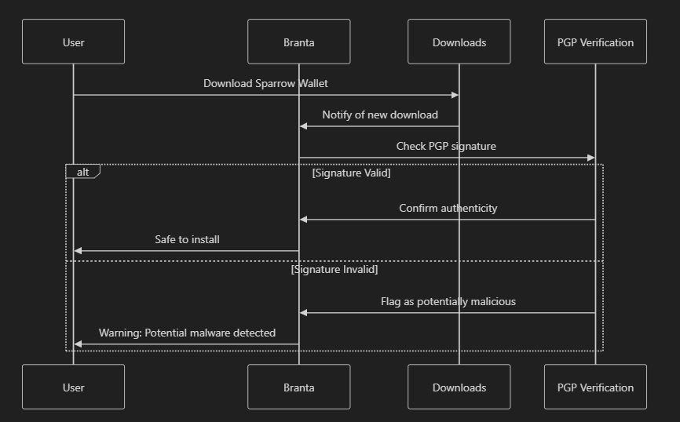
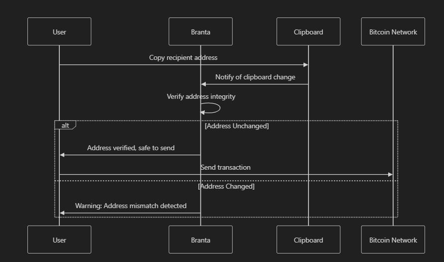

# Branta: Guardrails for Bitcoin & Lightning

Imagine this: After months of stacking sats on exchanges, you're ready to take the orange pill and truly own your Bitcoin. The horror stories of exchange collapses like FTX have you itching to self-custody. But as you prepare to move your hard-earned Bitcoin to your own wallet, a pit forms in your stomach. What if you make a mistake? What if you send your Bitcoin to the wrong address, never to be seen again?

This fear isn't unfounded. In the unforgiving world of Bitcoin, one wrong move can mean irreversible loss. It's precisely this anxiety that Branta, part of PlebLab's Top Builder Season 2, aims to address. By tackling one of the most critical challenges in the Bitcoin ecosystem, Branta is on a mission to make transactions safer and more accessible for everyone. But how exactly does it work to alleviate the fear of sending your Bitcoin to the wrong address?

## What is Branta?

Branta acts as an invisible layer of protection that runs alongside Bitcoin wallets. It provides an extra shield against phishing attacks and malicious threats, such as clipboard attacks. Branta verifies the authenticity of wallet software, which helps protect users from inadvertently interacting with harmful entities.

Here's a simplified diagram of its functionality:

<figure><figcaption></figcaption></figure>

## **Key Features of Branta**

## Branta Features Overview

Branta enhances your Bitcoin experience with the following key features:

1. **Wallet Verification**
   * Automatically scans your downloads folder.
   * Checks PGP keys of wallet installation files against known legitimate keys.
   * Ensures you're not installing malware or compromised wallets.
2. **Transaction Protection**
   * Provides visibility into your clipboard at runtime.
   * Prevents malware from swapping your Bitcoin addresses during transactions.
   * Protects against man-in-the-middle attacks.
3. **Merchant Verification**
   * Offers API support for verifying the authenticity of merchant addresses.
   * Reduces the risk of sending funds to impersonators.
4. **Lightning Network Integration**
   * Supports Lightning Network functionality.
   * Enables faster and more efficient Bitcoin transactions while maintaining security.

## Here's how Branta works in practice:

### **Example 1: Wallet Download Protection**

Imagine you're downloading Sparrow Wallet for the first time. You might not realize there's a difference between sparrow .com and sparrow .org, and one of these could be an imposter site.

Here's how Branta protects you:

<figure><figcaption></figcaption></figure>

This proactive approach significantly reduces the risk of users falling victim to sophisticated phishing attempts that target the very tools meant to keep Bitcoin safe.

### **Example 2: Transaction Protection**

When making a Bitcoin transaction, Branta ensures your intended recipient address isn't swapped by malware:

<figure><figcaption></figcaption></figure>

## **Lightning Bounties Partnership**

<figure><figcaption></figcaption></figure>

We at Lightning Bounties are thrilled to be partnered with Branta! We've integrated Branta directly into our application, providing an unparalleled level of security for our users. We can't think of a better way to keep our users safe than having Branta as our security layer. This integration ensures that every transaction, whether on-chain or through the Lightning Network, is protected by Branta's advanced security features.

For more details on how Lightning Bounties is utilizing Branta, visit Branta's [blog post here. ](https://www.branta.pro/blog?tag=lightningbounties)

## **The Inspiration Behind Branta**

The development of Branta stems from a deeply personal understanding of the risks involved in handling Bitcoin. Keith, the creator of Branta, was inspired by his own journey into Bitcoin security. As he puts it, "Once you buy your first significant amount of Bitcoin, you start thinking, how do I keep my Bitcoin safe?" This relatable concern led him to explore the mindset of potential attackers, ultimately driving the creation of Branta. Keith Gardner's approach to Bitcoin security extends beyond just software solutions. He emphasizes the importance of user education and vigilance.

Some of his top tips for guarding against phishing and man-in-the-middle attacks include:

1. Protecting your email inbox vigorously, as it's often the first point of entry for attackers.
2. Being extremely cautious of any messages that create a sense of urgency, especially those asking you to log in immediately to prevent account closure.
3. Exercising caution when using large group messaging apps like Telegram or Signal, and avoiding clicking on links shared in these platforms.

By combining robust software protection with user education, Branta aims to create a comprehensive security solution for Bitcoin users of all levels of experience.

## Conclusion

Branta is transforming Bitcoin security. Whether you're self-custodying your first sats or managing a significant stack as a seasoned Bitcoiner, Branta offers peace of mind by addressing critical vulnerabilities like phishing attacks, wallet authenticity, and address verification. It doesn’t hold your seed phrase and integrates seamlessly into existing setups or applications.

Bitcoiners deserve tools that make transacting safe without sacrificing sovereignty. Branta delivers exactly that—an invisible layer of protection that ensures you're sending to the right place and using authentic software. It’s simple to add, powerful in its protection, and essential for anyone serious about securing their Bitcoin.

Branta isn’t just a product; it’s a solution helping Bitcoiners sleep better at night.&#x20;

<table data-view="cards"><thead><tr><th align="center"></th><th data-hidden data-type="files"></th><th data-hidden data-card-cover data-type="files"></th><th data-hidden data-card-target data-type="content-ref"></th></tr></thead><tbody><tr><td align="center"><a href="https://www.branta.pro/"><strong>Website</strong></a></td><td></td><td><a href="../../../.gitbook/assets/branta (1).png">branta (1).png</a></td><td><a href="https://www.branta.pro/">https://www.branta.pro/</a></td></tr><tr><td align="center"><a href="https://x.com/BrantaOps"><strong>Twitter</strong></a></td><td></td><td><a href="../../../.gitbook/assets/x_twitter_card.png">x_twitter_card.png</a></td><td><a href="https://x.com/BrantaOps">https://x.com/BrantaOps</a></td></tr><tr><td align="center"><a href="https://github.com/BrantaOps"><strong>GitHub</strong></a></td><td></td><td><a href="../../../.gitbook/assets/github_card.png">github_card.png</a></td><td><a href="https://github.com/BrantaOps">https://github.com/BrantaOps</a></td></tr></tbody></table>
