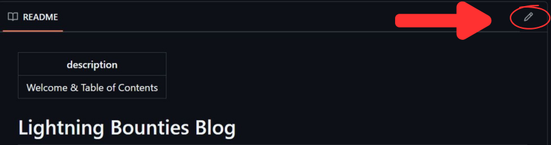

# Suggesting Changes

Want to make our documentation even better? First of all, thank you! This page will guide you through our contribution process, including:

* The steps you need to follow to make contributions and edits on our blog.&#x20;
* How to claim a bounty on [app.lightningbounties.com](https://app.lightningbounties.com/) for your contrinutions.&#x20;

To edit our docs, you must have a GitHub account. If you already have one, make sure you are logged in. If you don't, please [create one](https://github.com/join).

## Understanding GitBook's integration with GitHub <a href="#understanding-gitbooks-integration-with-github" id="understanding-gitbooks-integration-with-github"></a>

We use a platform called [GitBook](https://www.gitbook.com/) to host, manage and serve our documentation. GitBook fetches files from our GitHub repository [**Lightning-Bounties/our-blog**](https://github.com/Lightning-Bounties/our-blog/issues/4), reads them and converts them into the pages you can access on [docs.lightningbounties.com](https://docs.lightningbounties.com). A generic structure of a documentation hosted on GitBook would look like this:\




```markup
First page
├── A group of pages

│   ├── A page
│   ├── Another page
│   ├── One more page
│   │   ├── A nested page
│   │   └── Another nested page
```



Its mirror to GitHub, on the other hand, would have the following structure:



```markup
├── .gitbook/
│    └── assets/
│    │    └── an-image.png
├── a-group-of-pages/
│    ├── a-page.md
│    ├── another-page.md
│    ├── one-more-page/
│    │    ├── README.md
│    │    ├── a-nested-page.md
│    │    └── another-nested-page.md
├── README.md
└── SUMMARY.md
```



* The `.gitbook/asset`s folder manages every file used in any page.&#x20;
* The `SUMMARY.md` file tells GitBook in which order we wish to display our pages and what groups there are in our documentation.
* The `README.md` file in the main folder has the contents of the first page users see when accessing the documentation website.
* Groups of pages are controlled by folders named after the group title (i.e. `a-group-of-pages`).
* Nested pages have a similar structure to groups of pages; however, a `README.md` file with the contents of the parent page must be added to the folder named after the parent page title.

### Editing Existing Pages <a href="#editing-existing-pages" id="editing-existing-pages"></a>

**1.** Open the page you want to edit. What you see next depends on the resolution of your screen and whether you are viewing that page zoomed in or not.

_**a.** On certain occasions, you may see a button saying **Edit on GitHub** above the **Table of Contents** on the right side of the page._

<figure><figcaption><p>Screenshot of our blog home page. A GitHub icon along with the text "Edit on GitHub" is seen above the Table of Contents.</p></figcaption></figure>

**2.** Click on the GitHub icon. This will direct you to the Markdown file in which the contents of the page are stored.

**3.** Click on the pencil icon (labeled "Edit this file"). This will open a basic editing environment in which you are able to customize aspects like line wrap and indentation.

<figure><figcaption><p>Screenshot of a version of our Contributing page on GitHub showing the Edit this file button as a pencil icon.</p></figcaption></figure>

**4.** Make any edits you need, remembering to always format them using Markdown. To understand better GitBook's implementation of Markdown, check [their reference guide](https://docs.gitbook.com/content-editing/markdown)

**5.** When you are done making changes, scroll down and write a short description of your changes. Select the option **Create a new branch for this commit and start a pull request** and click on **Propose file change**. This will direct you to the **Pull request** page.

<figure><figcaption><p>Screenshot of the Commit changes box. There are boxes for a brief description of the changes, an extended one, a selection menu for email addresses to associate with the commit, options to commit directly to the current branch or to create a new branch and a pull request (which opens an option to name your branch as you like) and buttons to either Propose file change or Cancel.</p></figcaption></figure>

**6.** On the **Pull request** page, write a short comment explaining why are proposing those changes (e.g. improving readability, covering cases that weren't mentioned, adding critical details about our platform) and publish your pull request clicking on **Create pull request**.\


<figure><figcaption><p>Screenshot of the Pull request page. It shows a box for the title of the Pull request, another for any comments. Below them, there's a Create pull request button.</p></figcaption></figure>


Congratulations, you submitted a pull request! 🎉 The Lightning Bounties team will review it and merge them to our documentation if approved.



## Earning Rewards

1. Visit [https://app.lightningbounties.com](https://app.lightningbounties.com/)
2. Look for bounties titled "Help Improve Our Blog & Docs and Earn Sats!"
3. Claim a bounty by linking your pull request
4. Once approved, you'll receive sats as a reward!

## Additional Info

1. For a more detailed walkthrough on how to submit a pull request on the blog article file through Lightning Bounties see [here](https://docs.lightningbounties.com/docs/solve-a-bounty/working-on-the-bounty)
2. Also, feel free to contact us at [mike@lightningbounties.com](mailto:mike@lightningbounties.com)

Thank you for helping us improve our documentation!
